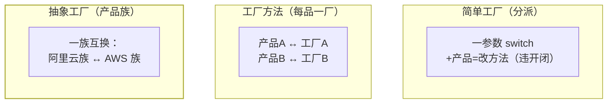

## 意图：把"造哪个"从调用方剥离

`new MySqlOrderDao()` 这行代码的问题不是 new 本身，而是**调用方从此
焊死在具体实现上**——换数据库必须改它。工厂模式把对象构造封装起来，
调用方只表达"要什么"，不表达"怎么造"。

三件套不是三个独立模式，是**同一意图在不同扩展需求下的三档成本**。

## 三件套

```java
// 简单工厂：一个静态方法按参数分派（不是 GoF 23 个之一，但最常用）
public static Payment of(String type) {
    return switch (type) {
        case "alipay" -> new AlipayPayment();
        case "wechat" -> new WechatPayment();
        default -> throw new IllegalArgumentException(type);
    };
}

// 工厂方法：把"造哪个"下放给子类——每加一个产品加一个工厂
interface PaymentFactory { Payment create(); }
class AlipayFactory implements PaymentFactory {
    public Payment create() { return new AlipayPayment(); }
}
class WechatFactory implements PaymentFactory {
    public Payment create() { return new WechatPayment(); }
}

// 抽象工厂：造"一族"相关产品——一次性换掉整个产品族
interface CloudFactory {
    Compute createCompute();  // 阿里云族：Ecs + Oss + Slb
    Storage createStorage();  // AWS 族：Ec2 + S3 + Alb
    LoadBalancer createLb();
}
```

三件套的"扩展方向"决定了什么时候用哪个：



| | 简单工厂 | 工厂方法 | 抽象工厂 |
|---|---|---|---|
| 加新产品 | 改工厂方法（违反开闭） | 加工厂类（开闭友好） | 加产品族成员要改所有工厂 |
| 类数量 | 1 个 | 产品数 × 2 | 产品族 × 成员数 |
| 适用 | 分支少且稳定 | 产品独立扩展 | 产品成套出现 |

判断顺序：**先问加产品的频率**——一年不加一次用简单工厂（switch 就
是它的合理形态）；产品各自膨胀用工厂方法；产品必须成套匹配（同一朵
云的存储 + 计算 + 负载均衡）才上抽象工厂。

## 静态工厂方法的第二重价值

工厂模式之外，**静态工厂方法本身**（Effective Java 第 1 条）还有三个
匿名构造器给不了的收益：

```java
// ① 有名字：语义自明，两个构造器签相同也能区分
List.of("a", "b");                 // 一眼知道是不可变列表

// ② 可缓存：不必每次都新建
Integer.valueOf(127);              // -128~127 走缓存（享元篇与此呼应）
Boolean.valueOf(true);             // 两个实例全局复用

// ③ 可返回子类型：调用方只见接口，实现随便换
Calendar.getInstance();            // 返回哪个子类由地区/时区决定
Executors.newFixedThreadPool(4);   // 返回的是哪个实现，调用方不关心
```

JDK 的设计惯性是**构造器私有 + 静态工厂当家**：`List.of`、
`Optional.of`、`Stream.of`、`BigInteger.valueOf` 全是它。

## Spring：工厂模式的工业化

Spring 的 `BeanFactory` 是工厂家族的集大成者——`getBean()` 按名/类型
取对象，产品就是全部 Bean。更关键的是它把工厂的两件事都自动化了：

1. **选型**：DI 按类型注入，调用方连工厂方法都不用调（IoC 篇的依赖
   倒置自动化）；
2. **造**：BeanDefinition 是图纸，容器反射实例化——**容器本质是
   "工厂 + 单例池 + 图纸"的超集**。

一个容易被面试官追问的细节——**BeanFactory 与 FactoryBean 的区别**：

- `BeanFactory`：容器本身，是工厂模式里的"工厂"角色；
- `FactoryBean`：一个特殊的 Bean，它是**给你自己写复杂对象工厂的
  扩展点**——`getObject()` 里造出来的对象才是真正暴露给容器的东西
  （MyBatis 的 `SqlSessionFactoryBean` 就靠它把 SqlSession 体系
  塞进 Spring，见 MyBatis 集成篇）。

## 小结

- 三件套按"加产品的成本"分层：分派 → 每品一厂 → 产品族。
- 静态工厂方法的价值不止解耦：有名字、可缓存、可返回子类型。
- Spring 容器即工厂的工业化终点——业务代码里不再手写工厂，
  `FactoryBean` 是你保留的最后一个手写扩展点。
