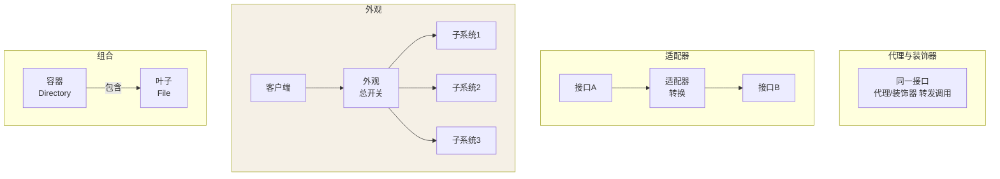
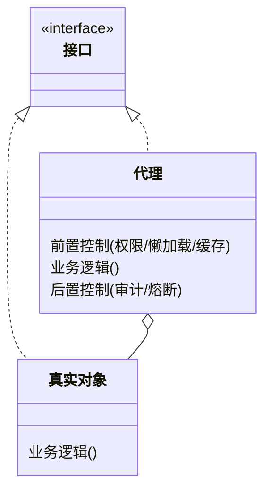
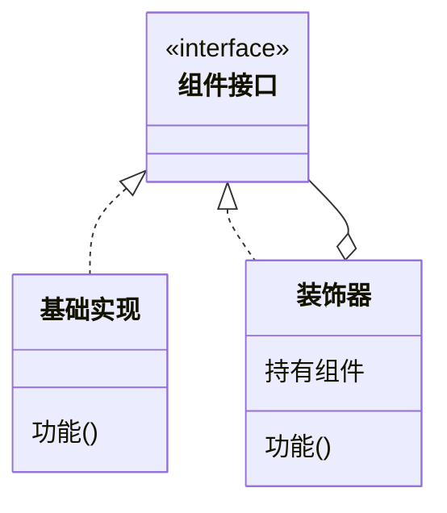
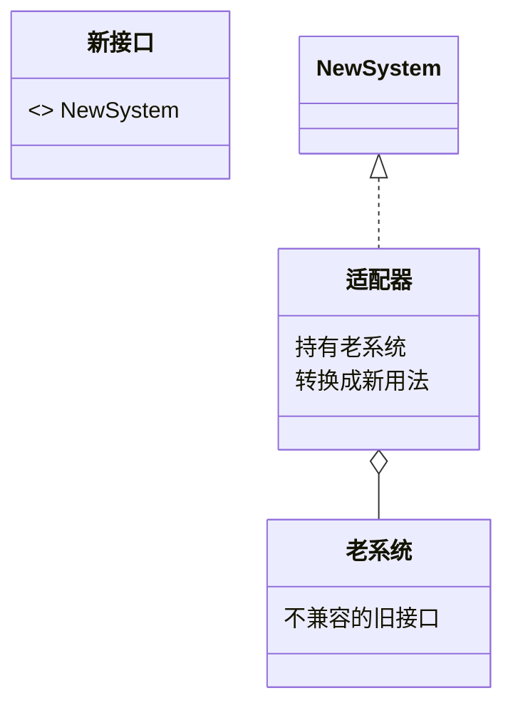
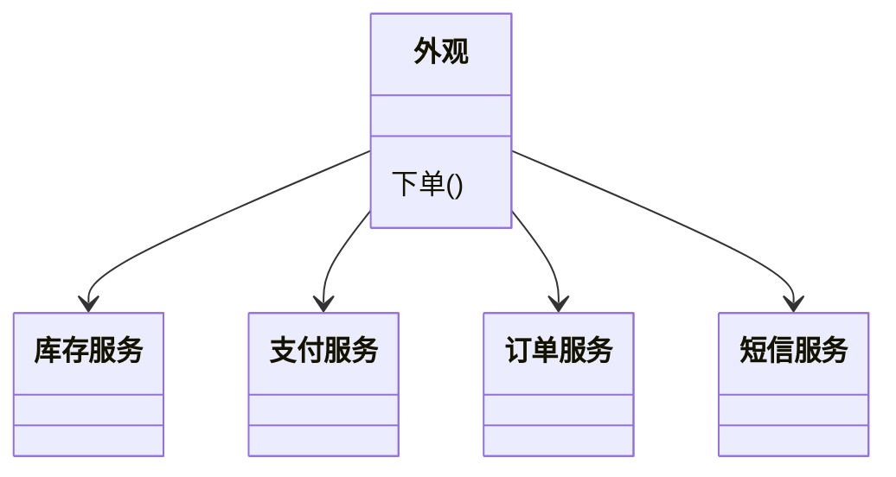
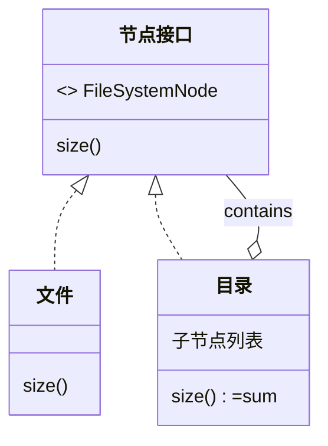

## 结构型的主题：组装

类怎么组合成更大的结构——核心张力永远是**接口兼容**与**职责附加**。

五种模式的角色定位，先看总图：



它们想解决的问题不同：**代理管"能不能访问"、装饰器管"加不加能力"、
适配器管"接口合不合"、外观管"用不用认识全部"、组合管"树形统不统一"**。

## 代理（Proxy）：控制访问

**意图：不改变接口，控制"能不能访问、怎么访问"**（AOP 篇的底层
已经讲透 JDK/CGLIB 动态代理，这里补设计视角）：



```java
interface UserService { void save(); }

class UserServiceImpl implements UserService {
    public void save() { /* 真实逻辑 */ }
}

class UserServiceProxy implements UserService {
    private final UserService target;
    public void save() {
        checkPermission();               // 前置控制：访问权限
        target.save();
        recordAudit();                   // 后置控制：审计日志
    }
}
```

代理三连问：**谁调（权限）、何时调（延迟/懒加载）、怎么调（缓存/
熔断）**——全是"控制"，一点业务不掺。JDK 动态代理、MyBatis Mapper、
@FeignClient 接口、@Transactional，本质全是代理。

## 装饰器（Decorator）：叠加功能

**意图：不改变接口，动态叠加"能力"**：



```java
// 经典现场：Java IO 的"俄罗斯套娃"
Reader r = new BufferedReader(          // 装饰：缓冲能力
          new InputStreamReader(         // 装饰：字节→字符转换
          new FileInputStream("a.txt"))); // 被装饰者：真实的字节源
```

```java
// 自己写一个：给任意价格计算器叠加折扣
interface Pricer { double price(double base); }
class BasePricer implements Pricer { public double price(double b) { return b; } }

class DiscountDecorator implements Pricer {
    private final Pricer next; private final double rate;
    public double price(double b) { return next.price(b) * rate; }
}
new DiscountDecorator(new DiscountDecorator(new BasePricer(), 0.8), 0.9).price(100);  // 72
```

**代理 vs 装饰器——一个高频面试题**：

| | 代理 | 装饰器 |
|---|---|---|
| 意图 | **控制访问**（替真实对象把门） | **增强能力**（给对象穿衣服） |
| 关系 | 编译期就确定"我是他的代理" | 运行期任意叠加多层 |
| 感知 | 调用方往往不知道代理存在 | 调用方主动选择怎么包 |

结构一模一样（同接口 + 持有同接口引用 + 转发调用），**区别只在意图**
——GoF 原话：代理控制访问，装饰器动态附加职责。

## 适配器（Adapter）：转换接口

**意图：让不兼容的接口合作**（改不了老代码的遗留系统集成场景）：



```java
// 老系统：给商品列表；新系统需要 key-value 结构
interface NewSystem { Map<String, Product> getProducts(); }

class OldSystemAdapter implements NewSystem {
    private final OldSystem old;                        // 组合持有老系统
    public Map<String, Product> getProducts() {
        return old.listAll().stream()
            .collect(toMap(Product::getId, p -> p));   // 转换
    }
}
```

JDK 现场：`Arrays.asList()`（数组→List 视图）、`InputStreamReader`
（字节流→字符流，它同时是适配器 + 装饰器套娃的一环）。与代理的区别：
**代理同接口转发，适配器换接口转换**。

## 外观（Facade）：给子系统一个总开关



```java
// 客户端不想认识 OrderService + StockService + PayService + SmsService
class OrderFacade {
    public void placeOrder(Order o) {
        stockService.lock(o);      // 子系统们
        payService.charge(o);
        orderService.create(o);
        smsService.notify(o);
    }
}
```

**外观 = 子系统的"前台"**：简化调用，不阻止你绕过它深入子系统
（与代理的差别：代理控制访问，外观只是懒得让你全认识一遍）。Spring
里的 `JdbcTemplate`、`TransactionTemplate` 都是外观——把 JDBC 的
Connection/Statement/ResultSet 与事务边界封装成"一个方法"。

## 组合（Composite）：树形结构的统一

**叶子与容器实现同一接口**，递归处理整棵树：



```java
interface FileSystemNode { long size(); }
class File implements FileSystemNode {
    public long size() { return fileSize; }
}
class Directory implements FileSystemNode {
    private final List<FileSystemNode> children;
    public long size() { return children.stream().mapToLong(FileSystemNode::size).sum(); }
}
```

调用方无需区分"文件还是文件夹"——**`Map` 里的 `computeIfAbsent` 递归
组装、前端组件树、菜单/权限树**全是它。与装饰器的差异：装饰是"链"
（一层包一层），组合是"树"（一对多容纳）。

## 小结

- 记意图不记结构：代理管访问、装饰器管叠加、适配器管转换、外观管
  简化、组合管树形。
- 代理与装饰器结构全同、意图相反——回答"为什么用"时要能说清这条线。
- Java IO 套娃 = 装饰器家族；JdbcTemplate = 外观；@Transactional =
  代理——框架世界里结构型模式出镜率最高。
