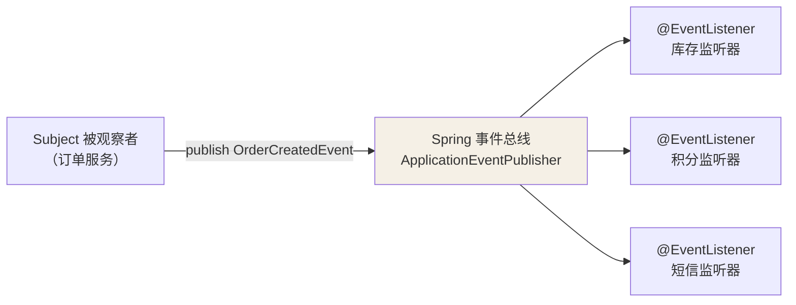
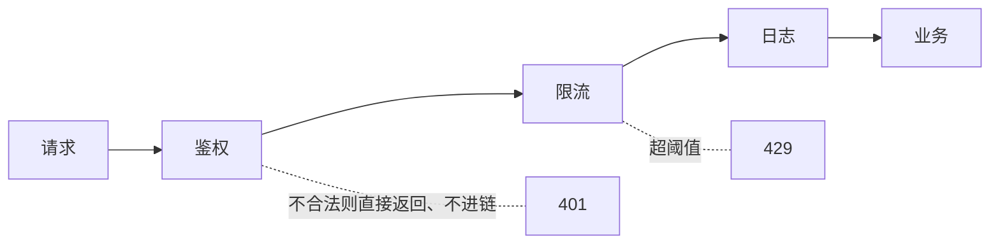

## 行为型的主题：通信

对象之间**怎么分配职责、怎么交互**——工程里出场率最高的四件套。

## 策略（Strategy）：if-else 的正规军

```java
// 重灾区：按类型分派行为，还不断膨胀
double calc(String type, double price) {
    if (type.equals("FULL_REDUCTION")) return fullReduction(price);
    if (type.equals("DISCOUNT")) return discount(price);
    if (type.equals("N_BUY_GIFT")) return nBuyGift(price);   // 每加活动改这里
    return price;
}
```

**正规解法**：Spring 容器天然是最好的策略注册器——

```java
public interface PromotionStrategy {
    String type();                        // 策略自报身份
    double calc(double price);
}

@Component
class FullReductionStrategy implements PromotionStrategy {
    public String type() { return "FULL_REDUCTION"; }
    public double calc(double price) { return price > 100 ? price - 20 : price; }
}

@Component
public class PromotionContext {
    private final Map<String, PromotionStrategy> strategies;   // Spring 自动注入
    // 构造器注入 List<PromotionStrategy> → 按 type() 建 map
    public double calc(String type, double price) {
        return strategies.get(type).calc(price);   // 新活动 = 新类，零修改
    }
}
```

消灭 switch 的代价是类的数量上升——**分支稳定（3 个固定分支）用
switch 没毛病；分支不断膨胀才值得上策略**（避免过度设计）。

## 模板方法（Template Method）：父类定骨架，子类填空

```java
abstract class AbstractGame {
    // 骨架：final 防子类改变流程
    public final void play() {
        initialize();
        startPlay();     // 变化点：钩子方法
        endPlay();
    }
    protected void initialize() { System.out.println("初始化"); }   // 公共实现
    protected abstract void startPlay();                            // 子类填空
}
class Cricket extends AbstractGame { protected void startPlay() { /* 板球开局 */ } }
class Football extends AbstractGame { protected void startPlay() { /* 足球开局 */ } }
```

**JDK/JUC 现场回顾**（全是老朋友）：

- **AQS**：`acquire()` 骨架写死（tryAcquire → 入队 → park），
  `tryAcquire/tryRelease` 留给 ReentrantLock/Semaphore 填空（AQS 篇）。
- `HttpServlet`：service() 分派 doGet/doPost。
- `AbstractList`：get/add 留空，迭代逻辑写死。
- Spring 的 `JdbcTemplate`：连接获取/释放是骨架，回调
  `PreparedStatementCallback` 是变化点——**"模板 + 回调"是模板方法在
  函数式时代的进化形态**（继承被组合替代）。

## 观察者（Observer）：事件的双向解耦



```java
// 发布方：只关心业务事实，不关心谁听
publisher.publishEvent(new OrderCreatedEvent(orderId));

// 订阅方：各自独立，新增订阅零改动发布方
@EventListener
public void onOrderCreated(OrderCreatedEvent event) { deductStock(event); }

@EventListener
@Async                                   // 异步不阻塞主链路（MQ 篇的削峰思想）
public void onOrderCreatedForPoints(OrderCreatedEvent event) { addPoints(event); }
```

与 MQ 的边界：**Spring 事件 = 单进程内的解耦**（JVM 里同步/异步）；
**MQ = 跨进程的解耦**（持久化、跨语言、削峰）。进程内上 MQ 是杀鸡
用牛刀，跨进程用事件总线是没的放矢。

**事件监听器的典型陷阱**：`@TransactionalEventListener` vs `@EventListener`
——前者在事务提交后才触发（否则监听器看到的可能是还没提交、甚至
最终回滚的数据）。事件风暴前先想清楚"读一致性要求"。

## 责任链（Chain of Responsibility）：一站一站处理

```java
public interface Filter {
    void doFilter(Request req, Response res, FilterChain chain);   // 自己处理后调链
}

// 框架现场：
// ① Spring Cloud Gateway 的过滤器链（网关篇的 pre/post 双向链）
// ② Servlet Filter：编码设置 → 鉴权 → 日志 → 放行 controller
// ③ Netty pipeline：入站 handler 顺序、出站 handler 逆序
// ④ Sentinel 的 ProcessorSlotChain：限流 → 熔断 → 统计（熔断篇）
// ⑤ OkHttp interceptor：重试 → 缓存 → 真实网络（RetryAndFollowUpInterceptor 链）
```

**链上每个节点自己决定"处理 + 放行"还是"拦截 + 返回"**——网关鉴权
过滤器 `return exchange.getResponse().setComplete()`（网关篇的代码）
就是"拦截不放行"的标准写法。



## 番外：状态（State）与迭代器

- **状态模式**：状态迁移逻辑从 `if(status == PAID)` 散落各处，收敛
  为每状态一个类——订单状态机（UNPAID→PAID→SHIPPED）是标准场景，
  与策略结构相同（策略的"策略"由外部选，状态的"状态"由迁移规则选）。
- **迭代器**：JDK `Iterator` 本身——`hasNext/next` 把遍历协议从数据
  结构里剥出来，for-each 的语法糖就建在它上面。

## 小结

- 策略消灭膨胀的分支，Spring 容器就是最好的策略注册表。
- 模板方法：骨架 + 钩子；AQS 是教科书，回调是它的函数式进化。
- 观察者管进程内事件、MQ 管跨进程事件；责任链是过滤器栈的理论名——
  Gateway/Sentinel/OkHttp 全是现场。
