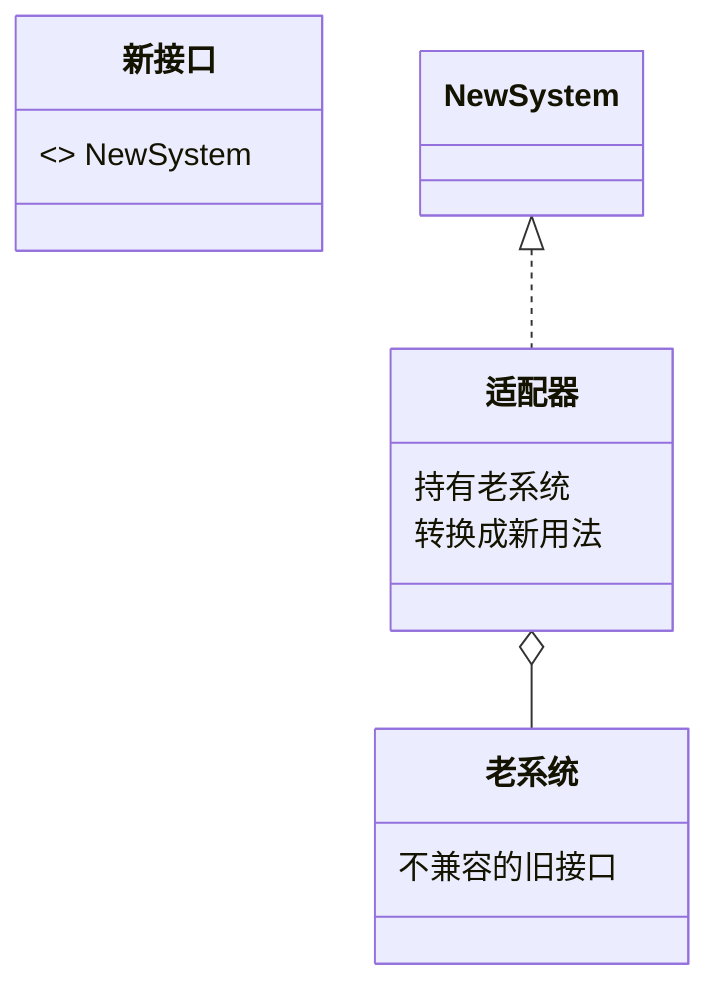

## 意图：让不兼容的接口合作

适配器的场景有一个共同前提：**被适配的老代码改不了**——第三方 SDK、
遗留系统、历史接口。能随手改老类时不需要适配器，重构就完了。

它的动作是**转换**：老接口的能力都在，只是长得不合新调用方的胃口，
适配器把 A 接口翻译成 B 接口。

## 两种写法

**对象适配器（组合）**——工程首选：



```java
// 老系统：给商品列表；新系统需要 key-value 结构
interface NewSystem { Map<String, Product> getProducts(); }

class OldSystemAdapter implements NewSystem {
    private final OldSystem old;                        // 组合持有老系统
    public Map<String, Product> getProducts() {
        return old.listAll().stream()
            .collect(toMap(Product::getId, p -> p));   // 转换
    }
}
```

**类适配器（继承）**——同时继承两边，Java 单继承下几乎没有生存空间：

```java
class ClassAdapter extends OldSystem implements NewSystem {
    public Map<String, Product> getProducts() {
        return listAll().stream().collect(toMap(Product::getId, p -> p));
    }   // 老方法是继承来的，少一个字段，但占死了继承名额
}
```

对象适配器赢在两点：**不占继承名额**、**可以适配老系统的所有子类**
（持有的是父类型引用）。继承版只有一个优势——省掉一个字段——所以
实际项目里几乎见不到它。

## 实战的两类场景

```java
// 场景①：统一多渠道 SDK——外部渠道接口千奇百怪，域内只认自己的接口
interface SmsClient { void send(String phone, String content); }

class AliyunSmsAdapter implements SmsClient {
    private final AliyunSdk sdk;                     // 渠道 SDK 改不了
    public void send(String phone, String content) {
        sdk.sendMessage(new SmsRequestBuilder()
            .setPhoneNumbers(phone).setMessage(content).build());  // 翻译
    }
}
// 腾讯云/华为云各写一个 Adapter，域内调用方永远只认识 SmsClient
```

```java
// 场景②：遗留系统对接——新平台要 JSON，老系统只会 Socket 流
interface OrderQuery { String queryJson(String orderId); }
class LegacyOrderAdapter implements OrderQuery {
    public String queryJson(String orderId) {
        return JsonUtil.toJson(legacy.queryXml(orderId));   // XML→JSON 翻译层
    }
}
```

共同点：**适配器不产生业务价值，它只值"翻译费"**。如果一个类里翻译
逻辑比转换逻辑还多，多半是越界了。

## JDK 现场

| 现场 | 转换内容 |
|---|---|
| `Arrays.asList(arr)` | 数组 → List 视图（视图！改数组它看得见，add 却抛异常） |
| `InputStreamReader` | 字节流 → 字符流（同时也是 IO 装饰链的一环，见装饰器篇） |
| `Collections.enumeration(coll)` | Collection → 老式 Enumeration，喂给历史 API |
| Spring MVC `HandlerAdapter` | 各种形态的处理器（注解方法/老式 Controller）统一成 `handle()` 一个入口 |

`HandlerAdapter` 是最值得记的 Spring 现场：`DispatcherServlet` 不想
认识 N 种处理器形态，靠一层适配器把它们全部翻译成同一个调用协议——
**"框架核心只认一套接口，扩展形态全靠适配器收编"**。

## 与近邻模式的分界

| 模式 | 接口 | 意图 |
|---|---|---|
| **适配器** | **换接口** | 让不兼容的合作 |
| 装饰器 | 同接口 | 叠加能力 |
| 代理 | 同接口 | 控制访问 |
| 外观 | 简化（多个→一个粗接口） | 降低子系统认知成本 |

四个结构型经常混在一起出现（`InputStreamReader` 就是适配器 + 装饰器
套娃），区分它们只看**接口动没动、为什么动**。

## 小结

- 适配器的前提是"老代码改不了"；写法永远选组合（对象适配器）。
- 两类高频场景：统一多渠道 SDK、对接遗留系统——翻译层要薄。
- 记分界：适配器换接口、装饰器同接口加能力、代理同接口控制访问、
  外观把多接口捏成一个。
