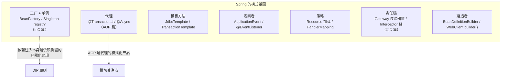

## 为什么要看框架里的模式

背 23 个模式没有意义，**在熟悉的框架里认出它们**才有——以下每个
模式都关联站内已有笔记，拼成一张"学过的都是模式"的地图。

## 看一个模式如何被框架化：给"代理"写一个微缩 Spring

与其背"AOP 用了代理模式"，不如亲手演示**框架如何把决策变成代理**。下面这段
就还原了 Spring 最核心的机制——**读注解 → 生成代理 → 调用兜底**：

```java
// 1. 一个"注解式"需求：方法上标了 @Retry 的方法失败时自动重试
@Retention(RetentionPolicy.RUNTIME)
@interface Retry { int times() default 3; }

// 2. 框架层：用 JDK 动态代理拦截被 @Retry 标注的调用
static Object wrap(Object target) {
    return Proxy.newProxyInstance(
        target.getClass().getClassLoader(),
        target.getClass().getInterfaces(),       // JDK 代理要求面向接口
        (proxy, method, args) -> {
            Retry r = method.getAnnotation(Retry.class);
            if (r == null) return method.invoke(target, args);  // 没标 → 直接调
            Throwable last = null;
            for (int i = 0; i < r.times(); i++) {
                try { return method.invoke(target, args); }     // 有标 → 重试兜底
                catch (Throwable e) { last = e; /* 进入下一轮重试 */ }
            }
            throw new RuntimeException("重试失败", last);
        });
}
```

把这段的 `@Retry` 换成 `@Transactional`、把"重试"换成"开启事务+回滚"，你就
得到了 Spring AOP 的骨架。**这正是它和"手动写 if/else"的区别**：业务方法不用
改一行，横切逻辑由代理在运行期注入——代理模式在这里被"框架化"成了生产力。

## JDK 现场速查

| 模式 | JDK 现场 | 一句话原理 |
|---|---|---|
| 迭代器 | `Iterable/Iterator`、for-each 语法糖 | 遍历协议与数据结构解耦 |
| 工厂 | `Calendar.getInstance()`、`List.of()` | 按参数/平台返回实现 |
| 适配器 | `Arrays.asList()`、`InputStreamReader` | 接口转换（数组→List、字节→字符） |
| 装饰器 | java.io 全家（BufferedReader 套娃） | 能力叠加不改接口 |
| 模板方法 | `HttpServlet.service()` 分派 doGet/doPost | 父类定骨架子类填空 |
| 策略 | `Comparator`（TreeMap/Stream.sort 注入） | 排序算法不动，比较规则注入 |
| 观察者 | `PropertyChangeListener` | 属性变化通知 |
| 原型 | `Object.clone()` / 拷贝构造 | 克隆代替重构造 |
| 单例 | `Runtime.getRuntime()` | 进程内唯一 |
| 状态 | `Thread.State`（线程状态机的语义载体） | 状态决定行为合法迁移 |
| 代理 | 动态代理 `Proxy`/`InvocationHandler`（反射篇） | 运行期生成代理类 |

## Spring 全家桶：模式的工业化



几个值得在面试里说出口的深度绑定：

1. **IoC 容器 = 工厂模式 + 单例管理 + 依赖倒置**：`getBean()` 是工厂
   方法；SingletonBeanRegistry 是单例池；而"面向接口 + 容器注入"就是
   依赖倒置的自动化——Spring 把 DIP 从"手工纪律"变成"框架默认"。

2. **AOP = 代理模式的框架化**：业务代码写注解（@Transactional），容器
   在 `postProcessAfterInitialization` 生成代理（AOP 篇的织入时机）——
   **动态代理是代理模式的运行期实现**。

3. **Bean 生命周期 = 模板方法**：`doCreateBean()` 定死"实例化 → 填充 →
   初始化 → 销毁"骨架，`BeanPostProcessor` 是扩展钩子——与 AQS 的
   `acquire + tryAcquire` 结构完全同构（**"骨架稳定 + 钩子开放"是所有
   优秀框架的共性**）。

4. **Spring 事件 = 观察者**：`ApplicationEventPublisher` +
   `@EventListener`（行为型篇的代码）——进程内解耦的官方姿势。

5. **Gateway 过滤器链 = 责任链**：`GatewayFilterChain.filter(exchange)`
   每个节点"处理 + 放行"（网关篇的 AuthGlobalFilter）——与 OkHttp
   Interceptor、Sentinel SlotChain 同构。

## 并发包里的模式

| 模式 | 并发现场 | 关联笔记 |
|---|---|---|
| 模板方法 | **AQS**：acquire 骨架 + tryAcquire 钩子 | AQS 篇 |
| 状态 | Thread 六状态、LockSupport 的 park/unpark | 线程基础篇 |
| 生产者消费者 | BlockingQueue（ArrayBlockingQueue 有界队列 = 削峰的进程内版） | MQ 篇（为何需要 MQ） |
| 策略 | ThreadPoolExecutor 的 4 种拒绝策略（CallerRuns/Abort/Discard...） | 线程池篇 |
| 装饰器 | Collections.synchronizedList 包装 List | ArrayList 篇 |
| 代理/委托 | ConcurrentHashMap 分段思路（1.7）与桶级委托（1.8） | CHM 篇 |

**线程池的拒绝策略是"策略模式"最短小精悍的现场**：池子的骨架逻辑
（提交 → 入队/建线程）不动，满了之后的行为由 RejectedExecutionHandler
这个策略接口决定，运行期可替换。

## 反模式：什么时候不该用模式

| 信号 | 说明 |
|---|---|
| 只有 3 个固定分支 | switch 足矣，上策略是过度设计 |
| 类只有一个实现且看不见第二个 | "未来可能换"不是抽象的理由（YAGNI） |
| 为了模式而模式 | 问不出"违反了哪条原则"就是不要用 |
| 一层代理套一层代理 | 装饰器过深 = 调试地狱（Java IO 就是反例之一） |

模式是**重复问题的重复解**——先有疼痛（if-else 膨胀、构造参数失控、
横切逻辑散落），再上对应的模式；疼痛不存在，模式就是负债。

## 小结

- JDK 看 io/集合/并发三件套，Spring 看 IoC/AOP/模板/事件四件套——
  认出它们，模式就从"背书"变成"视野"。
- 优秀框架共性：骨架稳定 + 钩子开放（模板方法）+ 依赖倒置 + 横切代理。
- 反模式清单收尾：模式的成本是间接性——没有疼痛就没有模式的入场券。
