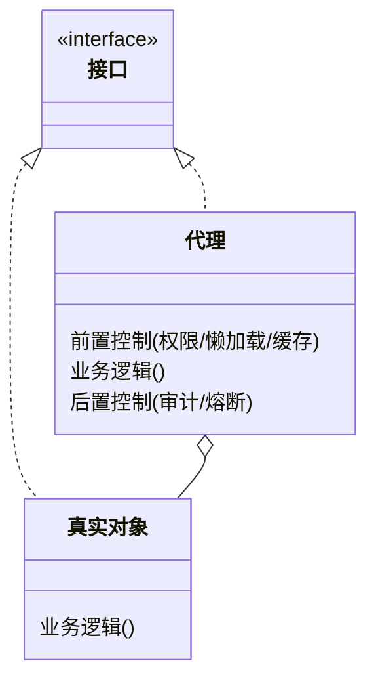

## 意图：不改变接口，控制"能不能访问、怎么访问"

代理三连问：**谁调（权限）、何时调（延迟加载）、怎么调（缓存/熔断/
日志）**——代理只做控制，一点业务不掺。掺了业务就是装饰器（分界见
装饰器篇）。

## 静态代理：先看清结构



```java
interface UserService { void save(); }

class UserServiceImpl implements UserService {
    public void save() { /* 真实逻辑 */ }
}

class UserServiceProxy implements UserService {
    private final UserService target;
    public void save() {
        checkPermission();               // 前置控制：访问权限
        target.save();
        recordAudit();                   // 后置控制：审计日志
    }
}
```

结构一目了然，但静态代理的死穴也在眼前：**给 20 个类加审计要写 20 个
代理类**——控制逻辑与目标方法一比一手工复制。动态代理解决的就是这个。

## JDK 动态代理：运行期生成代理类

```java
UserService proxy = (UserService) Proxy.newProxyInstance(
    target.getClass().getClassLoader(),
    target.getClass().getInterfaces(),  // 前提：面向接口
    (p, method, args) -> {  // 所有方法收敛到一个 InvocationHandler
        checkPermission();
        try {
            return method.invoke(target, args);
        } finally {
            recordAudit();
        }
    });
```

一比二十的问题被压扁成**一个 InvocationHandler**：方法级的控制逻辑
写一份，代理类本身由 JVM 在运行期生成（字节码结构见反射篇）。代价是
**只能代理接口**——`target` 不实现接口时，JDK 代理直接无能为力。

## CGLIB：子类化代理

```java
Enhancer enhancer = new Enhancer();
enhancer.setSuperclass(UserService.class);       // 生成子类
enhancer.setCallback((MethodInterceptor) (obj, method, args, proxy) -> {
    checkPermission();
    Object r = proxy.invokeSuper(obj, args);     // 走父类原实现
    recordAudit();
    return r;
});
UserService proxy = (UserService) enhancer.create();
```

| | JDK 动态代理 | CGLIB |
|---|---|---|
| 原理 | 实现同接口 | 生成子类覆写方法 |
| 要求 | 目标必须实现接口 | 类和方法不能是 `final` |
| 调用入口 | InvocationHandler | MethodInterceptor |

**Spring 的选择逻辑**：有接口默认走 JDK 代理；`proxyTargetClass=true`
或 Boot 2.x 起的默认配置走 CGLIB（让"注入具体类"不再报错）。日常
使用者可以不知道区别，但排查"AOP 没生效"时必须知道。

## 代理的四种形态

GoF 按用途把代理分成好几类，工程里常见的四种：

| 形态 | 控制什么 | 现场例子 |
|---|---|---|
| 保护代理 | 权限——能不能调 | 网关鉴权过滤器（网关篇） |
| 虚拟代理 | 时机——延迟到真需要 | Hibernate 实体懒加载（第一次访问属性才发 SQL） |
| 远程代理 | 位置——本地壳包装远程调用 | RPC stub、`@FeignClient` 接口 |
| 缓存代理 | 重复——命中缓存不落地 | MyBatis 二级缓存拦截器 |

## Spring AOP：代理模式的框架化

AOP 篇讲过织入时机：**容器在 Bean 初始化完成后
（`postProcessAfterInitialization`）判断有没有切点匹配，有就替换成
代理对象放进容器**。`@Transactional`、`@Async`、`@Cacheable` 全是
"注解声明需求 + 代理注入实现"。

由此推导出最经典的翻车现场——**自调用失效**：

```java
@Service
class OrderService {
    public void create() {
        this.doPay();                    // this 是原始对象，不走代理！
    }
    @Transactional
    public void doPay() { ... }          // 事务不生效
}
```

代理控制的是"从外部进入对象"的调用；对象内部 `this` 直达，代理拦
不住。解法：拆类、自注入，或 `AopContext.currentProxy()`。

## JDK 现场

| 现场 | 说明 |
|---|---|
| `Proxy` / `InvocationHandler` | JDK 动态代理本体（反射篇） |
| MyBatis Mapper 接口 | 没有实现类的接口——代理凭方法签名找 SQL |
| `@FeignClient` | 接口即 HTTP 客户端，远程代理 |
| `@Transactional` / `@Async` / `@Cacheable` | Spring AOP 代理三件套 |

## 小结

- 代理只控制不干活；静态代理看清结构，动态代理解决类爆炸。
- JDK 代理要求接口，CGLIB 靠子类——Spring 默认策略会换脸，排查
  AOP 失效先问"这次生成的是哪种代理"。
- 自调用失效的根因：代理拦的是入口，`this` 不经过代理。
- 框架里代理无处不在：Mapper、Feign、事务——认出"接口没有实现类
  却能跑"就是代理。
