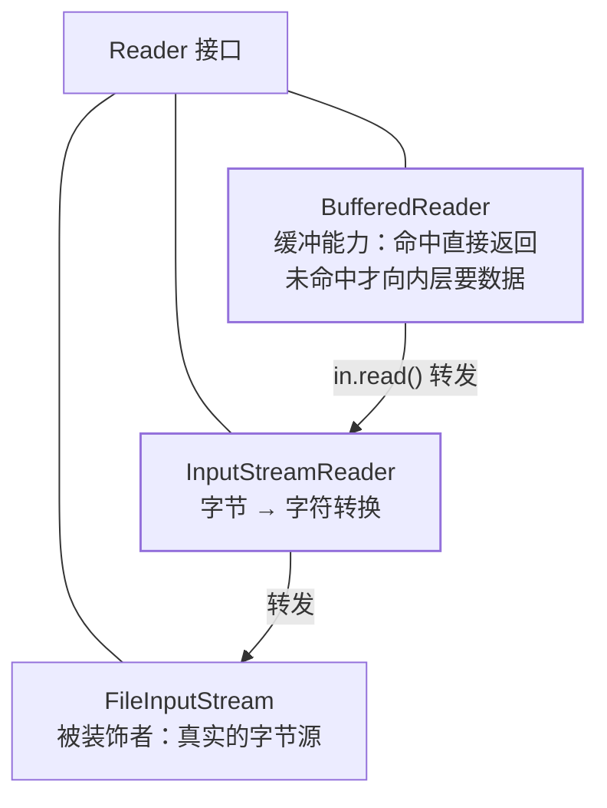

## 意图：不改变接口，动态叠加"能力"

装饰器要解决的痛点是**继承爆炸**：给"咖啡"加奶、加糖、加奶又加糖，
用继承要为每种组合建一个子类（n 个配料 = 2ⁿ 个类）；用装饰器，任意
组合都是**运行期把对象包一层**。

结构上它与代理一模一样（同接口 + 持有同接口引用 + 转发调用），**区别
只在意图**：装饰器给对象"穿衣服"增强能力，代理替对象"把门"控制
访问——GoF 原话的区分。

## 经典现场：Java IO 的俄罗斯套娃

```java
Reader r = new BufferedReader(          // 装饰：缓冲能力
          new InputStreamReader(         // 装饰：字节→字符转换
          new FileInputStream("a.txt"))); // 被装饰者：真实的字节源
```

拆开看每层都在干同一件事——**实现 `Reader` 接口，同时持有一个
`Reader`**，把不认识的调用转给内层，自己只附加一点能力：

```java
class BufferedReader extends Reader {
    private final Reader in;                    // 持有同接口引用
    public int read(char[] cbuf) {
        // 命中缓冲区 → 直接返回（新能力）
        // 未命中 → in.read(...) 装满缓冲区（转发）
    }
}
```

这就是装饰器全部的秘密：**每一层既是 Reader 又有 Reader**，能力像
洋葱一样一层层叠上去，而接口从头到尾没变。

IO 套娃的结构——每一层都实现同一接口、同时持有同接口引用：



## 自己写一个

```java
interface Pricer { double price(double base); }
class BasePricer implements Pricer { public double price(double b) { return b; } }

class DiscountDecorator implements Pricer {
    private final Pricer next; private final double rate;
    DiscountDecorator(Pricer next, double rate) { this.next = next; this.rate = rate; }
    public double price(double b) { return next.price(b) * rate; }
}

new DiscountDecorator(new DiscountDecorator(new BasePricer(), 0.8), 0.9)
    .price(100);  // 72：叠加顺序一目了然，且随时可换组合
```

对比继承方案：`EightyPercentOffPricer`、`NinetyPercentOffPricer`、
`TwoDiscountsPricer`……继承是**编译期写死的组合**，装饰器是**运行期
自由拼装**——这正是组合复用原则（principles 篇的第六条）的模范落地。

## JDK 现场

| 现场 | 叠加的能力 |
|---|---|
| `BufferedInputStream/Reader` | 缓冲 |
| `DataInputStream` | 按 Java 基本类型读 |
| `InputStreamReader` | 字节→字符转换（它同时是适配器——见适配器篇的套娃分析） |
| `Collections.synchronizedList(list)` | 给任意 List 加同步 |
| `Collections.unmodifiableList(list)` | 加"只读"约束 |

`Collections` 的两个包装尤其能说明意图：**同一个 List，想加什么包一层
就行**，`ArrayList` 的源码一个字不用改。

## 代价与边界

- **调试地狱**：IO 套娃报错时，栈里七八层 `read` 调用要一层层剥——
  框架模式地图篇的反模式清单专门点过它；
- **顺序敏感**：`new BufferedReader(new InputStreamReader(...))` 正确，
  反过来包语义就变了（装饰器不保证各层可交换）；
- 只有 2~3 种固定组合时，老老实实写子类比堆装饰器直白。

## 与代理的分界（高频面试题）

| | 代理 | 装饰器 |
|---|---|---|
| 意图 | **控制访问**（替真实对象把门） | **增强能力**（给对象穿衣服） |
| 关系 | 编译期就确定"我是他的代理" | 运行期任意叠加多层 |
| 感知 | 调用方往往不知道代理存在 | 调用方主动选择怎么包 |

结构全同、意图相反——回答"为什么用"时要说清这条线，而不是背
"都是持引用转发调用"。

## 小结

- 装饰器 = 同接口 + 持有同接口 + 转发 + 附带能力；Java IO 是教科书
  现场，`Collections.unmodifiableXxx` 是最短的现场。
- 它是"组合代替继承"的样板：继承组合数爆炸，装饰器运行期自由拼装。
- 与代理只差意图：穿衣服是装饰器，把门是代理。
