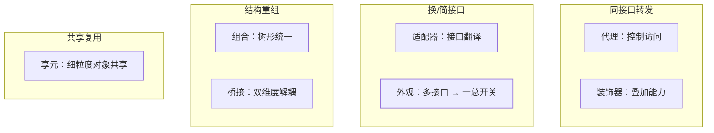
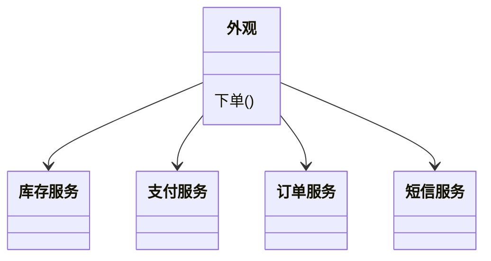
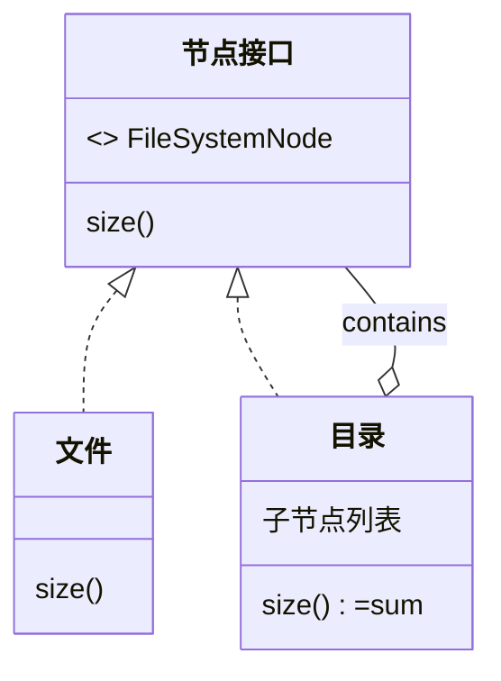

## 结构型的主题：组装

类怎么组合成更大的结构——核心张力永远是**接口兼容**与**职责附加**。

代理、装饰器、适配器三个高频模式已独立成篇，本篇收编剩下的四种。
先看八种结构型的全景分工：



## 外观（Facade）：给子系统一个总开关



```java
// 客户端不想认识 OrderService + StockService + PayService + SmsService
class OrderFacade {
    public void placeOrder(Order o) {
        stockService.lock(o);      // 子系统们
        payService.charge(o);
        orderService.create(o);
        smsService.notify(o);
    }
}
```

**外观 = 子系统的"前台"**：简化调用，但不阻止你绕过它深入子系统
（与代理的差别：代理控制访问，外观只是懒得让你全认识一遍）。Spring
里的 `JdbcTemplate`、`TransactionTemplate` 都是外观——把 JDBC 的
Connection/Statement/ResultSet 与事务边界封装成"一个方法"。

## 组合（Composite）：树形结构的统一

**叶子与容器实现同一接口**，递归处理整棵树：



```java
interface FileSystemNode { long size(); }
class File implements FileSystemNode {
    public long size() { return fileSize; }
}
class Directory implements FileSystemNode {
    private final List<FileSystemNode> children;
    public long size() { return children.stream().mapToLong(FileSystemNode::size).sum(); }
}
```

调用方无需区分"文件还是文件夹"——**前端组件树、菜单/权限树、
`Map` 里的递归组装**全是它。与装饰器的差异：装饰是"链"（一层包一层），
组合是"树"（一对多容纳）。

## 桥接（Bridge）：两个独立维度的解耦

**信号**：类名里出现两个变化维度的叉乘——`红色圆形`、`蓝色方形`、
`微信短信通知`、`邮件加急消息`——继承会把它们排成 m × n 矩阵。
桥接把两个维度拆到**组合的两边**：

```java
// 维度一：消息类型（继承侧）；维度二：发送渠道（组合侧）
interface Channel { void transmit(String content); }  // 短信/邮件/钉钉各一个实现

abstract class Message {  // 普通/加急各一个子类
    protected final Channel channel;  // 桥：组合注入
    protected Message(Channel channel) { this.channel = channel; }
    abstract String render();
    public final void send() { channel.transmit(render()); }
}

new UrgentMessage(new DingTalkChannel()).send();  // 2 × 3 = 6 组合只需 5 个类
```

桥接和策略结构相似，区别在**被组合的维度本身也常是多态体系的一部分**
——桥接通常拆的是"抽象与实现两条独立演化的线"。

**JDBC 是教科书现场**：`DriverManager`（抽象侧——应用只写 SQL）与
`Driver`（实现侧——MySQL/Oracle 各自的连接实现）被 Connection 这座
"桥"连起来，应用代码与数据库驱动互不牵连——换数据库不改 SQL 层。

## 享元（Flyweight）：共享细粒度对象

**意图：重复对象只建一份，共享使用**——省内存的本质是**把状态拆成
内部（可共享）与外部（调用时传入）**：

```java
// 五子棋：棋盘 400 个位置只有两种棋子
// 内部状态：颜色（共享）；外部状态：坐标（每次传入）
class Piece { private final Color color; }  // 内部——共享
Map<Color, Piece> pool = Map.of(BLACK, new Piece(BLACK), WHITE, new Piece(WHITE));
// place(x, y, color) → 查池，坐标作为参数走，不进对象
```

JDK 现场：

| 现场 | 共享了什么 |
|---|---|
| `Integer.valueOf(-128~127)` / `Boolean.valueOf` | 小整数、布尔的缓存池 |
| String 常量池（string 篇） | 字面量对象全局共享 |
| `Long.valueOf` 的 CachedArchives | 常用区间 Long 复用 |

享元的适用前提很苛刻：**对象足够多、足够重复、内部状态天然不变**。
线程池的"池化"常被误认成享元——池化复用的是**昂贵资源的占用权**
（用完归还），享元复用的是**对象本身**（大家共用同一个），别混。

## 小结

- 外观管简化（多接口→一个入口）、组合管树形（叶子容器同接口）。
- 桥接拆双维度：类名出现"××××"叉乘就是信号；JDBC 是必记现场。
- 享元省内存靠状态拆分：内部共享、外部传参；`Integer.valueOf` 与
  String 常量池是最短现场。
- 八种结构型的记忆锚点：代理把门、装饰穿衣、适配翻译、外观开门、
  组合组树、桥接架桥、享元共享。
