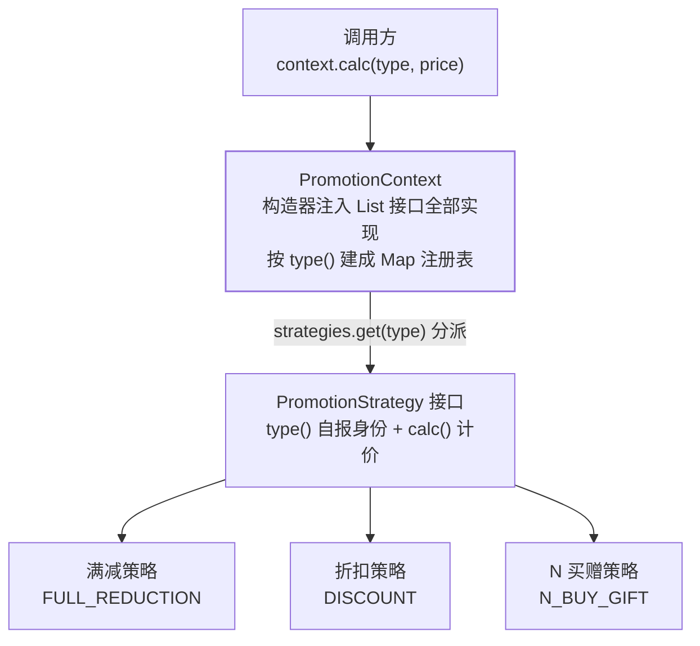

## 意图：把"一组可互相替换的算法"各自封装

策略消灭的是**同一位置不断膨胀的分支**——按类型分派行为，每加一种
类型改一处：

```java
// 重灾区：按类型分派行为，还不断膨胀
double calc(String type, double price) {
    if (type.equals("FULL_REDUCTION")) return fullReduction(price);
    if (type.equals("DISCOUNT")) return discount(price);
    if (type.equals("N_BUY_GIFT")) return nBuyGift(price);   // 每加活动改这里
    return price;
}
```

这段代码的病根：**calc 方法同时知道"所有策略的存在"**。策略模式把
每种算法收进各自的类，分派交给一个只认识接口的上下文。

## 正规解法：Spring 容器天然是策略注册器

```java
public interface PromotionStrategy {
    String type();  // 策略自报身份
    double calc(double price);
}

@Component
class FullReductionStrategy implements PromotionStrategy {
    public String type() { return "FULL_REDUCTION"; }
    public double calc(double price) {
        return price > 100 ? price - 20 : price;
    }
}

@Component
public class PromotionContext {
    private final Map<String, PromotionStrategy> strategies;

    // Spring 注入所有实现
    public PromotionContext(List<PromotionStrategy> list) {
        this.strategies = list.stream()
            .collect(toMap(PromotionStrategy::type, s -> s));
    }

    public double calc(String type, double price) {
        return strategies.get(type).calc(price);  // 新活动 = 新类，零修改
    }
}
```

这一段值得背下来：**构造器注入 `List<接口>` → 按 type() 建 Map**，
三行完成"策略注册"，开闭原则（principles 篇）直接兑现——新增策略
只是加一个 `@Component` 类，Context 一行不改。

结构与分派路径——calc 方法不再认识任何具体策略：



## JDK 现场

| 现场 | 策略是什么 |
|---|---|
| `Comparator` | 排序骨架不动（`Collections.sort`），比较规则注入（`Comparator.comparing(User::getAge)`） |
| 线程池拒绝策略 | `RejectedExecutionHandler` 四选一：CallerRuns/Abort/Discard/DiscardOldest——**最短小精悍的现场** |
| `ThreadPoolExecutor` 的时间等待 | `TimeUnit` 枚举本身就是策略族 |
| `Lambda` / 方法引用 | `Runnable`、`Function` 都是策略接口，lambda 是匿名策略的语法糖 |

线程池的拒绝策略值得展开一句：池子的骨架逻辑（提交 → 入队/建线程）
不动，满了之后的行为由策略接口决定，**运行期可替换**
（`setRejectedExecutionHandler`）——线程池篇的四个策略名字就是这
模式的四个子类。

## 函数式时代的瘦身

一个接口、一个方法的策略，没必要建类：

```java
// 以前：每次新建一个类实现 Comparator
// 现在：
list.sort(comparing(User::getAge).thenComparing(User::getName));
executor.setRejectedExecutionHandler(new ThreadPoolExecutor.CallerRunsPolicy());
Runnable task = () -> sendEmail(order);      // lambda 即策略实例
```

**"行为参数化"（Effective Java / Java 8 函数式篇的说法）就是策略
模式的日常形态**——当策略无状态且只有一个方法时，写 lambda；策略
有状态、有多个协作方法、要被 Spring 管理时，才写类。

## 何时不要上策略

消灭 switch 的代价是类的数量上升——**分支稳定（3 个固定分支）用
switch 没毛病；分支不断膨胀才值得上策略**。判断信号见框架模式地图篇
的反模式清单：为未来可能出现的变化预先抽象，是负债不是投资。

## 与状态模式的分界

结构与状态模式完全同构（接口 + 一组实现 + 上下文持有），区别在
**谁决定用哪个**：

- **策略**：调用方/外部条件选一个，选中后不自己换——`strategies.get(type)`；
- **状态**：对象按迁移规则自己流转——订单对象 UNPAID → PAID →
  SHIPPED（行为型其余篇的订单状态机）。

## 小结

- 策略消灭膨胀的分支；Spring 容器就是最好的策略注册表
  （`List<接口>` → Map 三行搞定）。
- `Comparator`、拒绝策略、lambda 全是它的现场——认出"骨架不动、
  规则注入"就是策略。
- 分支稳定别上策略；与状态模式只差"谁决定切换"。
