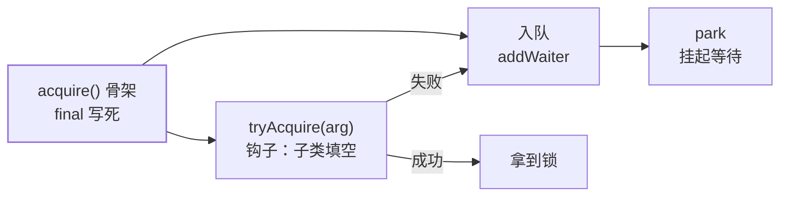

## 意图：骨架写死，变化点留钩子

流程步骤固定、个别步骤因场景而变——把不变的流程钉死在父类，把变化
点抽象成钩子方法让子类填空。它解决的是**"重复的流程编排"**：五个
子类各写一遍"取连接 → 执行 → 释放"是复制粘贴，模板方法把编排收走。

## 最小示例

```java
abstract class AbstractGame {
    // 骨架：final 防子类改变流程
    public final void play() {
        initialize();
        startPlay();  // 变化点：钩子方法
        endPlay();
    }
    protected void initialize() { System.out.println("初始化"); }  // 公共实现
    protected abstract void startPlay();  // 子类填空
}
class Cricket extends AbstractGame {
    protected void startPlay() { /* 板球开局 */ }
}
class Football extends AbstractGame {
    protected void startPlay() { /* 足球开局 */ }
}
```

两个细节是面试考点：**骨架方法加 `final`**（子类不许改流程，只能填
空），**钩子方法用 `protected`**（扩展点是给子类的，不是给调用方的）。

## 教科书现场：AQS

AQS 是模板方法在 JUC 里的巅峰之作（AQS 篇讲过实现，这里看模式视角）：



```java
// AQS 只发布这一个 public 方法——流程编排写死
public final void acquire(int arg) {
    if (!tryAcquire(arg) &&                 // 钩子：怎么才算"获取成功"？
        acquireQueued(addWaiter(Node.EXCLUSIVE), arg))
        selfInterrupt();
}
// tryAcquire 默认直接抛异常——AQS 不知道语义，留给子类：
// ReentrantLock 填"state 0→1 或重入"，Semaphore 填"state-1 后 ≥ 0"
```

**`acquire()` 骨架写死（tryAcquire → 入队 → park），`tryAcquire/
tryRelease` 留给 ReentrantLock/Semaphore/CountDownLatch 填空**——
 Doug Lea 用一个骨架长出了整个并发工具家族。这是"骨架稳定 + 钩子
开放"最极端的成功案例。

## JDK / Spring 现场速查

| 现场 | 骨架 | 钩子 |
|---|---|---|
| `HttpServlet` | `service()` 分派 GET/POST | `doGet`/`doPost` |
| `AbstractList` | 迭代逻辑写死 | `get(int)` / `size()` |
| `Thread` | `start()` 的启动编排 | `run()` |
| Spring `doCreateBean()` | 实例化 → 填充 → 初始化（IoC 篇） | `BeanPostProcessor` 前后钩子 |
| `WebMvcConfigurer` | SpringMVC 默认配置骨架 | 你覆写的回调方法 |

## 函数式进化：模板 + 回调

继承填空有个代价——**每变一次填空就要一个子类**。Spring 的
`JdbcTemplate` 把变化点从"继承钩子"改成了"回调参数"：

```java
jdbcTemplate.query("SELECT * FROM t WHERE id = ?",
    (rs, rowNum) -> new User(rs.getLong("id"), rs.getString("name")));
// 连接获取/异常翻译/资源释放是骨架（模板）
// RowMapper 回调是变化点——lambda 直接填空，不需要子类
```

**"模板 + 回调"是模板方法在函数式时代的进化形态**：继承被组合替代，
钩子方法被 lambda 替代，骨架从父类搬进了调用方持有的模板类。判断
变体只需一句——**填空的语法是"子类覆写"还是"传一段代码"**。

## 与策略模式的分界

两者都在"固定流程中留变化点"，区别在变化点的**粒度与归属**：

- **模板方法**：变的是流程中的某一步，流程本身共享——AQS 的入队/
  挂起不因工具而变；
- **策略**：变的是整个算法，调用方随时整体替换——拒绝策略四选一。

## 小结

- 骨架 final、钩子 protected；"骨架稳定 + 钩子开放"是所有优秀框架
  的共性（IoC 篇的 Bean 生命周期同构）。
- AQS 是继承填空的教科书，JdbcTemplate 是回调填空的进化版。
- 与策略的边界：变一步是模板，变全套是策略。
