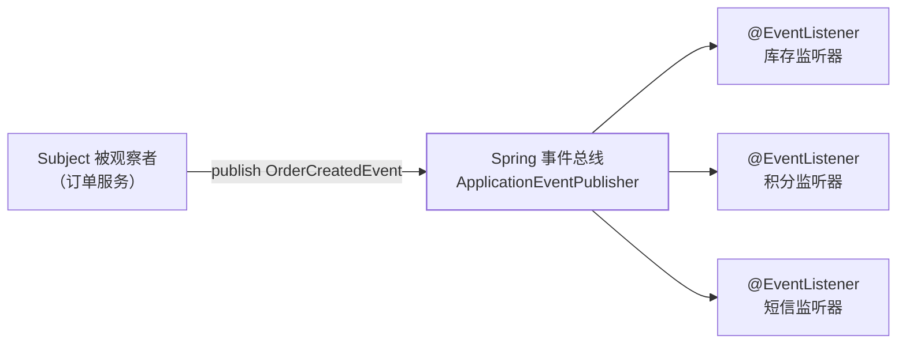

## 意图：业务事实一发生，关心者自己来听

订单创建后要扣库存、加积分、发短信——写在 `createOrder()` 里，
每加一个下游改一次主流程。观察者把"发生了什么"（事件）与"谁关心"
（监听器）解耦：**发布方只广播业务事实，订阅方各自认领**。



## Spring 事件：进程内的官方姿势

```java
// 事件：业务事实的载体（POJO 即可）
public record OrderCreatedEvent(Long orderId) {}

// 发布方：只关心业务事实，不关心谁听
publisher.publishEvent(new OrderCreatedEvent(orderId));

// 订阅方：各自独立，新增订阅零改动发布方
@EventListener
public void onOrderCreated(OrderCreatedEvent event) { deductStock(event); }

@EventListener
@Async                                   // 异步不阻塞主链路（MQ 篇的削峰思想）
public void onOrderCreatedForPoints(OrderCreatedEvent event) { addPoints(event); }
```

三个工程要点：

1. **事件设计成"已发生的过去式"**（OrderCreated 而非 CreateOrder）
   ——监听器是在**响应事实**，不是被调用去做事；
2. **默认同步**：`@EventListener` 就在发布线程里执行，主链路耗时 =
   所有监听器耗时之和——要异步必须自己加 `@Async`（并配好线程池，
   线程池篇）；
3. **一个监听器抛异常，整条同步链中断**——同步事件里监听器与发布方
   是同一个事务、同一条命。

## 最大的坑：事务边界

```java
@Transactional
public void createOrder(Order o) {
    orderRepository.save(o);
    publisher.publishEvent(new OrderCreatedEvent(o.getId()));
    // 若后面回滚，同步监听器已经扣了库存——数据不一致！
}
```

```java
// 解法：等事务真正提交后再触发
@TransactionalEventListener(phase = TransactionPhase.AFTER_COMMIT)
public void onOrderCreated(OrderCreatedEvent event) { deductStock(event); }
```

`@TransactionalEventListener` vs `@EventListener` 的区别就是这条线：
**前者在事务提交后才触发**（否则监听器看到的可能是还没提交、甚至最终
回滚的数据）。事件风暴前先想清楚"读一致性要求"。

## JDK 的历史现场

- `java.util.Observable/Observer`：最早的内置观察者，**JDK 9 起废弃**
  （同步通知、不可靠的 setChanged 顺序、Observer 不是接口）——面试
  提到它要知道"过时了"；
- `PropertyChangeListener`：JavaBean 时代的属性变化通知，仍在用；
- Guava `EventBus`：进程内事件总线的第三方实现，Spring 事件出现后
  用得少了。

## 与 MQ 的分界

| | Spring 事件 | MQ（MQ 篇） |
|---|---|---|
| 进程边界 | 单进程内 | 跨进程、跨语言 |
| 可靠性 | 进程挂了事件就没了 | 持久化、重试、死信 |
| 削峰 | 无（同步）或线程池背压 | 天然削峰 |
| 适用 | 模块解耦、事务后钩子 | 服务间解耦、异步最终一致 |

**进程内上 MQ 是杀鸡用牛刀，跨进程用事件总线是没的放矢**——解耦的
层次要对齐进程边界。

## 什么时候别用

事件流滥用会让主流程"散装"：一次下单涉及 10 个事件监听器，排查
"库存为什么没扣"要从事件链里考古。**核心主链路（下单必扣库存）留在
方法调用里，旁路动作（通知、积分、埋点）才交给事件**。

## 小结

- 发布方说事实、订阅方认领——开闭原则在事件维度的兑现。
- `@EventListener` 默认同步同命；跨事务的读一致性交给
  `@TransactionalEventListener(AFTER_COMMIT)`。
- 与 MQ 分界：进程内解耦用事件，跨进程解耦用 MQ。
- 主链路直调、旁路上事件——别让业务流程变成事件考古现场。
