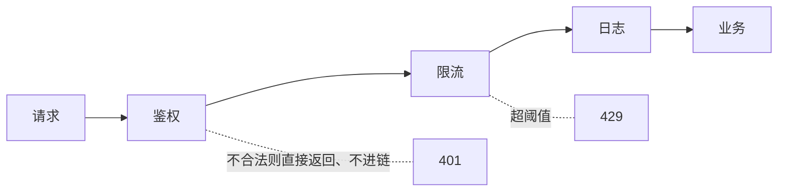

## 意图：请求沿着处理者队列一站站走，各站自己决定处理或放行

鉴权、限流、日志、编码……横切处理逻辑每个请求都要过，但组合顺序
因场景而异。责任链把每个处理逻辑做成链上的一站，**新增/调整处理
= 改链的装配，不改处理逻辑本身**。

```java
public interface Filter {
    void doFilter(Request req, Response res, FilterChain chain);   // 自己处理后调链
}
```

**链上每个节点自己决定"处理 + 放行"还是"拦截 + 返回"**——这就是
与"管道"类模式的分水岭：控制权在节点手里。



## 五大框架现场（同构验证）

| 框架 | 链的形态 | 关键细节 |
|---|---|---|
| **Servlet Filter** | 编码 → 鉴权 → 日志 → 放行 Controller | `FilterChain.doFilter` 放行 |
| **Spring Cloud Gateway** | pre 沿链进、post 沿链回（双向） | 网关篇的 `exchange.getResponse().setComplete()` 是"拦截不放行" |
| **Netty pipeline** | 入站 handler 顺序、出站 handler 逆序 | 事件在链上流动，方向相反 |
| **Sentinel ProcessorSlotChain** | 统计 → 限流 → 熔断（熔断篇） | slot 顺序固定，各司其职 |
| **OkHttp Interceptor** | 重试 → 缓存 → Bridge → 真实网络 | 递归调用栈，天然支持改写请求/响应 |

五个现场长在同一副骨架上：**节点实现统一接口 + 有一个"链"对象负责
传递 + 节点决定放行或拦截**。认出这副骨架，任何一个框架的责任链都
能十分钟上手。

## 双向链：pre 与 post 的不对称

Gateway/OkHttp 的链比 Servlet 多一层玩法——**`chain.filter(exchange)`
前后的代码分属两个阶段**：

```java
public Mono<Void> filter(ServerWebExchange exchange, GatewayFilterChain chain) {
    // pre：请求进来，正着走（鉴权、加头）
    long start = System.currentTimeMillis();
    return chain.filter(exchange).then(Mono.fromRunnable(() -> {
        // post：响应回来，倒着走（记录耗时、改响应头）
        log.info("耗时 {}ms", System.currentTimeMillis() - start);
    }));
}
```

后写的 post 逻辑先执行——**栈式回溯**。理解了"递归进、逆序出"，
Netty 的出站事件逆序、OkHttp 的响应回传就都通了。

## 装配责任链的两种工程形态

1. **约定顺序**：Servlet 容器按 `web.xml`/`@Order` 装配，运行期不可改；
2. **注册中心**：像 Sentinel 一样在初始化时按 slot 顺序拼链，
   或像规则引擎一样动态增删节点。

```java
// 手动装配的样子（理解用，框架里都是容器/构建器代劳）
var chain = new DefaultFilterChain(
    new AuthFilter(),
    new RateLimitFilter(),
    new LoggingFilter());
```

## 何时别用责任链

- 处理步骤**必须全走**且顺序固定（纯管道）：直接顺序调用更直白；
- 链上节点**有状态依赖**（上一站的输出是下一站的必需要素）：说明
  不是"各管一段"，硬拆成链会造出隐式耦合；
- 超过 10 个节点还不分层：链本身会变成新的面条。

## 与观察者的分界

两者都做"解耦"，观察者是**广播**（一个事实，N 个监听器各自独立响应，
互不知晓），责任链是**接力**（一个请求，沿固定顺序一站站走，有拦截
语义）。"要不要走完"是这条分界线的试金石。

## 小结

- 骨架三件套：统一接口 + 链对象 + 节点自决；五框架现场同构。
- 双向链的 pre/post 是"递归进、逆序出"——Gateway、Netty、OkHttp
  通用。
- 观察者广播、责任链接力；核心主链路别硬拆链。
