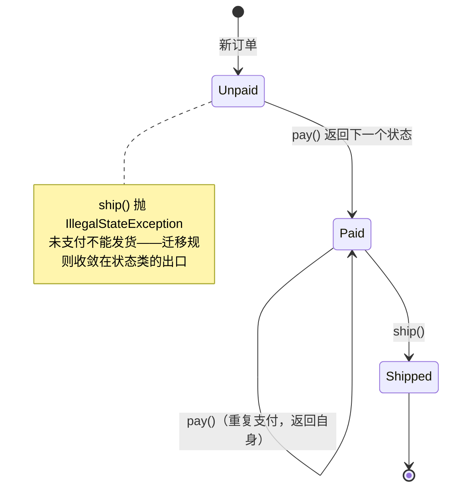

## 行为型的第二梯队

策略、模板方法、观察者、责任链四个高频模式已独立成篇，本篇收编
行为型的另外四员——它们出场率略低，但各自背着一个独特的思想：
**状态管迁移、迭代器管协议、命令管对象化、备忘录管快照**。

## 状态（State）：行为随状态流转

订单状态散落 `if(status == PAID)` 是第一现场；状态模式把**每个状态
的行为收进一个类**，迁移规则收敛到一个出口：

```java
interface OrderState {
    OrderState pay();  // 返回下一个状态——迁移规则写在这里
    OrderState ship();
}
class Unpaid implements OrderState {
    public OrderState pay()  { return new Paid(); }  // 合法迁移
    public OrderState ship() {
        throw new IllegalStateException("未支付不能发货");
    }
}
class Paid implements OrderState {
    public OrderState pay()  { return this; }
    public OrderState ship() { return new Shipped(); }
}

class Order {
    private OrderState state = new Unpaid();  // 当前状态可整体替换
    public void pay()  { state = state.pay(); }
    public void ship() { state = state.ship(); }
}
```

这套状态类的迁移图——非法迁移直接拦在状态类里：



与策略结构完全同构（接口 + 一组实现 + 上下文持有），**分界在谁决定
切换**：策略由调用方选、选完不自换；状态由迁移规则自己流转。
`Thread.State` 六状态机（线程基础篇）是 JDK 里的语义现场；工程上
状态多、迁移复杂时直接上 Spring Statemachine，别手搓。

## 迭代器（Iterator）：遍历协议与数据结构解耦

`hasNext/next` 把"怎么走"从"怎么存"里剥出来——for-each 的语法糖
就建在它上面：

```java
for (User u : users) { ... }
// 编译器展开：Iterator<User> it = users.iterator(); while (it.hasNext()) ...
```

真正的考点藏在**fail-fast**：`ArrayList` 内部维护 `modCount`，迭代器
创建时记住它，每次 `next()` 校验——遍历途中被 `add/remove` 改了结构，
立刻抛 `ConcurrentModificationException`：

```java
for (User u : users) {
    if (u.isDead()) users.remove(u);      // 抛 CME！结构改动绕过了迭代器
}
users.removeIf(User::isDead);              // 正解①：集合自带的批量删除
Iterator<User> it = users.iterator();      // 正解②：走迭代器自己的 remove
while (it.hasNext()) { if (it.next().isDead()) it.remove(); }
```

fail-fast 是**尽力而为的 early-warning**（没有并发保证，并发场景还是
ConcurrentHashMap/CopyOnWriteArrayList），但"为什么单线程也会 CME"
是高频面试题。

## 命令（Command）：把"请求"封装成对象

请求一旦变成对象，就能**排队、记录、撤销、重放**：

```java
interface Command { void execute(); }

// 你每天都在提交命令而不自知：
executor.submit(() -> sendEmail(order));      // Runnable/Callable 就是命令接口
                                              // 线程池 = 命令的排队器
```

命令模式的核心收益清单：

| 需求 | 命令对象化后怎么做 |
|---|---|
| 异步执行 | 命令进队列，另一个线程消费（线程池、MQ 消息本质是命令的序列化形态） |
| 撤销/重做 | execute 之外再定义 undo，历史命令入栈 |
| 审计/重放 | 命令日志落盘，重放即重算（事件溯源 Event Sourcing 的前身） |
| 宏组合 | 一组命令合成一个宏命令 |

"请求 = 对象"这个思想比模式的写法更重要——**MQ 消息、定时任务的
Job、撤销栈，全是命令对象化的现场**。

## 备忘录（Memento）：快照与恢复

**在不破坏封装的前提下，捕获对象状态并支持回滚**：

```java
// 状态载体只暴露快照，不暴露内部结构
class Editor {
    record Snapshot(String text, int cursor) {}        // 不可变快照
    public Snapshot save() { return new Snapshot(text, cursor); }
    public void restore(Snapshot s) { text = s.text(); cursor = s.cursor(); }
}
```

工程上它很少以教科书形态出现，但思想无处不在：

- **数据库 undo log**（事务篇）：回滚就是恢复快照；
- **JVM 保存点/checkpoint、虚拟线程挂起恢复**：状态快照的另一形态；
- Java 里最省事的实现是**序列化 round-trip**（原型篇的深拷贝同一招）
  ——快照即深拷贝的别名。

注意边界：快照大（大对象全量复制）时，备忘录的存储成本要算清——
工程里常改成"记录操作而非状态"（把备忘录换成命令 + undo）。

## 小结

- 状态与策略同构不同权：迁移规则自己换的是状态。
- fail-fast 靠 modCount，遍历中改集合必用 `removeIf` 或迭代器 remove。
- 命令的价值在"请求对象化"之后的一切：队列、撤销、重放。
- 备忘录是封装良好的快照；快照太贵就改记操作（命令 + undo）。
