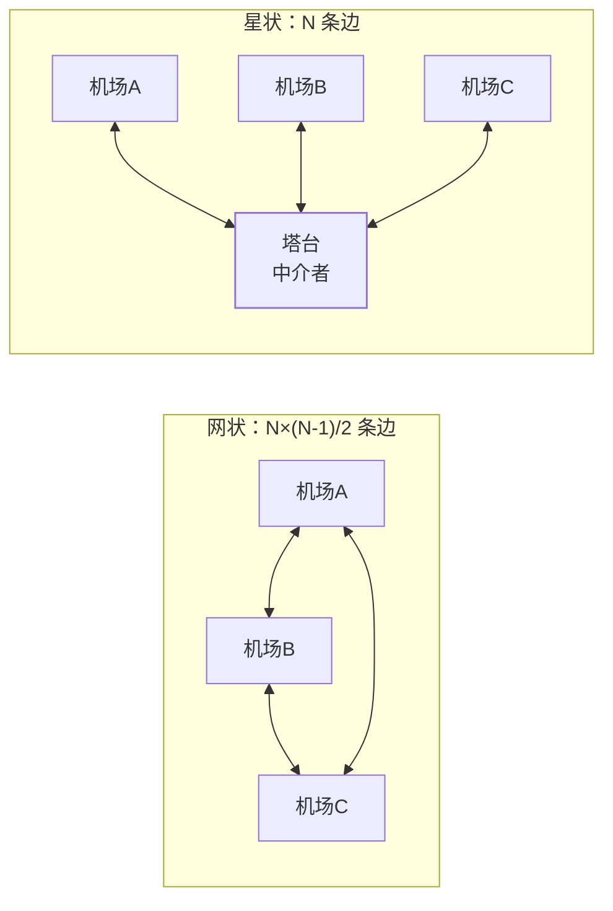

## 为什么低频也要认识它们

这三个是 23 个模式里出场率垫底的，但各自背着一个**别处学不到的
思想**：访问者教**双分派**，中介者教**网状收敛星状**，解释器教
**语言的骨架**。面试冷门，思想通吃。

## 访问者（Visitor）：结构稳定，操作多变

一批对象结构固定（编译器 AST、文件树），操作却不断新增（打印/统计/
优化/压缩）——把操作塞进每个类是灾难（加一个操作改 N 个类），访问者
把操作外置：

```java
interface Shape {
    <R> R accept(ShapeVisitor<R> v);      // 每个类只有一行固定代码
}
class Circle implements Shape {
    public <R> R accept(ShapeVisitor<R> v) { return v.visit(this); }
}
interface ShapeVisitor<R> {               // 新操作 = 新的访问者实现
    R visit(Circle c);
    R visit(Rect r);
}
double area = shape.accept(new AreaVisitor());      // 求面积
String json  = shape.accept(new JsonVisitor());     // 导出 JSON——零改类
```

关键机制是**双分派**：第一次 `accept` 按对象实际类型分派，第二次
`visit` 按访问者重载分派——**两次分派叠加，让"操作"绕过 Java 单分派
的限制**（normal 方法调用只按接收者分派）。

Java 现场：`Files.walkFileTree`（`FileVisitor` 四个钩子遍历文件树）、
ASM 字节码框架的 `ClassVisitor/MethodVisitor`（JIT 篇的分析工具全靠
它）、注解处理器的 ElementVisitor——**全是"稳定结构 + 多变操作"**。

局限也要背：结构一加新类型（新加一种 Shape），所有访问者都要加
方法——**它赌的是结构不变、操作常变**，赌反了就是灾难。

## 中介者（Mediator）：网状交互收敛为星状

N 个同事对象互相调用，连线是 N×(N-1)/2 条——重构一次全线崩。中介者
把**所有交互收敛到中心**：



```java
// 塔台不载客不飞行，只做"调度协调"
class TowerMediator {
    public void requestLanding(Flight f) {
        if (runwayBusy) queue.offer(f);      // 协调：谁先谁后
        else { runwayBusy = true; f.clearToLand(); }
    }
}
```

Java 现场的精髓在于**很多中介者长得不像"类"**：

| 现场 | 中介者 | 网状被收敛成 |
|---|---|---|
| 线程池 | 任务队列 | 线程不互相通信，全部通过队列 |
| MVC | Controller | View 之间不直连 |
| AQS | 同步器状态 state + CLH 队列 | 线程间不直接等待/唤醒彼此 |
| 网关 | API Gateway | 服务之间不互知地址 |

判断信号：**一群对象如果两两通信才健康，就该请中介者**——代价是
中介者本身会膨胀成上帝类，它适合"协调逻辑简单、交互数量爆炸"的
场景。

## 解释器（Interpreter）：语言的骨架

给一门小语言定义文法，每个文法规则一个类，解释执行。它是 23 个模式
里最冷门的一个，工程上**几乎总是用解析库代替手搓**（手写 AST 的
成本与坑都太多），但必须认识它的两个现场：

- `Pattern.compile("\\d+").matcher(s)`——正则就是一门小语言，Pattern
  是编译后的解释器；
- SpEL/OGNL 表达式、SQL 的 WHERE 片段解析、规则引擎的条件表达式
  ——**"文法 → AST → 求值"的流水线都是它的思想**。

一句忠告：识别需求时用它的思想（"这是个 DSL，值得定义文法"），
落地时用库（Antlr、SpELParser），不手写。

## 小结

- 访问者赌"结构稳、操作多变"，核心是双分派；结构常变就别用。
- 中介者把 N² 交互收敛成 N：队列、塔台、网关都是它的变体。
- 解释器认识思想就够：文法 → AST → 求值，落地交给解析库。
- 低频模式的正确打开方式：背思想、认现场、不硬用。
