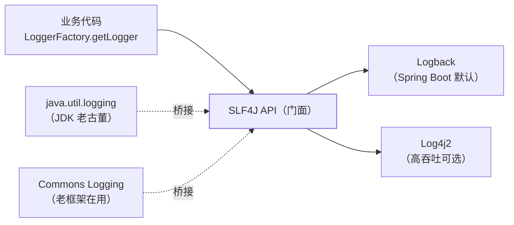

## 门面与实现：两套 jar 的分工

日志领域的第一性认知：**门面（API）和实现是分开的**。代码只面向
门面写，实现随时可换——SLF4J 是事实上的门面标准，Logback/Log4j2
是实现：



- **绑定**：slf4j-api 找实现靠 classpath——引入 `logback-classic`
  即绑 Logback，引入 `log4j-slf4j2-impl` 即绑 Log4j2。
- **桥接**：老框架内部直接用 JUL/JCL/log4j 1.x，桥接包
  （`jcl-over-slf4j`、`log4j-to-slf4j`）把它们重定向到 SLF4J，
  最终统一从一个出口输出。

### 依赖冲突的典型症状

classpath 上同时出现两个实现 → 启动打出一行
`SLF4J: Class path contains multiple SLF4J bindings`（实际谁生效看
加载顺序，等于薛定谔的日志）；一个实现都没有 → 所有日志进
`NOPLogger`，静默丢弃。排查口诀：`mvn dependency:tree | grep -i log`，
把多余的桥接/实现 exclude 掉，**门面留一个、实现留一个、桥接按需**。

## Spring Boot 的日志默认与配置

Boot 自带 `slf4j-api + logback-classic`（spring-boot-starter-logging），
开箱零配置。简单定制用 application.yml：

```yaml
logging:
  level:
    root: INFO
    com.demo.service: DEBUG          # 按包调级
  file:
    name: logs/app.log
```

要滚动策略、分文件、按 profile 区分，就上 `logback-spring.xml`
（放 resources 下，Boot 会读取；`<springProfile>` 标签是它比原生
logback.xml 多出的能力）：

```xml
<configuration>
  <appender name="FILE" class="ch.qos.logback.core.rolling.RollingFileAppender">
    <file>logs/app.log</file>
    <rollingPolicy class="ch.qos.logback.core.rolling.SizeAndTimeBasedRollingPolicy">
      <fileNamePattern>logs/app.%d{yyyy-MM-dd}.%i.log.gz</fileNamePattern>
      <maxFileSize>100MB</maxFileSize>
      <maxHistory>30</maxHistory>
    </rollingPolicy>
    <encoder><pattern>%d{HH:mm:ss.SSS} [%thread] %-5level %logger{36} [%X{traceId}] - %msg%n</pattern></encoder>
  </appender>
  <root level="INFO"><appender-ref ref="FILE"/></root>
</configuration>
```

pattern 里的 `%X{traceId}` 是本篇第二个主角——MDC。

## MDC：traceId 贯穿一条请求

多线程日志交错时，只有知道"哪些行属于同一请求"才能排查。MDC
（Mapped Diagnostic Context）是 ThreadLocal 的日志版：入口处 put，
整个调用链的每行日志自动带上：

```java
public class TraceIdFilter implements Filter {
    public void doFilter(ServletRequest req, ServletResponse res, FilterChain chain)
            throws IOException, ServletException {
        String traceId = UUID.randomUUID().toString();
        MDC.put("traceId", traceId);
        try {
            chain.doFilter(req, res);
        } finally {
            MDC.remove("traceId");  // 线程复用，必须清！
        }
    }
}
```

两个要点：**finally 里 remove**（Tomcat 线程池线程复用，不清会串到
下一个请求）；**跨线程要透传**——@Async、线程池里异步任务默认拿不到
父线程的 MDC，需要装饰器（`TaskDecorator`）复制上下文（线程池语境见
[线程池详解](/java/intermediate/concurrent/02-thread-pool/)）。挂在
[Filter 层](/java/intermediate/spring-mvc/01-springmvc-flow/)是通用位置，
下游 RPC 的 traceId 传递由链路追踪组件（Sleuth/Micrometer Tracing）接管。

## 占位符与异步日志

- **永远用 `{}` 占位符，不用字符串拼接**：
  `log.debug("order: {}", id)` 在 DEBUG 关闭时连字符串都不拼；拼接版
  白白付出一次拼接成本，高频路径肉眼可见。
- **异步日志**：磁盘 IO 慢，同步 appender 会拖住业务线程。
  Logback 用 `AsyncAppender`（队列缓冲）；Log4j2 的异步 Logger 走
  LMAX Disruptor 无锁环形队列，吞吐高一个量级——高并发服务的标配。
  代价是进程崩溃时队列里未刷盘的日志会丢。

## 级别与动态调整

Logger 按名分层级继承：`com.demo` 的配置覆盖 root，未命中的逐级上溯。
线上临时开 DEBUG 不用重启——Logback 配置 `scan="true"` 定期热加载，
或 Spring Boot Actuator 的 `/actuator/loggers/com.demo`（POST level）
实时改级——排查完记得改回去，全量 DEBUG 是磁盘杀手。

## 小结

- 门面（SLF4J）与实现（Logback/Log4j2）分离，桥接包收编老日志
  框架；Multiple bindings 警告 = 实现不唯一，NOP 输出 = 没有实现。
- MDC 靠 ThreadLocal 携带 traceId：入口 put、finally remove、
  异步线程用 TaskDecorator 透传。
- 占位符代替拼接，高并发上异步 appender；线上调级走 Actuator
  或热加载，别重启。
