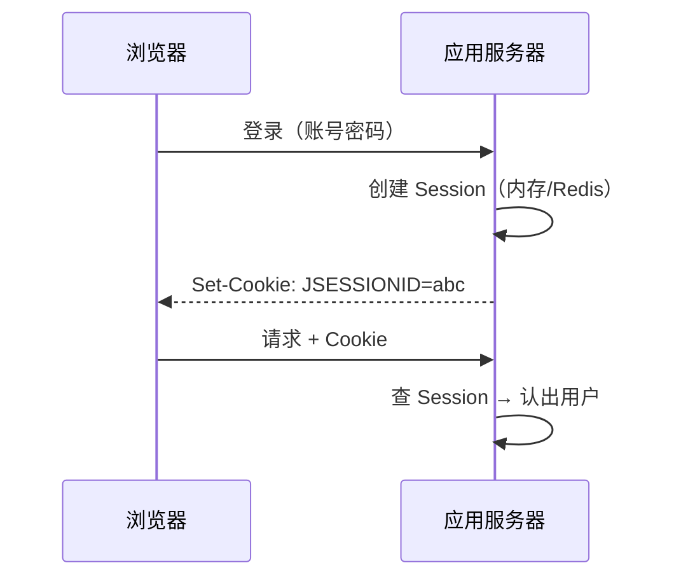
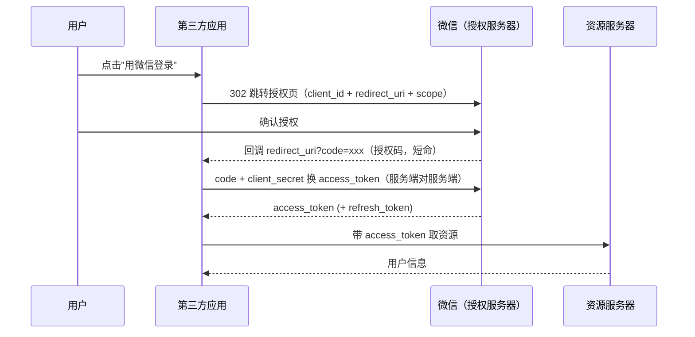
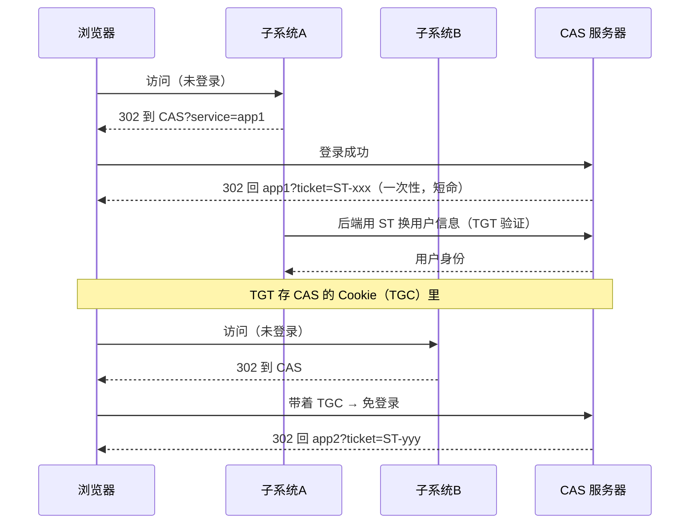

## 认证 vs 授权

- **认证（Authentication）**：你是谁——账号密码、短信、指纹；
- **授权（Authorization）**：你能干什么——角色、权限、scope。

JWT/OAuth2/SSO/CAS/LDAP 全在这两个问题的坐标系里，先摆正位置再看细节。

## Session/Cookie：有状态的起点

HTTP 无状态 → 服务端存会话（Session），Cookie 里只放 SessionId。



分布式下的问题：Session 在 A 机，请求落到 B 机就"不认识你"。解法
要么粘性路由，要么集中存储（Redis，Spring Session），要么——干脆
把状态挪到客户端，这就是 JWT 的动机。

## JWT：把状态装进令牌

三段结构 `header.payload.signature`，签名保证不可篡改：

```json
// header：算法
{"alg": "HS256", "typ": "JWT"}
// payload：claims（别放敏感信息，Base64 只是编码不是加密）
{"sub": "u1001", "name": "张三", "exp": 1735689600}
// signature：HMAC(header + payload, secret)
```

**优点**：无状态、服务端不存会话、天然跨服务（网关验签即可，见
[网关](/java/advanced/springcloud/03-gateway/)的 JWT 过滤器）。

**代价**（无状态的另一面）：

| 问题 | 常见解法 |
|---|---|
| 无法主动失效（签发即生效到过期） | 短有效期 + Refresh Token；黑名单（又变回有状态） |
| payload 明文可读 | 只放 userId 等非敏感 claims |
| 令牌较大，每请求携带 | 控制 claims 数量 |

定位：**JWT 是令牌格式，不是协议**——它解决"怎么携带凭证"，不解决
"怎么颁发凭证"。

## OAuth2：授权的四种模式

OAuth2 解决**第三方授权**："用微信登录 XX 应用"，XX 拿到的是访问你
微信资源的**受限凭证**，而不是你的密码。四种模式里最常用的是授权码：



为什么绕一道授权码：access_token 不经过浏览器前端（redirect_uri 只回
传 code），且换 token 时用 client_secret 做服务端认证——防令牌被
截获。其余模式各有场景：

| 模式 | 场景 | 信任要求 |
|---|---|---|
| 授权码（最常用） | Web 应用有后端 | 标准流程 |
| 简化（implicit） | 纯前端 SPA | 已不推荐，令牌暴露在前端 |
| 密码（password） | 自家 App（第一方） | 完全信任客户端才可用 |
| 客户端凭证（client_credentials） | 服务间调用，无用户参与 | 机器对机器 |

**常见误用**：把 OAuth2 当认证用（implicit/授权码拿 token 直接当登录态）。
正规姿势是 **OIDC**（OAuth2 之上的身份层，颁发 id_token 才是"认证"）。

## SSO 与 CAS：一次登录处处通行

单点登录（SSO）是**目标**：N 个子系统只登录一次。CAS 是实现 SSO 的
经典协议，核心是两种票据：



- **TGT/TGC**：全局会话（Ticket Granting Ticket），存 CAS 侧；
- **ST**：子系统会话凭证，一次性、用后即焚——防重放；
- 子系统拿 ST 到 CAS **后端验证**，再建自己的局部会话。

JWT 也能做 SSO（认证中心签发 token，各子系统验签），区别在于：CAS
**可主动登出**（销毁 TGT），JWT 体系登出难（见上文失效问题）。

## LDAP：企业目录与统一账号

LDAP（轻量级目录访问协议）是另一条战线：**账号存在哪**。目录数据库
树状组织、读优写差，天生适合"全员通讯录 + 统一认证源"。

- 概念链：目录树 → 条目（Entry，唯一 DN）→ 对象类/属性；
- 命名：`uid=zhangsan,ou=dev,dc=example,dc=com`——从叶到根的 DN；
- 典型产品：Microsoft Active Directory（AD）、OpenLDAP；
- 接入方式：系统配 LDAP 地址 + Bind DN，登录时拿用户输入的账号密码
  去 LDAP bind 一次，成功即认证。

企业内标准组合：**AD/LDAP 做账号源 + CAS/SSO 做登录互通 + 应用按组
（OU/group）做权限**——新员工入职只建一个 AD 账号，全部系统通吃。

## 选型地图

| 需求 | 方案 |
|---|---|
| 单体应用会话 | Session + Redis（Spring Session） |
| 微服务无状态令牌 | JWT（短效 + Refresh） |
| 第三方登录 / 开放平台 | OAuth2 授权码（要认证加 OIDC） |
| 集团内多系统互通 | CAS / OIDC SSO + LDAP 账号源 |
| 国内三方登录聚合 | JustAuth（Github/微信/钉钉…一站接入） |

Spring 生态落点：Spring Security 把以上全部抽象成 FilterChain +
`AuthenticationManager`，OAuth2/CAS/LDAP（`LdapAuthenticationProvider`）
都有 starter。

## 小结

- Session 有状态好失效、JWT 无状态难失效——选型先想清楚"登出要不要
  即时生效"。
- OAuth2 是授权框架不是认证协议，认证要上 OIDC；授权码模式的两次
  回传（code → token）是安全设计的精髓。
- CAS 双票据：TGT 管全局会话、ST 一次性回传防重放；LDAP 管账号源。
- 现实系统常是组合拳：LDAP 账号 + CAS/OIDC 互通 + 网关 JWT 验签。

## 延伸阅读

- [账户体系：JWT、OAuth、SSO 与 CAS（CSDN）](https://blog.csdn.net/winter_wu_1998/article/details/104322353)——本篇母本，四概念对照
- [理解 OAuth2 协议原理（CSDN）](https://blog.csdn.net/little_kelvin/article/details/111232009)
- [LDAP 概念和原理介绍（博客园）](https://www.cnblogs.com/wilburxu/p/9174353.html)——目录树/DN/产品矩阵
- [JustAuth 使用指南](https://www.justauth.wiki/guide/)——第三方登录聚合库
