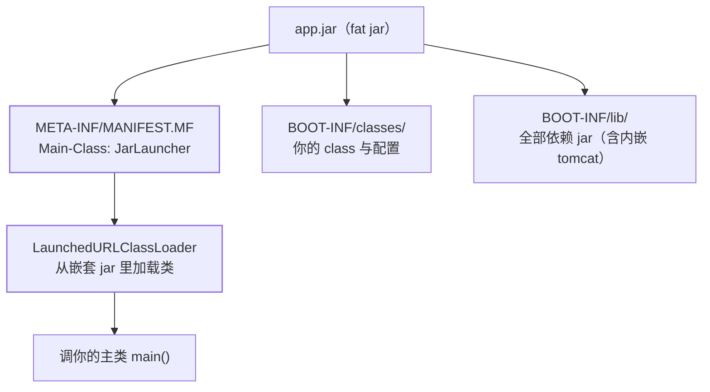

## 内嵌：Tomcat 从"装在机器上"变成"装在 jar 里"

传统部署把 war 丢进外置 Tomcat 的 webapps；Spring Boot 把容器**变成
应用的一个依赖**，`java -jar` 直接起——容器生命周期跟随应用，不再
共享（多应用共存的隔离问题随共享容器一起消失）。

启动时机在容器 refresh 的 onRefresh 阶段（见
[ApplicationContext](/java/intermediate/spring/07-application-context/)）：
`ServletWebServerFactory` 创建内嵌 Tomcat → 绑定端口 → Servlet 上下文
就位 → 回到主流程预实例化单例。所以**内嵌 Tomcat 起得比你的 Bean 早**，
Web 服务器就绪 ≠ 应用就绪（Runner 与 ApplicationReadyEvent 在后面）。
内嵌化的原理与 Tomcat 本体的连接器模型见
[Web 容器](/java/basic/tomcat/01-web-container/)。

## fat jar：一个 jar 里装着整个世界



关键设计：**标准 ClassLoader 加载不了 jar 里的 jar**（JDK 只认顶层
jar 或目录），Boot 用 `JarLauncher` 作入口、`LaunchedURLClassLoader`
读嵌套 jar——这就是 fat jar 能直接 `java -jar` 的原理，也是 fat jar
不能被别的应用当依赖引用的原因。解压后用 `-cp` 启动（分层 Docker
镜像的优化点：依赖层与应用层分开，改代码不用重传几百 MB 依赖）。

## jar 内嵌 vs war 外置

| | 内嵌 jar（主流） | 外置 war |
| --- | --- | --- |
| 部署 | `java -jar`，容器随应用 | 丢进共享 Tomcat 的 webapps |
| 升级 | 重启应用即换容器版本 | 容器升级影响所有应用 |
| 监控/线程池 | 应用自己全权配置 | 容器统一管（共享池） |
| 适合 | 微服务、容器编排 | 传统多应用共存的老机房 |

选 war 的当代理由只剩"运维制度要求统一容器"——微服务 + K8s 场景
没有悬念。

## 优雅停机：别让请求死在半路

`kill -9` 直接掐断，在途请求全部失败。正确姿势：

```yaml
server:
  shutdown: graceful          # Boot 2.3+
spring:
  lifecycle:
    timeout-per-shutdown-phase: 30s
```

收到 SIGTERM 后：**Web 服务器先停止接收新请求 → 等在途请求跑完
（有超时上限）→ 再走容器关闭回调销毁 Bean**（销毁链见
[ApplicationContext](/java/intermediate/spring/07-application-context/)）。
配合 K8s 的 `preStop` + `terminationGracePeriodSeconds`，滚动更新
零请求失败。自定义组件要"分层下线"（先停消费再停池）用
[SmartLifecycle](/java/intermediate/spring/06-extension-points/)。

## 部署建议收束

- JVM 参数显式给满：容器里 `-XX:MaxRAMPercentage=75`（感知容器内存
  配额），别依赖默认堆上限；
- health probe 指向 Actuator（见
  [Actuator](/java/intermediate/spring-boot/05-actuator/)），K8s 的
  readiness/liveness 各归其位；
- 日志输出到 stdout 交给采集器，别在容器里写本地文件（见
  [日志体系](/java/intermediate/log/01-logging-system/)）。

## 小结

- 内嵌容器在 refresh 的 onRefresh 阶段启动，早于业务 Bean；fat jar
  靠 JarLauncher + LaunchedURLClassLoader 解决"jar 里装 jar"。
- 内嵌 jar 是微服务默认解，war 只为多应用共存的旧世界服务。
- 优雅停机 = graceful + 超时上限 + K8s 宽限期，链路是"停接新流量 →
  耗尽在途 → 销毁 Bean"。
