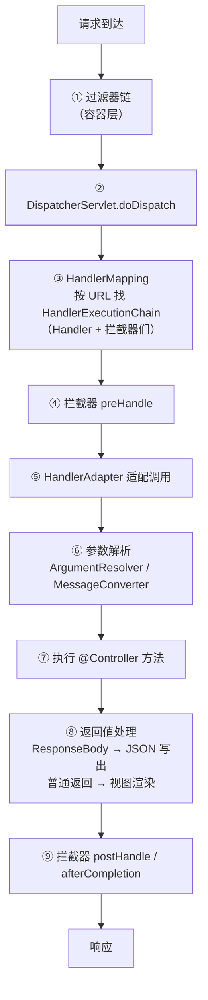

import AlgorithmVizIsland from '../../../../../components/viz/AlgorithmVizIsland.astro';

## 先立住一个事实：MVC 的核心是个 Servlet

`DispatcherServlet` 继承自 `HttpServlet`——Spring MVC 不是魔法，是
[Servlet 容器](/java/basic/tomcat/01-web-container/)之上把"写一堆
web.xml Servlet"收敛成**一个前端控制器统一分派**。Tomcat 负责网络与
Servlet 生命周期，DispatcherServlet 负责把每个请求路由到你的方法。

## doDispatch：九步流水线

`DispatcherServlet.doDispatch()` 的主线：

九步流水线按帧走一遍（两站考点：HandlerMapping 与 HandlerAdapter）：

<AlgorithmVizIsland demo="springmvc-flow" />

两个中间层是考点密集区：

- **HandlerMapping**："URL → 处理器"的注册表。`@RequestMapping` 在启动
  期被扫进 `RequestMappingHandlerMapping`（内部是
  `Map<RequestMappingInfo, HandlerMethod>`），请求时按 URL + 方法 +
  条件匹配。
- **HandlerAdapter**：处理器形态五花八门（`@RequestMapping` 方法、
  函数式 Endpoint、`@ControllerAdvice` 兜底），适配器让
  DispatcherServlet 用统一姿势调用它们——**适配器模式的教科书现场**
  （模式地图见[框架源码中的模式地图](/java/intermediate/design-pattern/15-patterns-in-frameworks/)）。

## 参数解析与消息转换

第 ⑥ 步里两套机制分工明确：

| 机制 | 干什么 | 典型 |
|---|---|---|
| `HandlerMethodArgumentResolver` | **方法参数**从哪来 | `@RequestParam`、`@PathVariable`、`@RequestHeader`、`@RequestBody` |
| `HttpMessageConverter` | **请求体/响应体**与对象的互转 | `MappingJackson2HttpMessageConverter`（JSON） |

`@RequestBody` 的链路：先由 ArgumentResolver 识别，再委托
MessageConverter 读流反序列化；`@ResponseBody` 反向：返回值经
MessageConverter 序列化直接写响应——**不走视图**。这就是"前后端
分离只返回 JSON"的底层支撑。

## 过滤器 vs 拦截器 vs AOP：三层关卡

| | Filter | Interceptor | AOP |
|---|---|---|---|
| 归属 | **Servlet 容器**规范 | Spring MVC 机制 | Spring 容器机制 |
| 作用范围 | DispatcherServlet **之外**的全程（静态资源也过） | 只拦**进到 MVC 的** Handler | 任意 Spring Bean 方法 |
| 能否拿 Handler 信息 | 不能 | 能（知道要执行哪个方法） | 能（切点表达式的目标） |
| 异常处理 | 走容器 error page | afterCompletion + 全局异常 | 声明式 try 语义 |
| 典型用途 | 编码、CORS、XSS 清洗、全局安全头 | **登录态/权限/日志/traceId** | 事务、缓存、审计 |

执行顺序：`Filter.doFilter 前 → preHandle → Controller → postHandle →
afterCompletion → Filter 后`。鉴权放拦截器是主流——比 Filter 多
拿到"目标方法"信息（可读 `@RequiresPermission` 之类注解），比 AOP
贴近 HTTP 语义；三者协作的实战见
[认证与单点登录](/java/intermediate/spring-boot/02-auth-sso/)。

## 异常去哪了：@ControllerAdvice 的接入点

Handler 抛出的异常不会直接漏给容器：`ExceptionHandlerExceptionResolver`
（三个默认 Resolver 之一）按"本类 `@ExceptionHandler` →
`@ControllerAdvice` 全局"的顺序找处理方法，命中就转成正常响应——
这就是[统一异常处理](/java/intermediate/spring-mvc/02-exception-advice/)
的执行位置。未命中才落到容器层（Tomcat error page / ErrorController）。

## 高频细节

- **转发 vs 重定向**：forward 服务器内一次请求（request 域还在，地址
  栏不变）；redirect 两次请求（302，request 域丢失）。重定向必须防
  **开放重定向**漏洞（校验目标 URL）。
- **@RequestParam vs @PathVariable vs @RequestBody**：查询参数、路径
  段、请求体——三种来源对应三种解析器分支。
- **拦截器 preHandle 返回 false**：后续 Controller 与 postHandle 全跳
  过，但**已执行的 preHandle 的 afterCompletion 会倒序补偿**（放行
  过的都要收尾）。

## 小结

- DispatcherServlet 本质是唯一的前端控制器 Servlet；doDispatch 九步
  主线里 HandlerMapping 管"找到谁"、HandlerAdapter 管"统一调"。
- 参数靠 ArgumentResolver、报文靠 MessageConverter；@RequestBody/
  ResponseBody 是前后端分离的技术底座。
- Filter（容器层全局）→ Interceptor（MVC 层 Handler 感知）→ AOP
  （Bean 层方法级）三层关卡各司其职，鉴权/日志/事务各有归属。
- 异常被 HandlerExceptionResolver 系统接住，@ControllerAdvice 是
  全局兜底的落点。
