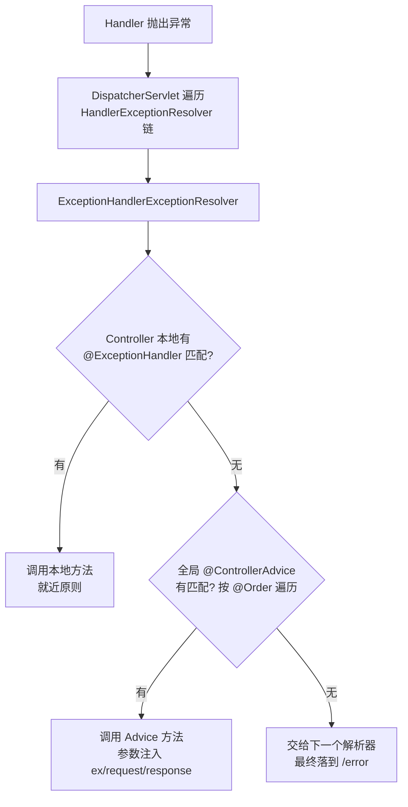

## 先想清楚：异常散落在 Controller 里有多痛

没有统一处理时，每个接口各写 try-catch、各自拼错误 JSON——格式
不一致、漏网的异常直接走 Spring Boot 默认的 `/error`（白标页或
不友好的报错体）。Spring 3.2 起给出的解法是
**`@ControllerAdvice`：一个"跨 Controller 的增强器"**，它把三类
回调提升到全局：

| 注解 | 作用域 | 用途 |
|---|---|---|
| `@ExceptionHandler` | 全局 | 拦截指定类型的异常，统一转响应 |
| `@InitBinder` | 全局 | 在所有 `@RequestMapping` 执行前初始化 `WebDataBinder`（如日期格式转换） |
| `@ModelAttribute` | 全局 | 向 Model 预置公共数据，所有映射方法可取 |

返回 JSON 场景直接用组合注解 **`@RestControllerAdvice`**
（= `@ControllerAdvice` + `@ResponseBody`），方法上就不用再标
`@ResponseBody` 了。

## 基本用法：自定义业务异常 + 全局兜底

```java
// ① 业务异常：用 code + msg 表达业务语义
public class MyException extends RuntimeException {
    private final String code;
    private final String msg;
    // 构造器/getter 省略
}
```

```java
// ② 全局处理器：具体异常放前面，Exception 兜底放后面
@RestControllerAdvice
public class GlobalExceptionHandler {

    @ExceptionHandler(MyException.class)          // 业务异常：精确拦截
    public Map<String, Object> myErrorHandler(MyException ex) {
        return Map.of("code", ex.getCode(), "msg", ex.getMsg());
    }

    @ExceptionHandler(Exception.class)            // 兜底：任何漏网异常
    public Map<String, Object> errorHandler(Exception ex) {
        return Map.of("code", "500", "msg", ex.getMessage());
    }
}
```

```java
// ③ Controller 尽情抛，不再写 try-catch
@RequestMapping("/home")
public String home() {
    throw new MyException("101", "参数非法");
}
// 响应体：{"code":"101","msg":"参数非法"}
```

需要渲染错误页面（而非 JSON）时，方法返回 `ModelAndView`
（`setViewName("error")` + addObject）即可——前后分离项目基本用
不上，服务端渲染场景的兜底手段。

## 原理：异常是怎么被"捞"到的

关键在 `DispatcherServlet` 的 **HandlerExceptionResolver 解析链**。
Controller 抛异常后，`DispatcherServlet` 遍历解析器逐个尝试，
其中 `ExceptionHandlerExceptionResolver` 的工作方式：



- **就近优先**：Controller 内部的 `@ExceptionHandler` 先于全局
  Advice 匹配——局部特殊逻辑可以覆盖全局规则；
- **匹配算法**：启动时 `ExceptionHandlerMethodResolver` 扫描每个
  `@ExceptionHandler` 声明的异常类型，建"异常类 → 方法"映射；
  运行期按异常的**继承链由近及远**找最精确的那个（抛
  `MyException` 不会落到 `Exception` 兜底，只要前者被声明）；
- 多个 Advice 按 `@Order` 排序遍历，先命中先用；
- 方法参数可注入异常本体、`HttpServletRequest/Response` 等，返回
  值走正常的 `HandlerMethodReturnValueHandler`（所以 JSON/页面/
  ResponseEntity 都行）。

## 实战要点

1. **异常即返回值**：Controller 只管抛，处理逻辑收敛到一处——
   但别把 Advice 写成巨型 if-else，按业务域拆多个 Advice（配合
   `basePackages`/`annotations` 限定作用范围）；
2. **事务回滚提醒**：Spring 默认只对 **RuntimeException** 回滚
   （受检异常需 `rollbackFor` 声明）——自定义业务异常记得继承
   `RuntimeException`；
3. **区分层级的异常体系**：`BizException`（业务可预期，4xx 语义）
   与 `SysException`（系统故障，5xx 语义）分开，别让参数校验失败
   和 NPE 共用一个响应码；
4. 配合 `@Valid` 校验异常（`MethodArgumentNotValidException`）
   单独拦截，返回字段级错误信息。

## 小结

- `@RestControllerAdvice` = 全局 Controller 增强器，三件套中
  `@ExceptionHandler` 是绝对主力：Controller 只抛不接，异常处理
  收敛到一处。
- 机制依托 DispatcherServlet 的异常解析链：本地
  `@ExceptionHandler` 就近优先，全局 Advice 按 `@Order` 兜底，
  匹配按异常继承链取最精确。
- 自定义业务异常继承 RuntimeException，配合分层异常体系
  （Biz/Sys）与响应码规范，是接口层整洁度的基本盘。

## 延伸阅读

- [@RestControllerAdvice作用及原理——隔壁w王叔叔，博客园](https://www.cnblogs.com/UncleWang001/p/10949318.html)——本篇母本，含页面渲染示例
- [Spring 官方 · @ControllerAdvice Javadoc](https://docs.spring.io/spring-framework/docs/current/javadoc-api/org/springframework/web/bind/annotation/ControllerAdvice.html)
- [Spring Boot 错误处理官方指南](https://docs.spring.io/spring-boot/reference/web/servlet.html#web.servlet.spring-mvc.error-handling)
