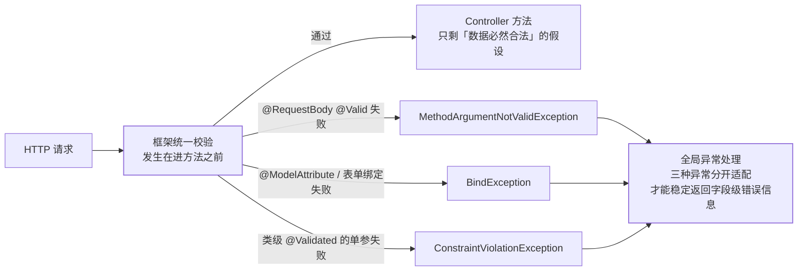

## 校验的位置：进方法之前

参数校验的本质：**把"if (name == null) throw ..." 从业务方法里搬出去**，
用声明式注解贴在参数上，框架在请求进来时统一校验——业务代码只剩
"数据必然合法"的幸福假设。

两份东西别混：**Jakarta Bean Validation 是规范**（JSR-303/380 的
Jakarta 化身），**Hibernate Validator 是事实上的参考实现**——Spring Boot
的 web starter 自动带上，开箱即用。

## @Valid vs @Validated

| | `@Valid` | `@Validated` |
| --- | --- | --- |
| 来源 | Bean Validation 规范 | Spring 扩展 |
| 分组校验 | 不支持 | **支持**（`@Validated(Create.class)`） |
| 嵌套校验 | **支持**（字段再标 @Valid 级联） | 不支持（要靠字段上的 @Valid） |
| 用在哪 | 方法参数、字段 | 类上（方法级校验）、参数（分组时） |

```java
@RestController
@Validated  // 类级：让 @PathVariable 等也能校验
public class OrderController {

    @PostMapping("/api/orders")
    public Order create(@RequestBody @Valid CreateOrderReq req) { ... }
}

public record CreateOrderReq(
        @NotBlank String sku,
        @NotNull @Min(1) @Max(999) Integer count,
        @Size(max = 200) String note,
        @Valid Address address) {  // 嵌套对象级联校验
}
```

## 常用约束速查

| 注解 | 语义 |
| --- | --- |
| `@NotNull` / `@NotBlank` / `@NotEmpty` | 非 null / 非空白字符串 / 非空集合 |
| `@Size(min,max)` / `@Length` | 长度 |
| `@Min` / `@Max` / `@Range` | 数值范围 |
| `@Pattern(regexp)` | 正则 |
| `@Email` / `@URL` | 格式 |
| `@Past` / `@Future` | 时间 |
| `@AssertTrue` | 布尔为真（跨字段逻辑挂这里） |

## 校验失败去哪了

校验不通过**不会**进 Controller 方法——抛异常被
[全局异常处理](/java/intermediate/spring-mvc/02-exception-advice/)接住：



| 场景 | 抛出的异常 |
| --- | --- |
| `@RequestBody @Valid` 失败 | `MethodArgumentNotValidException` |
| `@ModelAttribute` / 表单绑定失败 | `BindException` |
| 类级 @Validated 修饰的单参（@RequestParam/@PathVariable） | `ConstraintViolationException` |

三种异常的取错结构略不同（前两者从 `getBindingResult()` 取
FieldError），统一异常处理里**分开适配**才能稳定返回字段级错误信息——
这是"校验失败提示不友好"的头号原因。

## 分组校验与自定义校验器

**分组**：同一 DTO 在"创建"时 id 必须为空、"更新"时 id 必须非空——
用空标记接口分组：

```java
public interface OnCreate {}
public interface OnUpdate {}

public record UserReq(@Null(groups = OnCreate.class) Long id,
                      @NotNull(groups = OnUpdate.class) Long id2) {}

@PostMapping
@Validated(OnCreate.class)
void create(@RequestBody @Valid UserReq req) {}
@PutMapping
@Validated(OnUpdate.class)
void update(@RequestBody @Valid UserReq req) {}
```

**自定义约束**：注解 + 校验器两件套：

```java
@Target(ElementType.FIELD) @Retention(RetentionPolicy.RUNTIME)
@Constraint(validatedBy = PhoneValidator.class)  // 绑定校验器
public @interface Phone {
    String message() default "手机号不合法";
    Class<?>[] groups() default {};
}

public class PhoneValidator implements ConstraintValidator<Phone, String> {
    public boolean isValid(String v, ConstraintValidatorContext ctx) {
        return v == null || v.matches("^1\\d{10}$");  // null 交给 @NotBlank 管
    }
}
```

## 边界提醒

- 校验只覆盖"声明过的地方"：Service 内部调用不走 MVC 参数解析，
  类级 @Validated 的方法级校验靠 AOP 代理（**自调用失效**，同
  [AOP 篇](/java/intermediate/spring/02-aop/)的坑）；
- 约束注解默认不传给嵌套对象，**级联必须显式 @Valid**；
- 校验是"格式与边界"，**业务规则**（库存够不够）不在校验层——别把
  查库逻辑塞进 ConstraintValidator。

## 小结

- 规范（Jakarta Bean Validation）+ 实现（Hibernate Validator），
  Boot 开箱即用；@Valid 管嵌套、@Validated 管分组。
- 三种失败异常要对号入座地写统一异常处理；嵌套级联必须显式 @Valid。
- 分组解决"创建/更新两套规则"，自定义约束 = 注解 + Validator 两件套。
