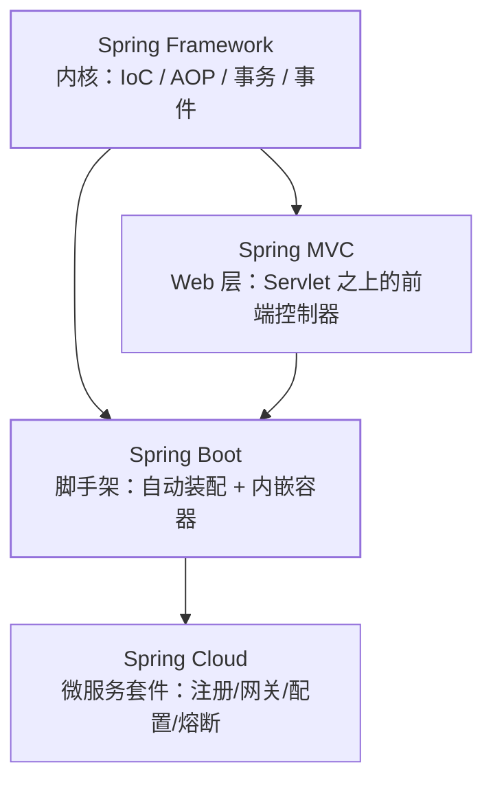

## 一句话定位四个子工程

这个方向下有四个并列分类，先搞清它们**谁是谁、谁依赖谁**：

| 子工程 | 解决什么问题 | 站在谁的肩膀上 |
| --- | --- | --- |
| **Spring Framework** | 依赖注入容器、AOP、事务、事件——"对象怎么来、怎么组装" | 纯 JDK（反射 + 动态代理，见[反射与注解](/java/basic/syntax/06-reflection-annotation/)） |
| **Spring MVC** | HTTP 请求进到方法——路由、参数、渲染、异常 | Framework + Servlet 容器（[Web 容器](/java/basic/tomcat/01-web-container/)） |
| **Spring Boot** | 把上面两者**装配成可运行程序**——自动配置、内嵌容器、starter | Framework + MVC（自动装配它们，见[自动配置原理](/java/intermediate/spring-boot/01-autoconfig/)） |
| **Spring Cloud** | 单体变微服务后的**分布式问题**——注册发现、网关、配置、熔断、链路 | Boot（全套组件都是 Boot starter） |

**依赖是单向叠加的**：Boot 必须带 Framework（内核不可选），通常带 MVC
（Web 应用）；Cloud 必须带 Boot（组件全是 starter 形态）。反向不成立
——Framework 不认识 Boot，MVC 不知道 Cloud 的存在。

## 四个分类怎么用

- **[Spring 核心](/java/intermediate/spring/)**：容器与生命周期、AOP、
  事务、扩展点——所有家族成员共用的地基，面试题密集区。
- **[Spring MVC](/java/intermediate/spring-mvc/)**：请求处理全流程、
  全局异常、参数校验——Web 层的事。
- **[Spring Boot](/java/intermediate/spring-boot/)**：自动配置、配置
  体系、内嵌容器与部署、Actuator、认证——"怎么把应用跑起来、跑得好"。
- **[Spring Cloud](/java/advanced/springcloud/)**：注册中心、网关、
  负载均衡、熔断限流、配置中心、链路追踪——"服务拆多了之后的麻烦"。

## 版本列车：一起升级的家族

Spring 家族发版是**对齐的列车**，选型必须看兼容矩阵：

| 世代 | Framework | Boot | Cloud | 基线 |
| --- | --- | --- | --- | --- |
| 当前主流 | 6.x | 3.x | 2023.x / 2024.x | JDK 17+、Jakarta EE 9+ |
| 上一代 | 5.x | 2.x | 2021.x（Ilford） | JDK 8+、javax.* |

两个断代记忆点：Boot 3.x 把 `javax.*` 全部换成 `jakarta.*`（Tomcat 10
的代价），并把基线抬到 JDK 17；Boot 2.x 时代 AOP 代理统一默认 CGLIB
（见[AOP 篇](/java/intermediate/spring/02-aop/)）。Cloud 版本号用
"年份.x" 命名正是为了对齐 Boot 的兼容关系——**Boot 升小版本，Cloud
未必跟；Boot 换大版本，Cloud 必须换列车**。

## 常见误区澄清

- **"Boot 取代了 Spring"**：没有。Boot 只是自动装配 + 内嵌容器的
  脚手架，容器、AOP、事务全部还是 Framework 内核在跑——所以
  [IoC](/java/intermediate/spring/01-ioc-bean-lifecycle/)、
  [扩展点](/java/intermediate/spring/06-extension-points/)的原理知识
  在 Boot 时代照样是核心面试题。
- **"用了 Cloud 就不用 Boot 了"**：相反，Cloud 的每个组件
  （Gateway/Sentinel/Nacos 集成）都是 Boot starter，脱离 Boot 无法运行。
- **"MVC 只在 Boot 里有"**：MVC 是 Framework 的 Web 模块，传统 war
  部署到外置 Tomcat 也能用；Boot 的贡献是内嵌它（见
  [内嵌容器与部署](/java/intermediate/spring-boot/04-embedded-deploy/)）。

## 学习路径建议

内核先行：IoC/Bean 生命周期 → AOP → 事务 → 扩展点，再上 MVC 请求
流程，然后 Boot 的自动配置与配置体系（这时回头看扩展点会豁然开朗），
最后 Cloud 按组件逐个击破——**每个组件的"为什么"都在内核里**。

## 小结

- 四家依赖单向叠加：Framework 内核 → MVC（Web 模块）→ Boot（装配
  脚手架）→ Cloud（微服务套件），反向不成立。
- Boot 3.x = Framework 6.x = JDK 17 + jakarta；Cloud 用年份列车
  对齐 Boot 大版本。
- 内核知识不过时：Boot/Cloud 的一切"魔法"最终都落在 Framework 的
  容器与扩展点上。
