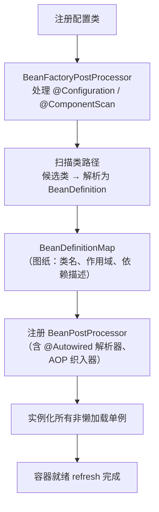
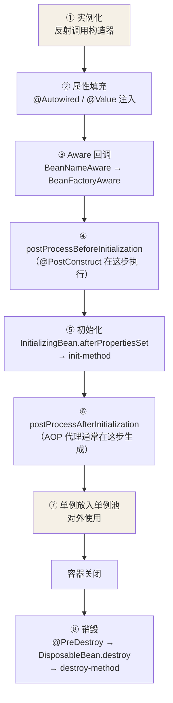

---

title: IoC 容器与 Bean 生命周期
description: 控制反转与依赖注入的关系、容器启动流程、Bean 从实例化到销毁的完整链路
level: intermediate
core: true
---

## IoC 与 DI：思想与实现

**IoC（控制反转）是思想**：对象的创建、装配、销毁的控制权，从程序代码
反转给容器——你不再 `new UserService(dao)`，而是声明"我需要什么"。

**DI（依赖注入）是实现手段**：容器在运行期把你声明的依赖塞进对象。
除此之外还有依赖查找（DL），但 Spring 用的就是 DI。

```java
@Service
public class OrderService {
    private final PaymentService payment;   // 只声明依赖

    public OrderService(PaymentService payment) {  // 构造器注入
        this.payment = payment;
    }
}
```

好处：解耦（换实现只改配置）、可测（测试时注入 Mock）、生命周期统一
托管（单例池复用、销毁回调）。

## 容器启动做了什么

`new AnnotationConfigApplicationContext(AppConfig.class)` 简化流程：



关键认知：**容器里先有图纸（BeanDefinition），再按图纸造对象**。扫描阶段
只解析注解生成图纸，真正的 `new` 发生在 `finishBeanFactoryInitialization`
触发预创建单例时。

## Bean 生命周期



用一个回调齐全的类验证：

```java
@Component
public class LifecycleDemo implements BeanNameAware, InitializingBean, DisposableBean {

    public LifecycleDemo() {                       System.out.println("① 构造器：实例化"); }

    @Autowired
    public void setDao(DemoDao dao) {              System.out.println("② 属性填充"); }

    @Override
    public void setBeanName(String name) {         System.out.println("③ Aware 回调: " + name); }

    @PostConstruct
    public void init() {                            System.out.println("④ @PostConstruct"); }

    @Override
    public void afterPropertiesSet() {             System.out.println("⑤ afterPropertiesSet"); }

    @PreDestroy
    public void preDestroy() {                     System.out.println("⑧ @PreDestroy"); }

    @Override
    public void destroy() {                        System.out.println("⑧ DisposableBean.destroy"); }
}
// 输出顺序与上图一致——注意 @PostConstruct 在 afterPropertiesSet 之前
```

两对扩展点的分工：

| 扩展点                      | 时机                 | 典型用途                      |
| ------------------------ | ------------------ | ------------------------- |
| BeanFactoryPostProcessor | 容器启动期，实例化**之前**改图纸 | 占位符解析、注册额外 BeanDefinition |
| BeanPostProcessor        | 每个 Bean 初始化**前后**  | @Autowired 解析、AOP 代理生成    |

## 作用域

| scope             | 行为                        |
| ----------------- | ------------------------- |
| singleton         | 默认；容器内一个实例，放单例池复用         |
| prototype         | 每次 getBean 新建，容器只负责创建不管销毁 |
| request / session | Web 环境：一次请求 / 一个会话一个实例    |

### 失效案例：单例注入原型 Bean，原型其实只有一份

**核心含义**：作用域管的是"容器返回时的创建策略"，管不到"单例 Bean
内部持有的那个引用"。**单例只在创建时注入一次依赖**，之后引用一路复用。

**原因（为什么）**：属性填充发生在 Bean 生命周期第②步，而单例 Bean 一
生只被创建一次，这"一次注入"里翻译成依赖的 action 也就执行一遍。
prototype 的"每次 getBean 新建"只对"向容器主动要"生效——单例早已把
第一个实例攥在手里，后面的调用根本不会再向容器要。

**例子**：

```java
@Component
@Scope(ConfigurableBeanFactory.SCOPE_PROTOTYPE)
public class Task {
    public Task() { System.out.println("new Task: " + this); }
}

@Service
public class TaskRunner {        // 默认 singleton
    @Autowired
    private Task task;           // 仅在 TaskRunner 创建时注入一次

    public void run() { System.out.println("run with " + task); }
}
```

调多少次 `run()`，打印的 Task 都是**同一个地址**——只发生过一次 `new Task`。

**解法**：注入"提供者"而不是"实例本身"，让依赖在使用时才向容器要。

```java
@Service
public class TaskRunner {
    private final ObjectProvider<Task> provider;   // 每次 getObject() 都是新实例
    public TaskRunner(ObjectProvider<Task> provider) { this.provider = provider; }

    public void run() { Task t = provider.getObject(); /* 每次都新建 */ }
}
```

| 解法 | 做法 | 特点 |
|---|---|---|
| **ObjectProvider**（推荐） | 注入 `ObjectProvider<T>`，用时 `.getObject()` | 同源、最少侵入，天然每次新建 |
| `@Lookup` | 给方法标 `@Lookup`，返回新原型 | 基于 CGLIB 重写方法，优雅但隐蔽 |
| Supplier 注入 | 注入 `Supplier<T>`，用时 `.get()` | 函数式、透明 |
| `ApplicationContext.getBean` | 注入容器，用时 `getBean(T.class)` | 侵入大，慎防循环依赖 |

## 注入方式与注解选择

| 注解         | 来源      | 匹配规则                      |
| ---------- | ------- | ------------------------- |
| @Autowired | Spring  | 先按类型，多个候选再按字段名/@Qualifier |
| @Resource  | JSR-250 | 先按名称，找不到再按类型              |
| @Inject    | JSR-330 | 行为同 @Autowired，需额外依赖      |

三种注入姿势中 **Spring 官方推荐构造器注入**：依赖不可变（final）、缺失
依赖在创建期就报错、单测不需要容器、天然规避循环依赖（显式暴露设计问题）。
字段注入最方便也最隐蔽——离开容器就没法测试，离不开 new 的快感是错觉。

## 小结

- IoC 是控制权反转的思想，DI 是它的落地；容器先收集图纸再统一造 Bean。

- 生命周期主线：实例化 → 填充 → Aware → 前置处理(@PostConstruct) →
  初始化 → 后置处理(AOP) → 使用 → 销毁。

- 构造器注入是官方答案：不可变、快速失败、可测试。

<br />
