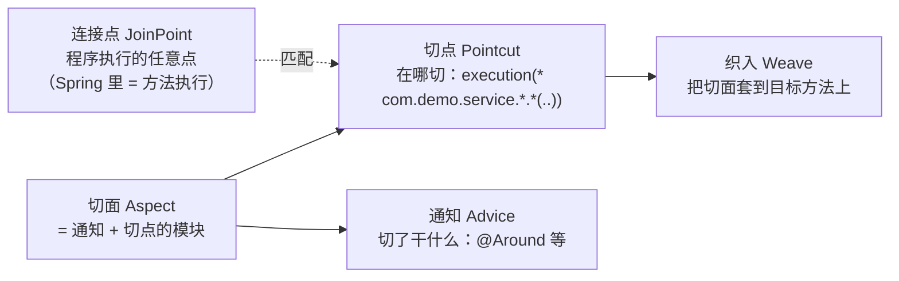
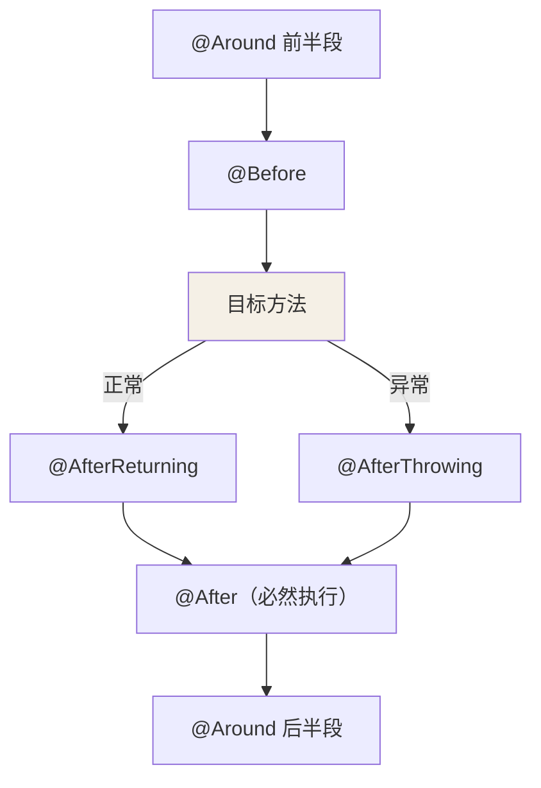

## AOP 解决什么问题

日志、事务、权限、限流……这些**横切关注点**散落在每个业务方法里就是重复
代码。AOP（面向切面）把这类逻辑抽成"切面"，在指定位置统一织入，业务代码
保持干净——Spring 里 @Transactional、@Async、@Cacheable 全是 AOP 的马甲。

术语一张图：



## 织入时机：Spring AOP 是运行时代理

| 方案 | 织入时机 | 实现 |
|---|---|---|
| Spring AOP | **运行时**：容器启动时给 Bean 生成代理对象 | JDK 动态代理 / CGLIB |
| AspectJ | 编译期 / 类加载期织入字节码 | 增强编译器 / javaagent |

Spring AOP 只支持**方法级**连接点（字段、构造器不行——要这个能力得用
AspectJ）。代理生成发生在 Bean 生命周期的 `postProcessAfterInitialization`
（AnnotationAwareAspectJAutoProxyCreator），所以**容器里你注入的其实是
代理对象，不是原始对象**。

## JDK 代理 vs CGLIB

| 维度 | JDK 动态代理 | CGLIB |
|---|---|---|
| 前提 | 目标类实现接口 | 无接口也行 |
| 方式 | 运行期生成实现同一接口的 $Proxy | 运行期生成目标类的**子类** |
| 限制 | 只能代理接口方法 | final 类/方法、private 方法不行 |
| 性能 | 创建快，JDK 8 后调用差距可忽略 | 创建慢一点 |

选型逻辑（Spring 的 ProxyFactory 内置）：**有接口默认 JDK，没接口走
CGLIB；Spring Boot 2.x 起统一默认 CGLIB**（`spring.aop.proxy-target-class=true`），
避免"注入具体类型却拿到代理接口"的意外。

## 五种通知与执行顺序

```java
@Aspect
@Component
public class TimingAspect {

    @Around("execution(* com.demo.service..*(..))")
    public Object around(ProceedingJoinPoint pjp) throws Throwable {
        long start = System.nanoTime();
        try {
            return pjp.proceed();                    // 放行目标方法
        } finally {
            System.out.println("耗时: " + (System.nanoTime() - start));
        }
    }

    @Before("execution(* com.demo.service..*(..))")
    public void before(JoinPoint jp) { /* 前置 */ }

    @AfterReturning(pointcut = "...", returning = "ret")
    public void afterReturning(Object ret) { /* 正常返回后 */ }

    @AfterThrowing(pointcut = "...", throwing = "ex")
    public void afterThrowing(Throwable ex) { /* 抛异常后 */ }

    @After("...")
    public void after() { /* 最终通知：类似 finally */ }
}
```



@Around 最强大也最危险：手里握着 proceed()，可以改参数、改返回值、吞
异常、干脆不执行目标方法。日志统计场景选它，事务场景 Spring 自己也用的它。

## 自调用失效：AOP 第一坑

```java
@Service
public class OrderService {
    public void createOrder() {
        this.validate();        // ← 坑：this 是原始对象，不是代理！
    }

    @Transactional
    public void validate() { }  // 切面逻辑（事务）不会生效
}
```

AOP 的本质是"**外部调用先经过代理，代理再转发给原始对象**"。`this.validate()`
压根没走代理，事务/日志/缓存全部失效。解法：

```java
// ① 注入自身代理（Spring 4.3+ 支持自注入）
@Autowired private OrderService self;
self.validate();                        // 走代理，切面生效

// ② AopContext.currentProxy()（需 exposeProxy = true）
((OrderService) AopContext.currentProxy()).validate();

// ③ 最干净：把方法拆到另一个 Bean
```

这也是 @Transactional 失效的头号原因（详见[事务篇](/ascension/java/intermediate/spring/04-transaction/)）。

## 小结

- AOP 抽横切逻辑；Spring AOP = 运行时动态代理，只支持方法级连接点。
- 注入的是代理对象；JDK 需要接口，CGLIB 生成子类，Boot 2.x 默认 CGLIB。
- 一切失效排查先问一句：这次调用**经过代理了吗**（自调用是重灾区）。
