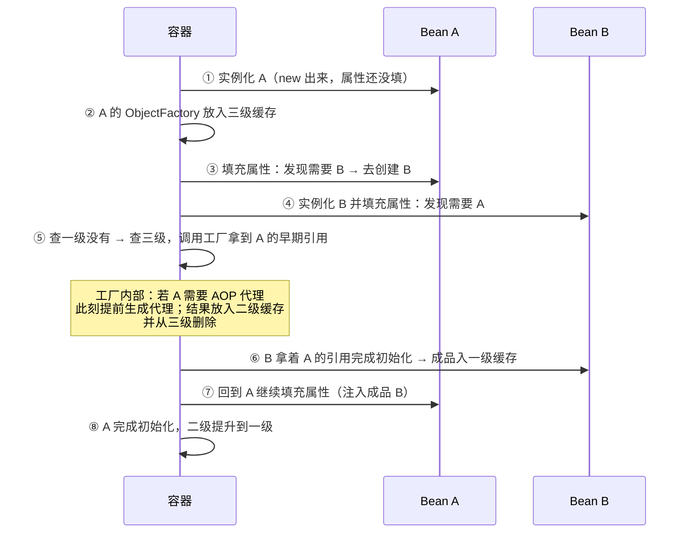

## 问题

```java
@Service
public class A {
    @Autowired private B b;    // A 需要 B
}

@Service
public class B {
    @Autowired private A a;    // B 也需要 A
}
```

创建 A 时需要 B，创建 B 时又需要 A——没有机制干预就是无限递归。

## 三级缓存存什么

| 缓存 | 名字 | 存什么 |
|---|---|---|
| 一级 | singletonObjects | **成品** Bean（完整初始化 + 若需要则已是代理） |
| 二级 | earlySingletonObjects | **半成品**（实例化但未填充属性；工厂提前给出的早期引用，可能是代理） |
| 三级 | singletonFactories | **工厂** ObjectFactory——调用它才产出早期引用 |

注意：三级缓存的工厂与"是否需要代理"绑定，这是整个设计的灵魂。

## 解圈流程



要点：B 注入的是 A 的**早期引用**（半成品或提前生成的代理），不是成品。
实例化与属性填充分两步，才给了"半成品先被别人引用"的机会——这也是
**构造器注入的循环依赖无解**的原因：构造器一步到位，对象还没出生就
被要，谁也变不出来。

## 为什么三级，不是两级

核心矛盾在 **AOP 代理**：

- 正常流程中，代理在初始化**之后**（postProcessAfterInitialization）生成，
  而且一个 Bean 只应有一个代理。
- 循环依赖时 B 需要 A 的引用，发生在 A 初始化完成**之前**。

只用两级缓存的两种做法都不可行：

| 两级方案 | 问题 |
|---|---|
| 实例化后**立刻**创建代理放二级 | 所有 Bean 一出生就代理，违背"代理尽量晚"的设计；且大量无循环依赖的 Bean 被迫提前 |
| 二级放原始对象，A 初始化完**再替换**成代理 | B 手里攥着原始对象引用，替换后 B 访问的还是没增强的老对象 |

三级的解法：二级存的是"**工厂按需生产的结果**"——没有循环依赖，工厂
永远不被调用，代理走正常时机；发生了循环依赖，工厂第一次被调用时生成
（提前）代理并缓存，后续都拿同一个。**既保证全局唯一代理，又保证尽量
延迟创建**，这就是多出来的那一级买的单。

## 边界与现状

- **构造器注入 / prototype**：无解，直接抛 BeanCurrentlyInCreationException。
- **Spring Boot 2.6+ 默认禁止**循环依赖（`spring.main.allow-circular-references=false`），
  官方态度：循环依赖是设计坏味道，而非要支持的场景。
- 解不开时的正路：@Lazy（注入代理，首次使用再解析）——

```java
@Service
public class A {
    private final B b;
    public A(@Lazy B b) {   // 注入的是 B 的代理，首次调用才真正获取
        this.b = b;
    }
}
```

更本质的解法是重构：抽出公共逻辑到 C，让 A、B 都依赖 C，依赖图变回
DAG。

## 小结

- 三级缓存 = 成品 / 半成品早期引用 / 工厂；解圈靠"实例化与属性填充分离"
  的时间差。
- 第三级的存在是为 AOP：延迟创建代理 + 循环依赖时提前且只创建一次。
- 构造器与 prototype 无解；Boot 2.6 起默认禁止——设计层面消除环才是
  正解。
