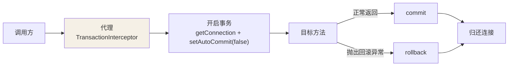
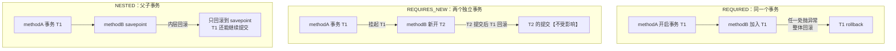

## @Transactional 的本质

AOP 环绕通知（TransactionInterceptor）：**开启事务 → 执行业务方法 →
正常提交 / 异常回滚**。所以它继承了 AOP 的全部命门——最典型的是自调用
失效（见 AOP 篇）。



事务与连接绑定在 ThreadLocal（事务同步管理器）里——这解释了为什么
**跨线程调用会失效**：新线程拿不到当前事务的连接。

## 七种传播行为

| 传播行为 | 语义 | 用一句话记 |
|---|---|---|
| **REQUIRED**（默认） | 有事务就加入，没有就新建 | 大多数场景，一荣俱荣 |
| **REQUIRES_NEW** | 挂起当前事务，**总是新建** | 记日志必须落库，主流程回滚也不影响 |
| **NESTED** | 在当前事务内开**嵌套**事务（savepoint） | 部分回滚，外层还在 |
| SUPPORTS | 有就加入，没有就非事务跑 | 可有可无 |
| NOT_SUPPORTED | 挂起当前，非事务执行 | 明确不要事务 |
| MANDATORY | 必须已有事务，否则报错 | 强制调用方负责事务 |
| NEVER | 必须没有事务，否则报错 | 明确禁止 |



REQUIRES_NEW vs NESTED 的关键差异：前者是**两个独立连接**的独立事务，
内层提交后外层回滚也拉不回来；后者是**同一个连接**里的保存点，内层
回滚后外层可继续，外层最终回滚时内层也一起没。

```java
@Service
public class AuditService {
    @Transactional(propagation = Propagation.REQUIRES_NEW)
    public void saveAudit(String msg) {
        // 即使调用方回滚，审计日志也已独立提交
    }
}
```

## 失效场景盘点（高频面试）

```java
@Service
public class OrderService {
    // ① 自调用：this.buy() 不走代理，事务失效
    public void createOrder() { this.buy(); }

    @Transactional
    public void buy() { /* ② 非 public 方法：代理拦截不到 */ }

    @Transactional
    public void wrong1() {
        try {
            doBiz();
        } catch (Exception e) {
            // ③ 异常被吞：切面根本感知不到，照常提交
            log.error("biz fail", e);
        }
    }

    @Transactional  // ④ 默认只回滚 RuntimeException 和 Error
    public void wrong2() throws Exception {
        throw new Exception("受检异常");   // 不会回滚！
    }

    @Transactional(rollbackFor = Exception.class)   // 正确姿势
    public void right() throws Exception { }
}
```

| # | 场景 | 根因 |
|---|---|---|
| 1 | 自调用 this.method() | 不经过代理 |
| 2 | 方法非 public | 代理层面直接跳过 |
| 3 | 异常被 catch 吞掉 | 切面感知不到异常 |
| 4 | 抛受检异常没配 rollbackFor | 默认规则只认运行时异常 |
| 5 | 多线程调用 | 事务绑定 ThreadLocal，跨线程拿不到连接 |
| 6 | 数据库引擎不支持 | MyISAM 没有事务 |
| 7 | 没被 Spring 管理 | 没有 Bean 就没有代理 |
| 8 | 传播行为设成 NOT_SUPPORTED 等 | 自己声明不要事务 |

排查口诀：**过了代理吗、public 吗、异常到了切面吗、回滚规则匹配吗**。

## 与隔离级别联动

```java
@Transactional(isolation = Isolation.READ_COMMITTED, timeout = 5)
public void biz() { }
```

隔离级别交由数据库实现（MySQL 默认 REPEATABLE READ），Spring 只是透传
——原理见 MySQL 事务篇。

## 小结

- @Transactional = AOP 环绕 + ThreadLocal 绑定连接，失效大多源于此。
- 传播重点记三个：REQUIRED 一体、REQUIRES_NEW 独立连接、NESTED
  savepoint 部分回滚。
- 受检异常记得 rollbackFor = Exception.class；自调用是第一嫌疑。
