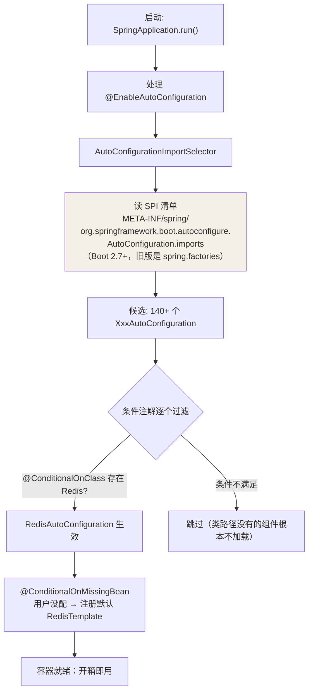

## 约定优于配置的背后

Spring Boot 的"开箱即用"= **依赖管理（starter）+ 自动配置**。引一个
`spring-boot-starter-data-redis`，连接池、模板、序列化器全部就位——
这一篇拆开看它怎么做到的。

## @SpringBootApplication 三合一

```java
@SpringBootConfiguration      // 就是 @Configuration：标识配置类
@EnableAutoConfiguration      // ← 自动配置的总开关
@ComponentScan                // 扫描主类所在包及子包
public @interface SpringBootApplication { }
```

自动配置的发动机在 @EnableAutoConfiguration：

```java
@AutoConfigurationPackage
@Import(AutoConfigurationImportSelector.class)   // 关键：导入选择器
public @interface EnableAutoConfiguration { }
```

## SPI 加载自动配置类

AutoConfigurationImportSelector 的活儿：读所有 jar 里的清单文件，把
清单上的配置类批量导入容器。



以 RedisAutoConfiguration 为例（简化）：

```java
@AutoConfiguration
@ConditionalOnClass(RedisOperations.class)      // 类路径有 Redis 客户端才生效
@EnableConfigurationProperties(RedisProperties.class)
public class RedisAutoConfiguration {

    @Bean
    @ConditionalOnMissingBean(name = "redisTemplate")   // 用户自己配了就不注册
    public RedisTemplate<Object, Object> redisTemplate(
            RedisConnectionFactory factory) {
        RedisTemplate<Object, Object> template = new RedisTemplate<>();
        template.setConnectionFactory(factory);
        return template;
    }
}
```

**用户配置永远优先**：@ConditionalOnMissingBean 保证你在自己代码里定义
的同名 Bean 会顶掉默认值——这就是"约定优于配置但配置可覆盖"的实现机制。

## 条件注解家族

| 注解 | 生效条件 |
|---|---|
| @ConditionalOnClass / OnMissingClass | 类路径有/没有某个类 |
| @ConditionalOnBean / OnMissingBean | 容器里有没有某个 Bean |
| @ConditionalOnProperty | 配置项匹配（如 `spring.datasource.url` 存在） |
| @ConditionalOnWebApplication | 是 Web 应用 |
| @ConditionalOnExpression | SpEL 表达式为真 |

所以自动配置是**防御性装配**：条件全过才注册，条件注解读的是当前
classpath 与已注册的 Bean——同一个 Spring Boot 应用，加不加 jar、配不配
属性，得到的行为天然不同。

## 配置如何绑定

```java
@ConfigurationProperties(prefix = "spring.data.redis")
public class RedisProperties {
    private String host = "localhost";   // spring.data.redis.host=... 覆盖
    private int port = 6379;
    private Duration timeout;
}
```

`application.yml` 的键值 → properties 类字段，自动配置类消费它创建
连接工厂。

## 自定义 starter

```java
// 1. 自动配置类 + 条件装配
@AutoConfiguration
@ConditionalOnClass(SmsClient.class)
@EnableConfigurationProperties(SmsProperties.class)
public class SmsAutoConfiguration {

    @Bean
    @ConditionalOnMissingBean
    public SmsClient smsClient(SmsProperties props) {
        return new SmsClient(props);
    }
}
```

```text
2. 清单文件 resources/META-INF/spring/
   org.springframework.boot.autoconfigure.AutoConfiguration.imports
   内容：com.demo.sms.SmsAutoConfiguration

3. 打成 xxx-spring-boot-starter，业务方引入依赖
   → application.yml 写 sms.api-key=xxx → SmsClient 直接注入使用
```

启动后 IDEA 里可以用 **Actuator 的 /actuator/conditions**（或启动日志
`--debug`）查每个自动配置类的命中情况，排查"为什么没装配上"。

## 小结

- 三合一注解里 @EnableAutoConfiguration 是发动机；SPI 清单（imports
  文件）列出候选，条件注解按 classpath/Bean/属性过滤。
- @ConditionalOnMissingBean 让"约定"可被用户配置覆盖。
- 自定义 starter 三步：自动配置类 + imports 清单 + 打包，就能复刻官方
  组件的体验。
