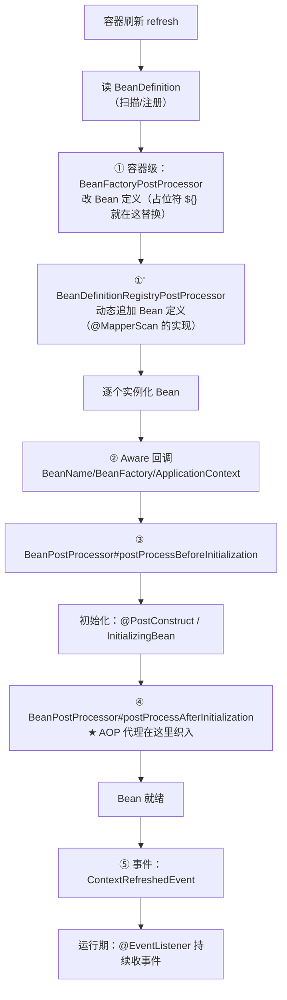

## 为什么扩展点值得单独一张地图

[Bean 生命周期](/java/intermediate/spring/01-ioc-bean-lifecycle/)讲了
"一个 Bean 从生到死"；扩展点回答的是**"第三方在生命周期与容器启动
的哪个环节能插手、插手能改什么"**。Spring 的可插拔——自动配置、
MyBatis 集成、事务、@Value——全都架在这些钩子上，这张地图是读懂
框架源码的索引页。

## 一条时间轴，两类扩展点



分水岭一句话：**容器级改的是"图纸"（BeanDefinition），Bean 级动的
是"成品"（Bean 实例）**。

## 五大扩展点速查

| 扩展点 | 时机 | 能干什么 | 框架现场 |
|---|---|---|---|
| `BeanFactoryPostProcessor` | 定义加载后、实例化前 | 改 Bean 定义：属性占位符、改 scope/懒加载 | `PropertySourcesPlaceholderConfigurer` |
| `BeanDefinitionRegistryPostProcessor` | BFPP 的前置兄弟 | **凭空注册新 Bean 定义** | `@MapperScan`/`@ComponentScan` 的扫描注册 |
| `BeanPostProcessor` | 每个 Bean 初始化前后 | 包一层代理、注入句柄 | **`AbstractAutoProxyCreator`（AOP）、`@PostConstruct` 处理器** |
| `Aware` 家族 | 初始化前 | 把容器内部件递给 Bean | `ApplicationContextAware` 拿上下文 |
| 事件机制 | 全程 | 组件间解耦通知 | `ContextRefreshedEvent`（启动后预热）、`ApplicationReadyEvent` |

`@Value("${key}")` 能生效，是 BFPP 阶段占位符配置器把定义里的字符串
换成了真值——**AOP 代理不是注解魔法，是 BeanPostProcessor 在初始化
完成后把你的对象换成了代理**（代理细节见[AOP 与动态代理](/java/intermediate/spring/02-aop/)）。

## FactoryBean：伪装成 Bean 的工厂

`FactoryBean<T>` 是一个特殊 Bean：容器里注册的是工厂，**getBean
拿到的是工厂生产的产品**；想拿工厂本身加 `&` 前缀（`context.getBean("&mapper")`）。

```java
public class MapperFactoryBean<T> implements FactoryBean<T> {
    @Override
    public T getObject() { return sqlSession.getMapper(interfaceType); }
    @Override
    public Class<?> getObjectType() { return interfaceType; }
}
```

MyBatis 的 `@Mapper` 接口没有实现类，却能 `@Autowired` 注入——因为
容器里放的是 `MapperFactoryBean`，注入时拿到的是 `getMapper` 的
动态代理。**FactoryBean = 容器认可的自定义对象生产线**（MyBatis
接入全链见[MyBatis 集成](/java/intermediate/spring/05-mybatis-sqlsession/)）。

## @Import：把任意东西塞进容器的统一入口

| 用法 | 参数形态 | 场景 |
|---|---|---|
| 直接导入 | `@Import(A.class)` | 普通类强转为 Bean |
| **ImportSelector** | 返回类名数组 | 按条件批量导入（**自动配置的核心机制**） |
| ImportBeanDefinitionRegistrar | 拿 Registry 手工注册 | 接口扫描生成 Bean（@MapperScan/@Service 标注接口） |

`@EnableAutoConfiguration` 的本质就是 `@Import(AutoConfigurationImportSelector.class)`
——SPI 文件里列出的配置类由 Selector 筛选后导入（链路见
[Spring Boot 自动配置](/java/intermediate/spring-boot/01-autoconfig/)），
与[SPI 机制](/java/basic/syntax/10-spi/)正好首尾相接。

## 事件机制：容器内的发布订阅

```java
@Component
public class OrderEvents {
    @EventListener                     // 同线程、同步执行（默认）
    public void on(OrderCreatedEvent e) { sendEmail(e); }
}
// 发布：publisher.publishEvent(new OrderCreatedEvent(order));
```

要点：默认**同步**在发布者线程执行（要异步自己加 `@Async` + 线程池）；
事务里发布可指定 `@TransactionalEventListener`（提交后才消费）——
"下单成功后发通知"不丢事件也不回滚邮件的正确姿势（事务语境见
[事务与传播](/java/intermediate/spring/04-transaction/)）。

## 初始化与销毁：三套写法的固定顺序

同一 Bean 可以同时挂三套初始化/销毁回调，顺序**固定不变**：

| 顺序 | 初始化 | 销毁 |
| --- | --- | --- |
| ① | `@PostConstruct` | `@PreDestroy` |
| ② | `InitializingBean.afterPropertiesSet()` | `DisposableBean.destroy()` |
| ③ | `@Bean(initMethod="…")` | `@Bean(destroyMethod="…")` |

选型：注解版给业务代码（零框架入侵）、接口版给库代码（比注解出现早）、
method 版给源码不可改的第三方类。一个 Bean 挑一套用满，别三套各写一半。

BeanPostProcessor 还有两个实践推论：

- **注册顺序敏感**：PriorityOrdered → Ordered → 无序。想抢在 AOP 织入
  前加工 Bean，必须用 `@Order` 排到自动代理创建器之前——否则你改的是
  原始对象，一织入代理修改就"丢"了。
- **@Value 依赖 BFPP**：占位符解析器（一个 BeanFactoryPostProcessor）
  没注册时，注入的就是 `${key}` 原文——环境里查"@Value 没替换"先看它。

## Boot 时代的启停钩子

| 扩展点 | 时机 | 典型用途 |
| --- | --- | --- |
| `EnvironmentPostProcessor` | 容器刷新前 | 自定义属性源（配置解密、远程配置合并） |
| `CommandLineRunner` / `ApplicationRunner` | 应用就绪时 | 启动后初始化：预热缓存、跑迁移（`String[]` vs `ApplicationArguments` 参数形态之差） |
| `SmartLifecycle` | refresh 完成 / close | 有 start/stop 的组件，优雅停机的标准落点 |

Runner 之间用 `@Order` 排先后；Web 层还留有四个高频插槽——
`HandlerMethodArgumentResolver`（自定义注解参数，如从 Header 解析
当前用户）、`Converter/Formatter`（类型转换）、
`RequestBodyAdvice/ResponseBodyAdvice`（报文加解密与日志）、
`HandlerExceptionResolver`（@ControllerAdvice 的底层机制，见
[统一异常处理](/java/intermediate/spring-mvc/02-exception-advice/)）。

## 小结

- 时间轴记忆：BFPP 改图纸 → Registry 后处理器加图纸 → Aware 递
  部件 → BeanPostProcessor 前后加工（AOP 在这里）→ 初始化 → 事件
  收尾。
- 初始化销毁三套写法顺序固定：注解 → 接口 → init-method；BPP 顺序
  敏感，抢位次靠 Ordered。
- FactoryBean 是"注册工厂、取出产品"，MyBatis Mapper 的注入本质；
  @Import 三形态是向容器塞东西的统一入口，自动配置即其 SPI 组合。
- 事件默认同步、随事务可选提交后触发——把它当"进程内解耦"用，
  别当消息队列用；启停期另有 Runner 与 SmartLifecycle 接管。
