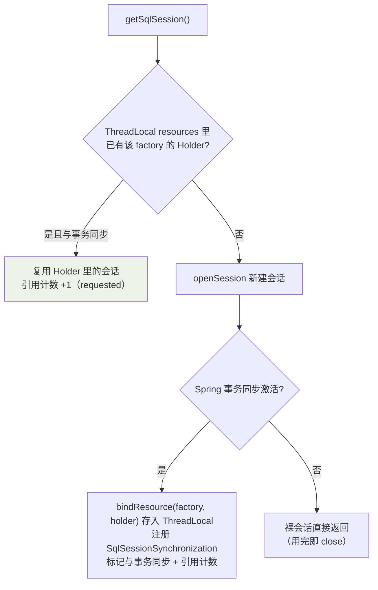
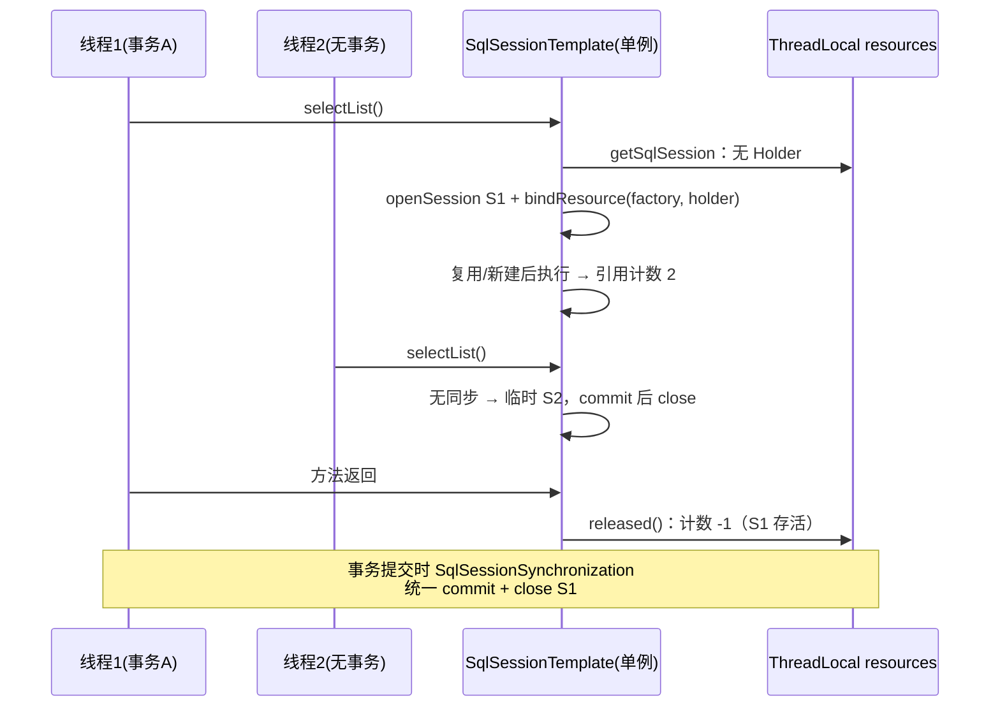

## 问题：DefaultSqlSession 不是线程安全的

原生 MyBatis 的用法是"一次操作一个会话"：

```java
try (SqlSession session = sqlSessionFactory.openSession()) {
    UserMapper mapper = session.getMapper(UserMapper.class);
    // ...
    session.commit();
}
```

`DefaultSqlSession` 内部的 Executor 带着一二级缓存与游标状态，**多线程
共用会串数据**。常规模式下每次 open/close 没问题，但与 Spring 集成后，
DAO 是单例 Bean，N 个请求线程共用同一个 `SqlSessionTemplate`——
它却敢注册成全局单例。靠的是两层设计：

1. **SqlSessionTemplate 自己不带会话状态**，每个方法调用临时拿一个
   真正的 SqlSession；
2. 拿哪个会话、什么时候关，由 **Spring 事务上下文**决定。

## 第一层：JDK 动态代理拦截所有调用

构造器里就把"会话的获取"外包给了代理：

```java
public SqlSessionTemplate(SqlSessionFactory sqlSessionFactory, ...) {
    this.sqlSessionFactory = sqlSessionFactory;
    // sqlSessionProxy：SqlSession 接口的动态代理
    this.sqlSessionProxy = (SqlSession) newProxyInstance(
        SqlSessionFactory.class.getClassLoader(),
        new Class[] { SqlSession.class },
        new SqlSessionInterceptor());   // 所有调用进 invoke
}
```

你调 `sqlSessionTemplate.selectList(...)`，实际进入
`SqlSessionInterceptor.invoke`——这是站内 [AOP 与动态代理](/java/intermediate/spring/02-aop/)
同款的 JDK 代理套路：**单例的只是壳，真正干活的会话每次现取**。

## 第二层：SqlSessionInterceptor 的固定四步

```java
private class SqlSessionInterceptor implements InvocationHandler {
    public Object invoke(Object proxy, Method method, Object[] args) {
        // ① 拿会话：有事务就复用事务里那个，没有就开新的
        SqlSession sqlSession = getSqlSession(sqlSessionFactory, executorType, ...);
        try {
            // ② 反射调用真实会话的方法
            Object result = method.invoke(sqlSession, args);
            // ③ 不在 Spring 事务里 → 手动 commit（有的库要求 commit 后才能 close）
            if (!isSqlSessionTransactional(sqlSession, sqlSessionFactory)) {
                sqlSession.commit(true);
            }
            return result;
        } catch (Throwable t) {
            // ④ 异常翻译：PersistenceException → Spring DataAccessException 体系
            Throwable unwrapped = unwrapThrowable(t);
            Throwable translated = exceptionTranslator
                .translateExceptionIfPossible((PersistenceException) unwrapped);
            throw translated != null ? translated : unwrapped;
        } finally {
            // ⑤ 关会话：事务里只减引用计数，事务外真关
            closeSqlSession(sqlSession, sqlSessionFactory);
        }
    }
}
```

会话的"借与还"全部收口在这四步里，业务代码一句都不用管。

## 事务级绑定：SqlSessionHolder 与 ThreadLocal

`getSqlSession` 是线程安全的关键，逻辑三分支：



要点：

- **同一事务内，一个 SqlSessionFactory 只开一个会话**——线程私有（
  `TransactionSynchronizationManager` 的 ThreadLocal），不同线程互不可见；
- **ExecutorType 不可中途换**：事务里已有 SIMPLE 会话又请求 BATCH →
  直接抛 `TransientDataAccessResourceException`（复用会话与执行器绑定）；
- 无事务时每次调用都是"open → invoke → commit → close"，天然线程安全
  但开销略高——这也是无事务批量场景慢的一个隐性原因。

对应的 `closeSqlSession` 做对称的两分支：

| 场景 | 动作 |
|---|---|
| 会话被事务管理（Holder 还在） | `holder.released()`：**只减引用计数**，会话留给事务后续操作复用 |
| 裸会话 | `session.close()`：真正关闭 |

引用计数归零、事务提交/回滚时，由 `SqlSessionSynchronization` 回调
统一善后——**会话的生命周期挂到了 Spring 事务上**（对照[事务与传播机制](/java/intermediate/spring/04-transaction/)：
REQUIRED 传播下多次 DAO 调用共用一个物理会话/连接，就是这里绑定的）。

## 一图串起来



## 要点备忘

- SqlSessionTemplate 单例线程安全的本质：**壳是无状态代理，真实会话
  按调用临时获取、按事务生命周期管理**。
- 事务内一个 factory 一个会话（ThreadLocal 绑定 + 引用计数）；事务外
  一次一开一关。
- ExecutorType 在同一事务内不可切换——混合批量需求要拆事务或换
  `SqlSessionTemplate` 实例。
- 异常被翻译进 Spring `DataAccessException` 体系，`@Transactional`
  回滚判定因此才能识别持久层异常。

## 延伸阅读

- [Mybatis SqlSessionTemplate 源码解析（博客园 · 大新博客）](https://www.cnblogs.com/daxin/p/3544188.html)——本篇母本，逐行讲解 invoke/getSqlSession/closeSqlSession
- [mybatis-spring 官方文档](https://mybatis.org/spring/zh/index.html)
