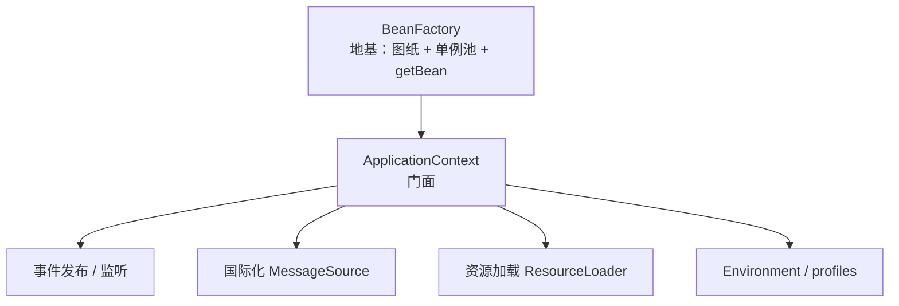
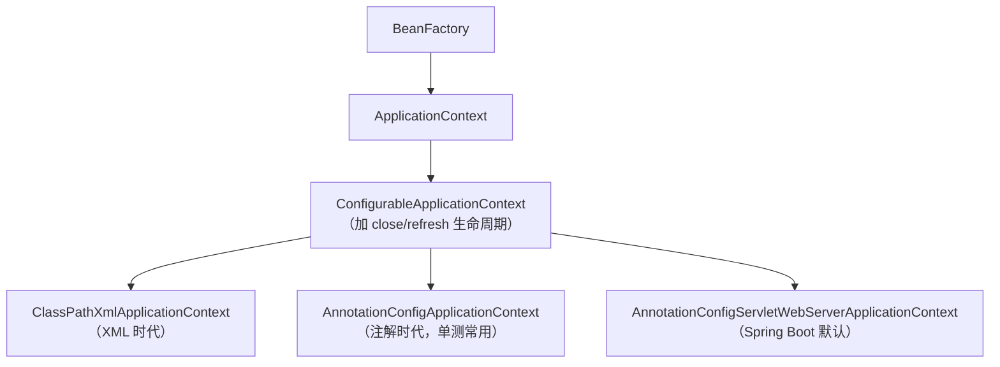
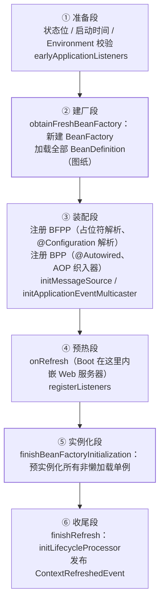

## 两个名字、一个分工

**BeanFactory 是地基**：只管"图纸 → 实例 → 单例池"这最小闭环，提供
`getBean` 与惰性加载，它是 Spring 最底层的容器接口。

**ApplicationContext 是门面**：在 BeanFactory 之上叠加了应用级能力，
日常开发你打交道的都是它——`@Autowired ApplicationContext`、
`SpringApplication.run()` 的返回值，全是它。

| 能力 | 接口 | 拿来干什么 |
| --- | --- | --- |
| 容器本体 | ListableBeanFactory | getBean、BeanDefinition 管理 |
| 事件发布 | ApplicationEventPublisher | 容器内广播事件（解耦） |
| 国际化 | MessageSource | i18n 文案解析 |
| 资源加载 | ResourceLoader | 统一读 classpath/file/URL |
| 环境抽象 | Environment | profiles + 属性源（配置优先级） |

一句话：**BeanFactory 负责"造东西"，ApplicationContext 负责"把应用
组织起来"**——事件、配置、资源、国际化都是"组织"的范畴。

## 上下文家族与父子容器

传统 SSM 项目里有**两个上下文**：root 容器（ContextLoaderListener 起，
管 Service/DAO）+ servlet 子容器（DispatcherServlet 起，管 Controller）。
查找规则：**getBean 先问自己，没有再问父容器**——所以 Controller 能注入
Service，反过来不行。父子结构是"分层隔离"的手段，也是"子容器扫描范围
配错导致 Bean 重复/找不到"这类老 bug 的根源。

Spring Boot 把它收敛成**单上下文**：所有 Bean 在一个容器里，没有父子
查找的心智负担（webflux 环境同理只是换成 Reactive 的家族成员）。

## refresh()：容器启动的十二步收敛成四段

[IoC 篇](/java/intermediate/spring/01-ioc-bean-lifecycle/)给过简化版启动
流程，这里把 `AbstractApplicationContext.refresh()` 按"四段"展开——
**这是理解一切启动期问题的地图**：

记忆锚点：

- **建厂段只产图纸不产对象**——扫描 `@Component`、解析 `@Bean` 都发生在
  这里（`ConfigurationClassPostProcessor`，一个 BeanFactoryPostProcessor，
  详见[扩展点全景](/java/intermediate/spring/06-extension-points/)）。
- **装配段必须赶在实例化之前**：@Autowired 解析器、AOP 织入器这些
  BeanPostProcessor 若晚于普通 Bean 注册，普通 Bean 就"没人加工"了。
- **Boot 的内嵌 Tomcat 在 onRefresh 起动**，随后单例铺开、
  `ContextRefreshedEvent` 广播，最后才是 Runner 与 `ApplicationReadyEvent`。

## 容器里有哪些"现成的 Bean"

不用自己声明，**构造器注入直接要**——容器启动时把下面这些注册成了
可解析依赖（resolvable dependencies）：

| 可注入组件 | 用途 |
| --- | --- |
| `ApplicationContext` / `BeanFactory` | 容器自身（BeanFactory 是懒加载底座） |
| `Environment` | 读配置项、判断 profile：`env.getProperty("app.x")` |
| `ApplicationEventPublisher` | 发事件：`publishEvent(new XxxEvent(...))` |
| `ResourceLoader` | 按前缀读资源：`classpath:` / `file:` / `http:` |
| `MessageSource` | i18n 文案 |
| `ObjectProvider<T>` | 延迟/可选/多实现依赖（原型场景见 IoC 篇） |

Spring Boot 在此之上又自动装配了一批高频组件，**开箱即可注入**：

| Boot 内置 Bean | 用途 |
| --- | --- |
| `ObjectMapper` | JSON 序列化（全局定制在这里改） |
| `RestTemplateBuilder` / `RestClient.Builder` | HTTP 客户端的"带默认配置工厂" |
| `Validator` | JSR-303 参数校验 |
| `ConversionService` | 类型转换（@Value 字符串转对象就走它） |
| `TaskExecutor` / `TaskScheduler` | 线程池与调度（@Async/@Scheduled 的执行者） |

### 坏味道：注入容器到处 getBean

`ApplicationContext.getBean(UserService.class)` 满天飞是把**依赖注入
退化成服务定位器**：依赖关系藏进方法体、编译期查不出来、单测必须起
容器。容器注入只该出现在两类框架级代码里——通用工具（如自己实现
Aware 回调）和确实只能运行期决定类型的多态分发。业务依赖一律走
构造器注入，让依赖在类签名里可见。

## 容器关闭：事件的最后一环

`close()` 或 JVM 优雅退出钩子触发时：发布 `ContextClosedEvent` →
逐个执行销毁回调（@PreDestroy → DisposableBean → destroy-method，顺序
见 [IoC 篇](/java/intermediate/spring/01-ioc-bean-lifecycle/)）→ 清空
单例池。配合 `SmartLifecycle` 能实现"先停流量入口、再停消费者、最后停
资源池"的分层下线；Boot 的 `server.shutdown=graceful` 就是这套机制
的现成应用。

## 小结

- BeanFactory 是最小容器，ApplicationContext 是叠加了事件/i18n/资源/
  环境抽象的应用门面；日常注入的就是后者。
- refresh() 四段：准备 → 建厂产图纸 → 抢在实例化前装配处理器 →
  预实例化单例并广播就绪事件；Boot 的 Web 服务器在 onRefresh 起动。
- Environment、ApplicationEventPublisher、ObjectProvider 等是容器
  预置的可注入组件，Boot 再叠加 ObjectMapper、RestClient 等。
- 到处 getBean 是反模式；容器只该被框架级代码持有。
