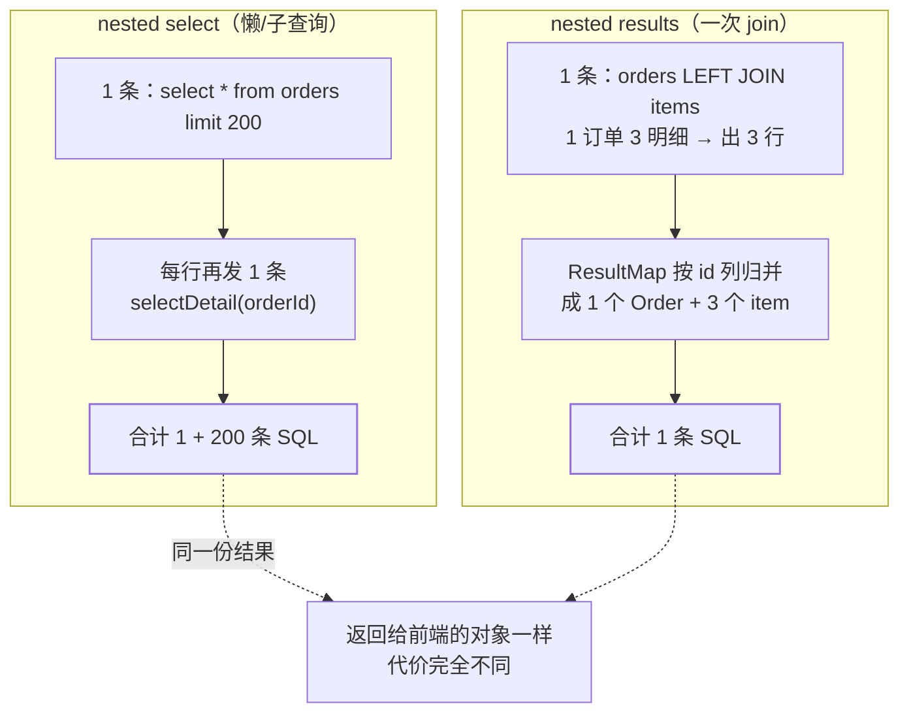

## 问题：一次请求打出 201 条 SQL

[SqlSessionTemplate 那篇](/java/intermediate/spring/05-mybatis-sqlsession/)
讲的是"单例模板为什么线程安全"——框架替你把会话绑到了事务上。
本篇是另一半：**框架不会替你管的四件事**——SQL 注入面、查询次数、
行归并边界、缓存作用域。这四件恰好是"能跑"与"能上生产"的分界。

主线场景：**列表接口查 1 张订单表 + 200 条明细，一次请求打出 201 条 SQL**，
而且加了一行日志之后 SQL 更多了。

## 一、`#{}` 是参数绑定，`${}` 是字符串拼接

```xml
<!-- #{}：预编译占位，值永远进不了 SQL 文本 -->
WHERE status = #{status} ORDER BY ${orderByColumn} ${direction}
```

| | `#{}` | `${}` |
|---|---|---|
| 到达 DB 的形态 | `?` + 参数包 | 已经拼进 SQL 文本 |
| 注入 | 不受影响 | **完全暴露**，转义救不了 |
| 用途 | 一切**值** | 只有标识符能动态：列名、表名、排序方向 |
| 类型/引号 | 驱动按类型处理 | 自己负责（字符串要手动加引号） |

`order by` 是唯一合理的动态位。**做法是白名单枚举，不是转义**：

```java
// 入参 col 只能命中这三项，其余直接拒绝——不给 SQL 文本留任何形状
private static final Set<String> OK =
    Set.of("create_time", "amount", "id");
```

顺带两个高频写法错误：

```xml
<!-- ✗ 拼接 like：既难读又给 ${} 开了口子 -->
AND name LIKE '%${keyword}%'
<!-- ✓ 值仍走 #{}，拼接交给数据库 -->
AND name LIKE CONCAT('%', #{keyword}, '%')
```

## 二、批量插入：`<foreach>` 拼一条大 SQL ≠ 真批量

两种写法代价完全不同：

| 方式 | 发往 DB 的语句 | 瓶颈 |
|---|---|---|
| `<foreach>` 拼多值 | `INSERT ... VALUES (..),(..),(..)` **1 条** | SQL 长度受 `max_allowed_packet` 限制、解析成本 |
| JDBC batch | N 条同模板语句在驱动侧攒着 | **MySQL 默认不攒，逐条发** |

第二条是真正的坑：Connector/J 的 `rewriteBatchedStatements` **默认 false**，
`addBatch()` + `executeBatch()` 会被驱动拆成 N 次网络往返——代码看着是批量，
线上是 N 次 RTT。开 `=true` 才会重写成多值 insert
（大批量导入的取舍见[百万行 Excel 导入](/distributed/intermediate/case-studies/17-excel/)）。

MyBatis 侧要两者配合：

```java
// SqlSessionTemplate 换成 BATCH 执行器（注意：事务内不可中途换！）
SqlSessionTemplate batch =
    new SqlSessionTemplate(factory, ExecutorType.BATCH);
list.forEach(mapper::insert);
batch.flushStatements();       // 不 flush 就一直攒着
```

**同一个 Spring 事务里已经用了 SIMPLE 会话，再要 BATCH 会直接抛
`TransientDataAccessResourceException`**——原因在 05 篇：会话与执行器绑定。
混合批量需求要么拆事务，要么用独立的 `SqlSessionTemplate` 实例。

## 三、N+1 是一句 `<association select="...">` 引来的

同一个"订单带明细"，两种写法，查询次数差一个数量级：



nested select 的写法本身没错，错在**不知道它会发 200 次**：

```xml
<!-- ✗ 每行触发一次 -->
<collection property="items" javaType="list"
    ofType="Item" column="id"
    select="com.x.ItemMapper.listByOrder"/>

<!-- ✓ 一次 join + 归并（同表多次 join 要用 columnPrefix 区分列） -->
<collection property="items" javaType="list" ofType="Item">
  <id column="i_id" property="id"/>
  <result column="i_name" property="name"/>
</collection>
```

**判定方法**很朴素：开 SQL 日志（或看 `p6spy`/驱动日志）数同一条
statement 出现几次。200 次同模板 = N+1，与"慢 SQL"是两类问题——
每条都很快，加起来才慢。

## 四、`toString` 会触发懒加载：日志一行，查询翻倍

`lazyLoadingEnabled=true` 之后，行为由两个设置共同决定（**默认值来自官方
配置表，版本相关**）：

| 设置 | 默认值 | 含义 |
|---|---|---|
| `lazyLoadingEnabled` | `false` | 全局懒加载开关 |
| `aggressiveLazyLoading` | `false`（**≤3.4.1 为 true**） | true 时**任何**方法调用装满所有懒属性 |
| `lazyLoadTriggerMethods` | `equals,clone,hashCode,toString` | 这四个方法一定触发 |

于是主线场景的第二半出现了：**你只是想加一行日志**。

```java
// 看着无害：toString() 在触发方法列表里 → 每个对象的懒属性全被查出来
log.info("处理订单 {}", order);           // 200 次 items 查询从这里出发
```

同类触发点还有两个更隐蔽的：**Jackson 序列化**给前端时会挨个调 getter，
以及任何把结果丢进 `equals`/`hashCode` 的集合操作（去重、放进 `Set`）。

对策分三层：

1. 生产日志**不要打整个领域对象**，打 ID；
2. 懒加载与序列化共存时，DTO 与实体分开，返回前已装配完；
3. 单个映射可用 `fetchType="lazy|eager"` 覆盖全局策略，
   明确"这个集合就是要在主查询里带出来"。

前提也别忘：懒加载靠给结果类生成代理，**final 类/没有默认构造器的类
代理不了**，静默退化成即时加载。

## 五、`<id>` 决定行边界：join 结果归并的唯一依据

一次 join 返回 3 行（1 订单 3 明细，订单列重复出现），要变成 1 个对象 + 3 个子项，
靠的是 MyBatis **按映射列拼 key 判断"还是同一行"**：

- 有 `<id>`：只用 id 列做 key——稳定、快；
- **没写 `<id>`**：用**所有**映射列拼 key → 明细列天然不同 →
  同一个订单被判成 3 个不同对象，`List<Order>` 长度变成 3，
  或者 `collection` 内容互相覆盖。

这是 nested results 最常见的"数据莫名重复/丢失"成因。规则一句话：
**凡是用 nested results 归并父子结构，父层必须有 `<id>`。**

## 六、分页插件的三条隐性契约

插件走 MyBatis 自己的 `Interceptor` 链（责任链，见
[责任链模式](/java/intermediate/design-pattern/12-chain-of-responsibility/)），
不改你的 SQL 文本而是拦截执行——代价是几条契约：

1. **`startPage` 基于 ThreadLocal，必须紧跟第一条查询**。中间插入任何其他
   查询，被分页的是它而不是你想要的那条；
2. **线程池复用要清**：翻页后异常退出没 `clearPage()`，下一个请求拿到
   上一个的 `pageNum`——典型的"数据偶尔串页"；
3. **count 是改写出来的**：插件会去掉 `order by` 再包一层 `count(*)`，
   复杂 SQL（含 `group by`、`union`）改写后 count 可能不对；
   且**深分页照旧慢**——分页插件只解决"少写代码"，
   不解决 `limit 1000000, 20` 的扫描代价（见
   [SQL 优化与分页](/mysql/advanced/performance-ha/01-optimization/)）。

## 七、一级缓存是真的，二级缓存在分布式里通常是负的

**一级（Local Cache，`SqlSession` 级）**：`localCacheScope` 默认 `SESSION`，
同会话内相同 statement + 参数 + 行范围直接命中。

- 与 Spring 集成时，**同一事务内共用一个会话**（05 篇）→ 一级缓存真的会命中；
  事务外每次新开会话 → 你会觉得"一级缓存好像不存在"，其实是会话太短；
- 会话内任何 insert/update/delete 会**清空整个一级缓存**（保守失效策略）；
- 想彻底关：`localCacheScope=STATEMENT`（它原本的职责是防循环引用与
  嵌套查询重复，关掉会让 nested 查询变多，别为省内存乱关）。

**二级（`<cache/>`，namespace 级）**：默认所有 mapper 都没配，
`cacheEnabled=true` 只是"允许"，**要显式 `<cache/>` 才生效**，
且所有被缓存的对象必须 `Serializable`。失效策略值得警惕：

| 行为 | 后果 |
|---|---|
| 该 namespace 任意写操作 → **整个 namespace 清空** | 高频写场景命中率接近 0，白付序列化成本 |
| join 了别的表，但缓存挂在订单 namespace | 明细表变了，订单缓存**不知道** → 脏读 |
| 应用多实例各有一份 | 实例 A 更新，实例 B 仍读旧值 → **分布式下不收敛** |
| `readOnly="true"` | 返回同一实例，省反序列化，但业务改一下就污染缓存 |

结论是团队的常见做法：**二级缓存不开**，跨实例一致的缓存放 Redis
（[缓存模式与多级缓存](/redis/intermediate/usage/04-cache-patterns/)），
一致性方案与代价见
[缓存一致性](/distributed/advanced/consistency/02-cache-consistency/)。

## 八、TypeHandler 与几个类型边界

| 类型 | 默认处理 | 容易错的点 |
|---|---|---|
| `enum` | `EnumTypeHandler`，存 `name()` | 换 `EnumOrdinalTypeHandler` 存序号 → 枚举顺序一变，老数据全错位 |
| `null` 参数 | `jdbcTypeForNull=OTHER` | Oracle 驱动不接受 OTHER → 报"无效的列类型"，要显式给 `jdbcType` 或把默认设成 `NULL`（MySQL 无此限制） |
| 日期 | 3.4.5+ 原生 `LocalDateTime` | 老驱动 + 新类型 → "no type handler"；统一用 `LocalDate*`，别混 `java.util.Date` |
| `BigDecimal` | 按 `DECIMAL` | 精度与 `scale` 由 DB 列决定，除法/比较要先定 scale，别在 Java 侧 round 完再落库 |
| JSON 列 | 无 | 自定义 `TypeHandler`（Jackson）+ `@MappedTypes`，或干脆在实体存字符串、仓储层转换 |

`mapUnderscoreToCamelCase` 默认 **false**：没开它、又指望
`create_time` 自动映射成 `createTime`，结果字段静默为 null——这是
"数据查出来了但字段是空的"的第一顺位嫌疑。

## 九、`Invalid bound statement (not found)`：两种成因别混

```text
org.apache.ibatis.binding.BindingException:
  Invalid bound statement (not found):
  com.x.mapper.OrderMapper.selectById
```

1. **绑定名字对不上**：XML 的 `namespace` 不等于接口全限定名，
   或 `<select id>` 与方法名不同——重构方法名时最容易漏；
2. **XML 根本没进产物**：mapper XML 放在 `src/main/java` 下、
   Maven 默认不打包非 class 资源；或 Boot 侧 `mapper-locations` 没配。
   判据是解压 jar 看有没有那个 XML，而不是改代码。

第 2 类属于**构建产物问题而不是 MyBatis 问题**，
排查顺序见[依赖冲突与构建治理](/java/intermediate/build/01-dependency-conflict/)
（同一份"代码没错、产物不对"的家族）。

## 小结

- `#{}` 是绑定、`${}` 是拼接：动态标识符只走白名单，`like` 交给 `CONCAT`。
- `<foreach>` 拼一条 vs JDBC batch 不等价；MySQL 不开
  `rewriteBatchedStatements=true` 时 batch 是逐条发；BATCH 执行器
  不能和 SIMPLE 共用事务会话。
- **N+1 的判定是数同模板 SQL 的次数**，不是看单条耗时；nested select
  换 nested results 或加 `fetchType` 控制。
- 懒加载默认 `lazyLoadingEnabled=false`，但一旦开了，
  `toString`/`equals`/`hashCode`/`clone` 必触发（`lazyLoadTriggerMethods`
  默认值）；打整个领域对象、Jackson 序列化都是触发点。
  `aggressiveLazyLoading` 在 ≤3.4.1 默认 true，升级前后行为不同。
- nested results 归并**必须有 `<id>`**，否则行边界判错、父子数据互相覆盖。
- 分页插件三条契约：`startPage` 紧跟查询、线程池要 `clearPage`、
  count 是改写出来的且救不了深分页。
- 一级缓存在同事务内是真命中的；二级缓存 namespace 级整体失效 +
  多实例不收敛，生产一般不开。

## 延伸阅读

- [MyBatis 官方配置说明（settings 默认值表）](https://mybatis.org/mybatis-3/configuration.html)
- [MyBatis 官方动态 SQL 与 Result Map 映射](https://mybatis.org/mybatis-3/sqlmap-xml.html)
- [MySQL Connector/J：`rewriteBatchedStatements` 选项](https://dev.mysql.com/doc/connector-j/en/connector-j-reference-configuration-properties.html)
- [mybatis-spring 官方文档：线程安全与 SqlSessionTemplate](https://mybatis.org/spring/zh/index.html)
