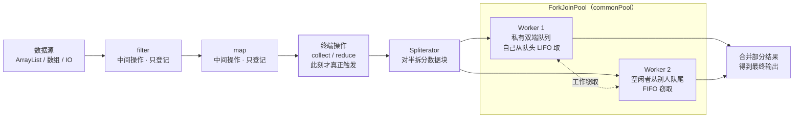

## 先想清楚：Stream 到底"流"的是什么

Java 8 的 Stream 是**来自数据源的元素队列 + 聚合操作**：

- **不存储**：元素按需计算，不像集合那样持有数据；
- **函数式**：filter/map/reduce 像 SQL 一样声明"做什么"，而非
  "怎么做"；
- 两大基石特征：
  - **Pipelining（管道）**：中间操作都返回流本身，可链式串联——
    这让**延迟执行**与**短路**成为可能（filter 还没短路判定就
    全量跑完 map 是浪费）；
  - **内部迭代**：Iterator/for-each 是"外部迭代"（你控制循环），
    Stream 把迭代藏进库里（访问者模式）——换来的是**库能替你
    并行化**：串行逐个读 item，并行则把数据分段、多线程处理、
    汇总输出。

```java
List<Integer> numbers = List.of(1, 2, 3, 4, 5, 6, 7, 8, 9);
numbers.parallelStream().forEach(System.out::println);   // 顺序不可控
numbers.parallelStream().forEachOrdered(System.out::println); // 强行有序
```

`forEachOrdered` 用并行流就是自我矛盾——最后还得全局排序，
不如直接串行。

## 接口骨架：BaseStream 与自递归泛型

```java
public interface BaseStream<T, S extends BaseStream<T, S>>
        extends AutoCloseable {
    Iterator<T> iterator();
    Spliterator<T> spliterator();   // 可拆分迭代器：并行的灵魂
    boolean isParallel();
    S sequential();                 // ← 返回 S
    S parallel();
    S unordered();
    S onClose(Runnable closeHandler);
}

public interface Stream<T> extends BaseStream<T, Stream<T>> {}
```

`S extends BaseStream<T, S>` 这个"自递归泛型"看着晕，实际含义
朴素：**parallel()/sequential() 返回的"还是同一种流"**——并行化
需要把流拆成子流，子流类型与父流一致（Stream 拆出 Stream，
IntStream 拆出 IntStream），子流还能继续拆。

中间操作签名也印证管道模型：

```java
Stream<T> filter(Predicate<? super T> predicate);  // 返回流本身
<R> Stream<R> map(Function<? super T, ? extends R> mapper);
<R> Stream<R> flatMap(Function<? super T,
    ? extends Stream<? extends R>> mapper);
Stream<T> sorted();  Stream<T> peek(...);  Stream<T> limit(long maxSize);
```

几个行为细节：

- **串/并行可反复切换，只认最后一次**：`stream.parallel().filter(...)
  .sequential().map(...).parallel().sum()` 最终按并行算；
- 多次调用不生成新流，而是复用当前流对象；
- 流实现了 `AutoCloseable`：`onClose()` 可多次注册、按注册顺序
  触发；某个 handler 抛异常不影响后续执行，但只向上抛第一个，
  其余压缩为 suppressed。

## 并行流的引擎：ForkJoinPool 与工作窃取

parallelStream 的底座是 JDK 7 的 **ForkJoinPool**（同属
Executor 家族）。它与 ThreadPoolExecutor 的分野在**任务结构**：

- ThreadPoolExecutor：线程无法"提交子任务并等它完成再继续"——
  处理有**父子依赖**的任务会死锁（父任务占着线程等子任务，子
  任务在队列里永远排不上队）；
- ForkJoinPool：线程遇到"需等待的子任务"时**挂起当前任务**，
  从队列取别的子任务继续干——用**少量线程跑海量父子任务**
  （4 个线程跑 200 万个排序子任务不在话下）。

这就是**分治法**的理想载体（快排/归并天然是父子树）。拆分由
**Spliterator**（spliterator = split + iterator）完成：数据源
不断二分，直到小于阈值（如元素 <10 时改用插入排序）转为直接
处理。

**Work Stealing 工作窃取**规则：

1. 每个工作线程一个私有双端队列 WorkQueue；
2. 自己 fork 的子任务进**队头**，本线程按 **LIFO**（栈）处理——
   后 fork 的子任务数据还热着，先做完它可能直接解锁父任务；
3. 空闲线程从别人队列的**尾部**窃取（FIFO 端）——两端操作，
   把冲突概率降到最低；
4. `push()/pop()` 仅队列主人调用，`poll()` 仅窃取者调用；
5. 只剩最后一个任务时仍有竞争，用 CAS 兜底。

把「管道」与「并行引擎」串成一张全景图：



终端操作前一切是惰性登记，触发后 Spliterator 把数据切块分给各
Worker——两端操作（主 LIFO / 窃 FIFO）把冲突概率压到最低。

## commonPool：全局共享的那口锅

Java 8 给 ForkJoinPool 加了静态**通用线程池 commonPool**：
parallelStream、Arrays.parallelSort 等未显式指定池子的并行操作
全都扔进它。默认线程数 = CPU 核数，可用
`-Djava.util.concurrent.ForkJoinPool.common.parallelism=N` 调整；
实际执行线程是 N+1——**调用线程自己也会干活**。

共享意味着**互相影响**。经典事故场景——并行流里做阻塞 I/O：

```java
Optional<String> result = engines.stream().parallel()
    .map(base -> WS.url(base + question).get())   // 阻塞 HTTP！
    .findAny();
```

worker 全部卡在等响应，commonPool 线程被耗光——**全 JVM 所有
并行流、所有 parallelSort 一起陪葬**。ForkJoinPool 不补偿阻塞
等待，这类任务该用独立线程池或异步化。

## 并行到底快不快：NQ 模型与遇到顺序

**NQ 模型**：N = 元素数量，Q = 每元素计算量，**N×Q 越大越可能
提速**。求和这种 Q 极小的，N 要上万才划算；Q 大（如算 SHA-1），
较小数据量也能吃到并行红利。拆分/合并的开销靠大 Q 摊薄。

**数据源的可分割性**决定拆分质量：

| 分割性能 | 数据源 |
|---|---|
| 好 | ArrayList、数组、IntStream.range（随机访问，任意对半切） |
| 一般 | HashSet、TreeSet |
| 差 | LinkedList（要遍历才能拆）、Stream.iterate、BufferedReader.lines |

**遇到顺序（encounter order）**是隐形税：ORDERED 流上，
`findFirst()/limit()/forEachOrdered()` 在并行时得保证前缀语义——
limit 必须攒住"前 N 个"，等前面的段完成才知道后面的要不要，
并行度被腰斩。顺序对结果无意义时，`unordered()` 主动摘掉
ORDERED 标志，limit 类操作立刻轻装上阵。

## 小结

- Stream = 数据源 + 聚合操作，靠"管道延迟执行 + 内部迭代"换
  来声明式风格与可并行性；接口用自递归泛型保证拆分后还是同类流。
- 并行引擎是 ForkJoinPool：分治任务结构 + 工作窃取（双端队列，
  主 LIFO/窃 FIFO）让少量线程跑海量父子任务。
- parallelStream 共享 commonPool：**阻塞操作会毒化全局**；
  快不快看 NQ 乘积、数据源可分割性、遇到顺序三个变量。

## 延伸阅读

- [Java8 中的 Stream 那么彪悍，你知道它的原理是什么吗？——Java小咖秀，掘金](https://juejin.cn/post/6941946196881571853)——本篇母本
- [Streams 的幕后原理——Brian Goetz](https://www.ibm.com/developerworks/cn/java/j-java-streams-2-brian-goetz/index.html)（NQ 模型与遇到顺序的出处）
- [Fork/Join 官方教程 · Oracle](https://docs.oracle.com/javase/tutorial/essential/concurrency/forkjoin.html)
