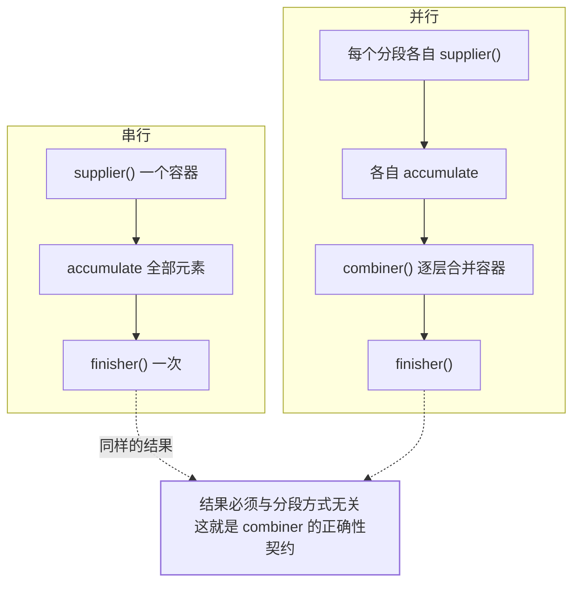

## 问题：同一段 `toMap`，串行好好的，上了并行就抛异常

[Stream 原理与并行流](/java/intermediate/stream/01-stream-principle/)
讲的是**管道怎么延迟求值、并行引擎怎么窃取任务**。本篇只讲终点那一步：
`collect(...)` 收到的那个 `Collector` 到底承诺了什么。三个症状都来自它：

```text
java.lang.IllegalStateException: Duplicate key 张三 (attempted
  merging values User@1 and User@2)
java.lang.NullPointerException: CONTEXT: merging value ...
并行跑出来的结果偶尔少几条，串行永远正确
```

## 一、Collector 是五个函数 + 一组声明

`Collector<T, A, R>` 的三个类型参数就是它的生命周期：
**元素 T → 中间容器 A → 结果 R**。

```java
public interface Collector<T, A, R> {
    Supplier<A> supplier();                       // 造一个容器
    BiConsumer<A, T> accumulator();               // 元素塞进容器
    BinaryOperator<A> combiner();                 // 两个容器合并
    Function<A, R> finisher();                    // 容器 → 结果
    Set<Characteristics> characteristics();       // 声明：我有什么性质
}
```

串行时只有 `supplier → accumulate×N → finish`；**`combiner` 在串行里
一辈子不会被调用一次**——这就是"本地永远对、并行偶尔错"的温床。



契约说清楚：**任意切分方式下，`combiner` 合并出来的容器必须与
"按顺序累积进一个容器"等价**。自定义 Collector 少写 combiner 语义，
串行测不出来。

## 二、三个 characteristics 各管什么

| 特征 | 声明的含义 | 影响什么行为 |
|---|---|---|
| `IDENTITY_FINISH` | `finisher` 就是恒等函数，容器本身就是结果 | 省掉一次转换；`toList()`/`toSet()` 属于这类，所以泛型强转就能返回 |
| `CONCURRENT` | `accumulator` 线程安全，**容器可以只有一个** | 流不再"分段各建容器再合并"，而是所有线程往同一个容器里塞——省掉合并与容器复制 |
| `UNORDERED` | 结果与遇到顺序无关 | 允许放弃顺序优化（配合 `limit()` 等遇到顺序敏感的操作，能显著减少等待） |

`CONCURRENT` 的实际收益看这两个 API 的差别：
`Collectors.groupingBy` 串行地建 `HashMap`，而
**`groupingByConcurrent` / `toConcurrentMap` 声明了 CONCURRENT**，
用 `ConcurrentHashMap` 让多线程共享一个容器累加。反过来，
`Collectors.toMap` 收集器**没有** CONCURRENT——并行时是"每段一个
HashMap 再 `putAll` 合并"。

一个常见误解要纠正：**给 `toList()` 加上 `parallelStream()` 不会变快**，
因为它既不是 CONCURRENT，也没有并行收益的空间（只是往里 add），
分段+合并反而多一层开销。

## 三、`toMap` 的两个异常，成因完全不同

```java
// 场景 1：key 撞了
Map<String, User> m = users.parallelStream()
    .collect(Collectors.toMap(User::getCity, u -> u));
// → IllegalStateException: Duplicate key ...
```

`toMap(keyMapper, valueMapper)` **没有合并函数**，遇到重复 key 直接抛。
并行下它由 `combiner` 合并两个 map 时抛出——**症状就变成"只在生产
高并发时炸，本地单线程怎么试都对"**。修法要么给 merge 函数，
要么先确认业务上 key 该不该唯一：

```java
// 保留后到者（或按需改成 (a, b) -> a、抛业务异常、计数）
Collectors.toMap(User::getCity, u -> u, (a, b) -> b);
```

```java
// 场景 2：value 是 null —— 与 key 重复无关
Collectors.toMap(User::getId, u -> u.getNickname());  // 昵称为 null
// → NullPointerException（发生在 HashMap.merge 里）
```

这条最反直觉：**`Map` 允许 null 值，但 `toMap` 不接受**，因为它底层
走 `Map.merge`，而 `merge` 的契约是 value 非空。`toConcurrentMap`
同样不行（`ConcurrentHashMap` 本身就不允许 null 键值）。
两个绕法：

```java
// ① 用可选包一层，收集完再拆
Collectors.toMap(User::getId, u -> Optional.ofNullable(u.getNick()));
// ② 退回 forEach + HashMap.put（串行、或自己保证并发安全）
```

## 四、downstream：`groupingBy` 的真正威力

`groupingBy` 的值收集器是可以嵌套的，这一层决定了绝大多数
"分组统计"的代码量：

```java
// 每个城市：人数、最贵年龄、按状态二级分组
Map<String, Long> cityCount = users.stream()
    .collect(groupingBy(User::getCity, counting()));

Map<String, Map<UserStatus, List<User>>> twoLevel = users.stream()
    .collect(groupingBy(User::getCity,
             groupingBy(User::getStatus)));   // downstream 套 downstream

Map<String, Integer> maxAge = users.stream()
    .collect(groupingBy(User::getCity,
             collectingAndThen(
                 maxBy(Comparator.comparingInt(User::getAge)),
                 opt -> opt.map(User::getAge).orElse(0))));
```

常用 downstream 与用途：`counting()`、`summingInt()`、
`averagingInt()`、`summarizingInt()`（一次拿到 count/sum/min/max/average，
比三次遍历省两趟）、`mapping(f, downstream)`（先把元素映射再收集，
"分组后只取名字列表"就是它）、`reducing()`、`filtering(p, downstream)`、
`partitioningBy(predicate)`（按布尔分成两堆，`Map<Boolean, List<T>>`）。

## 五、并行下真正会丢数据的那一类：自定义 Collector

```java
// ✗ 声明 CONCURRENT 却用了非线程安全容器
Collector.of(HashMap::new,
    (m, u) -> m.merge(u.getCity(), 1, Integer::sum),
    (a, b) -> {
        b.forEach((k, v) -> a.merge(k, v, Integer::sum));
        return a;
    },
    Characteristics.CONCURRENT, Characteristics.UNORDERED);   // 撒谎
```

声明了 `CONCURRENT`，流就**只建一个容器**让所有线程一起 accumulate，
不再调 combiner。于是 `HashMap` 在并发写下轻则丢计数、重则结构损坏。
要么容器换成 `ConcurrentHashMap` 并用其原子方法，要么去掉 `CONCURRENT`。

第二个坑是**把 `reduce` 当 `collect` 用**：

```java
// ✗ 并行下 identity 会被多个分段各自拿去用
list.stream().parallel().reduce(new ArrayList<>(),
    (acc, x) -> { acc.add(x); return acc; }, (a, b) -> a);
```

`reduce` 的 identity 要求是**不可变的单位元**，并行时每个分段都从它开始
累积——往同一个 `ArrayList` 上 add，结果既不完整也不确定。
需要可变累积容器就该走 `collect`（它用的是 `supplier()`，**每段一个新容器**）。

还有一个不属于 Collector 但经常被一起问的：**边遍历流边改数据源**——
`ArrayList` 的 spliterator 是弱一致的，不抛 `ConcurrentModificationException`
但可能读到重复或漏读；并行时更可能直接
`ArrayIndexOutOfBoundsException`。要么先 `List.copyOf()` 再流，
要么换线程安全容器。

## 六、要不要不可变结果

`toList()` 的官方契约只说"返回一个 `List`"——**类型、可变性、
可序列化、线程安全都不保证**（今天它是 `ArrayList`，不保证明天）。
需要这些性质时显式要：

```java
List<User> fix = users.stream().filter(...).collect(toUnmodifiableList());
                                     // Java 10+；类型/可变性明确
Map<String, User> m2 = users.stream()
    .collect(toMap(User::getId, u -> u, (a, b) -> b, LinkedHashMap::new));
                                     // 第四参数指定容器实现
```

`toUnmodifiableList/Set/Map` 返回真正不可变的集合，
往其上 `add` 会抛 `UnsupportedOperationException`——
**这也意味着它不能当中间结果继续攒**。

## 七、`teeing`：一次遍历出两个结果

`Collectors.teeing(downstream1, downstream2, merger)`（Java 9+）
适合"同一批数据要两份不同汇总"的场景，省掉两次遍历：

```java
// 一次遍历同时得到「总条数」和「最长的一条」
Result r = orders.stream().collect(teeing(
    counting(),
    maxBy(Comparator.comparingInt(Order::getAmount)),
    (count, max) -> new Result(count, max.orElse(null))));
```

它比 `collectAndThen` 更适合两个**互相独立**的汇总；
只要有一个汇总依赖另一个的中间结果，就该拆回两步或自定义 Collector。

## 小结

- Collector 是 `supplier / accumulator / combiner / finisher /
  characteristics` 五件套；**combiner 只在并行时被调用**，
  它是"切分方式无关"的正确性契约所在。
- 三个特征值各自改变运行方式：`IDENTITY_FINISH` 省一次转换、
  `CONCURRENT` 让全流共用一个线程安全容器、`UNORDERED` 摘掉遇到顺序税。
- `toMap` 有两种异常：**重复 key → IllegalStateException（没给 merge
  函数）**、**null value → NPE（底层 `Map.merge` 契约）**；后者是
  "Map 明明能存 null"的例外。
- 并行丢数据的头号原因是**声明了 CONCURRENT 却用非线程安全容器**，
  其次是**拿 `reduce` 的 identity 做有状态累积**——后者必须改用
  `collect`。
- `toList()` 不保证可变性与具体类型；要不可变用 `toUnmodifiableList`，
  要指定容器用四参数版 `toMap`。
- 分组统计的写法瓶颈在 downstream 嵌套（`counting/summarizingInt/
  mapping/partitioningBy`），不在 `groupingBy` 本身。

## 延伸阅读

- [Collectors 官方 Javadoc（含 toMap 对 null 值与重复 key 的说明）](https://docs.oracle.com/en/java/javase/17/docs/api/java.base/java/util/stream/Collectors.html)
- [Collector 接口 Javadoc：Characteristics 三个取值的语义](https://docs.oracle.com/en/java/javase/17/docs/api/java.base/java/util/stream/Collector.html)
- [Stream 短路与其他操作（Java Tutorials）](https://docs.oracle.com/javase/tutorial/collections/streams/)
