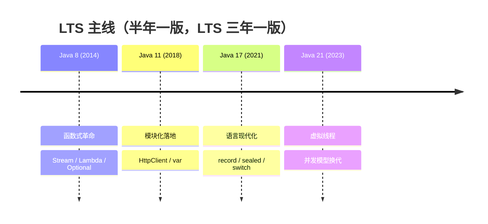

## 一张图定位 Java 8



Java 8 是 Java 语法史上的分水岭：**把"传递行为"变成一等公民**。之前
Java 只能传递数据（对象），想传递一段逻辑只能包成匿名内部类；8 之后
一段逻辑本身（Lambda）就能当值传。

## Lambda 与函数式接口

Lambda 的类型是**函数式接口**——只有一个抽象方法的接口（`@FunctionalInterface`
只是编译器检查，不写也行）：

```java
// 匿名内部类 → Lambda
Runnable r1 = new Runnable() {
    public void run() { System.out.println("go"); }
};
Runnable r2 = () -> System.out.println("go");

Comparator<Integer> c1 = (a, b) -> Integer.compare(a, b);
Comparator<Integer> c2 = Integer::compareTo;   // 方法引用：等价且更短
```

JDK 内置了四大函数式接口，覆盖绝大多数场景，**业务代码不必再自定义**：

| 接口 | 抽象方法 | 语义 | 典型场景 |
|---|---|---|---|
| `Supplier<T>` | `T get()` | 只出不进 | 工厂、懒加载 |
| `Consumer<T>` | `void accept(T)` | 只进不出 | forEach、回调 |
| `Function<T,R>` | `R apply(T)` | 进 T 出 R | map、类型转换 |
| `Predicate<T>` | `boolean test(T)` | 进 T 出 boolean | filter、断言 |

**方法引用四种写法**：`类::静态方法`、`对象::实例方法`、`类::实例方法`
（第一个参数当接收者）、`类::new`（构造器引用）。

> 为什么 Lambda 比匿名内部类轻：匿名内部类编译后是**真实的 class 文件**，
> 运行时真加载一个类、new 一个对象；Lambda 编译成私有静态方法 +
> `invokedynamic`，多数情况**不生成新类**，实现由 JVM 延迟织入。

## 接口默认方法与静态方法

Java 8 起接口可以有实现了：

```java
public interface List<E> {
    default void sort(Comparator<? super E> c) { /* 默认实现 */ }
    static <E> List<E> of() { /* 静态工厂 */ }
}
```

动机是**接口演化**：Stream 要给 `Collection` 加 `stream()` 方法，如果
接口只能声明不能实现，全生态的实现类（包括用户的）全部编译报错。
`default` 让新方法有默认行为，旧实现不用改。

与抽象类的差异收窄但仍在：接口**没有状态**（不能有实例字段），抽象类
可以持有字段与构造器。**"能默认实现"和"能存状态"是两回事**。

## Optional：把 null 检查变成类型语义

```java
// 旧：调用方靠文档/记忆判空
User u = findUser(id);
if (u != null) { ... }

// 新：返回类型本身声明"可能没有"
Optional<User> ou = findUser(id);
ou.map(User::getOrders)
  .orElse(List.of());          // 空就给默认值，链路不断
```

要点：`Optional` 用于**返回值**表达"可能缺失"；不建议当字段、入参用。
`isPresent() + get()` 组合等于没学，优先 `map/orElse/ifPresentOrElse`。

## 新时间 API：java.time

旧 `Date` 的三大罪：可变（线程不安全）、月份从 0 开始、`SimpleDateFormat`
线程不安全。`java.time` 全部治愈——**类型不可变、职责拆分、线程安全**：

```java
LocalDate d = LocalDate.of(2024, 1, 15);        // 月份回归人类计数
LocalDateTime t = d.atTime(10, 30);
Duration dt = Duration.between(t, t.plusHours(2));

DateTimeFormatter f = DateTimeFormatter.ISO_LOCAL_DATE;  // 线程安全可复用
LocalDate.parse("2024-01-15", f);
```

| 旧 | 新 | 说明 |
|---|---|---|
| `Date` | `LocalDateTime` / `Instant` | 本地时间 / UTC 时间戳 |
| `Calendar` | `LocalDate.plusDays()` | 运算返回新对象 |
| `SimpleDateFormat` | `DateTimeFormatter` | 可静态共享 |

## 集合与 JVM 的连锁改动

语言层革命之外，8 在底层动了三刀，都与已有笔记强相关：

1. **HashMap 桶内树化**：冲突链表长度到 8 且表容量 ≥ 64 转红黑树，
   最坏查找 O(n) → O(log n) —— 详见[HashMap 源码分析](/java/basic/collection/02-hashmap/)。
2. **ConcurrentHashMap 弃分段锁**：Segment 数组换成 CAS + `synchronized`
   锁单桶头节点，粒度更细内存更省 —— 详见
   [ConcurrentHashMap 详解](/java/basic/collection/03-concurrenthashmap/)。
3. **永久代谢幕**：JDK 8 移除 PermGen，类元数据搬进本地内存的
   **元空间 Metaspace** —— `MaxPermSize` 参数从此作废，详见
   [JVM 运行时数据区](/java/advanced/jvm/02-memory/)。

另外 Stream、CompletableFuture 也诞生于 8：前者专篇见
[Stream 原理与并行流](/java/intermediate/stream/01-stream-principle/)。

## 小结

- Java 8 的主线是**行为可传递**：Lambda + 函数式接口 + 方法引用；
  四大内置接口 `Supplier/Consumer/Function/Predicate` 先查后写。
- 接口 `default` 方法为的是**接口演化**不断生态；接口依旧不能存状态。
- `Optional` 管"可能没有的返回值"，`java.time` 治好旧日期 API 的
  可变与线程不安全。
- 底层三连锁：HashMap 树化、CHM 去分段锁、永久代 → 元空间。
