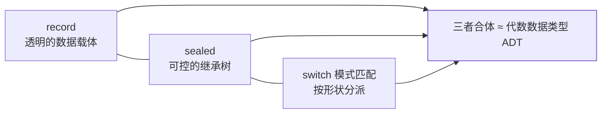

## 这一阶段的主题：把样板代码还给人

14~17 的语言特性瞄准同一个痛点——**Java 太啰嗦**。数据载体要手写
getter/equals/hashCode/toString，类型枚举靠约定，多分支判断靠 if 层层
嵌套。这个阶段交付了一整套"数据建模三件套"：



## record：一行顶一个数据类（16 转正）

```java
// 声明即拥有：全参构造器、getter（不带 get 前缀）、
// equals/hashCode（按全部字段）、toString
public record Point(int x, int y) {}

Point p = new Point(1, 2);
p.x();                       // 访问器就叫 x()
```

语义约束即设计意图：record 是**不可变的透明数据载体**——字段全是
final，没有 setter，**不能继承其他类**（隐含继承 `java.lang.Record`）。
适合 DTO、值对象、Map 的复合 key（自带正确 hashCode）；不适合有可变
状态、需要继承体系的领域对象。

```java
// 紧凑构造器：只做参数校验/规整，不用手抄赋值
public record Range(int low, int high) {
    public Range {
        if (low > high) throw new IllegalArgumentException();
    }
}
```

## sealed：谁是我的子类，我说了算（17 转正）

```java
public sealed interface Shape permits Circle, Square, Triangle {}
public record Circle(double radius) implements Shape {}
public record Square(double side) implements Shape {}
public final class Triangle implements Shape {}
// 子类必须是 final / sealed / non-sealed 三选一
```

没有 sealed，接口的实现是**开放集合**（任何包任何人都能 implement），
switch 穷举不可能；sealed 把继承树收成**封闭集合**，编译器因此知道
"Shape 只有这三种"——这是下一篇 switch 模式匹配能穷举检查的前提。

record + sealed 合起来正是函数式语言的**代数数据类型**：和类型
（sealed：是 A 或 B）+ 积类型（record：同时含 x 与 y）。

## switch 表达式（14 转正）与模式匹配（16/21 落地）

```java
// 14 转正：箭头语法（无穿透）+ 有值（表达式）+ yield 返回多行
int numLetters = switch (day) {
    case MONDAY, FRIDAY, SUNDAY -> 6;
    case TUESDAY                -> 7;
    default                     -> {
        int len = day.name().length();
        yield len;
    }
};

// 16 转正：instanceof 模式匹配，判断+强转一步到位
if (obj instanceof String s && !s.isBlank()) {
    System.out.println(s.length());   // s 直接用
}
```

到 21，`switch` 直接对**类型模式**分派，配合 sealed 做穷举：

```java
double area = switch (shape) {          // shape 是 sealed Shape
    case Circle c       -> Math.PI * c.radius() * c.radius();
    case Square s       -> s.side() * s.side();
    case Triangle t     -> 0.5 * t.base() * t.height();
    // 没写 default 编译器也不报错：它知道三种已穷举
};   // 少一种 case 编译报错——新增实现类时编译器逼你处理
```

对比老写法的收益：**多态该用继承，形状分派用 switch**——处理"外来
数据"（解析结果、协议消息）时比 visitor 模式轻得多。

## 文本块（15 转正）与其他甜点

```java
// 文本块：多行字符串不再拼 + 和 \n
String json = """
        {
          "name": "ascension",
          "level": 17
        }
        """;

// 14：NPE 精准报错，直接告诉你哪个引用为 null
// NullPointerException: Cannot invoke "String.length()"
//   because the return value of ...getUser().getName() is null
```

| 特性 | 版本 | 一句话 |
|---|---|---|
| 文本块 | 15 转正 | SQL/JSON/HTML 原样写 |
| NPE 友好提示 | 14 | 空指针直接报"是谁 null" |
| Stream.toList() | 16 | `collect(toList())` 退休 |
| jpackage | 14 | 打成安装包/exe |

## 升级到 17 要跨的坎

- **强封装 JDK 内部 API 默认生效**（16 起默认，17 彻底）：老框架反射
  JDK 内部会炸，临时解药 `--add-opens java.base/java.lang=ALL-UNNAMED`，
  根本解药是升级框架。
- **被移除的老古董**：CMS 收集器（14）、Nashorn JS 引擎（15）、
  RMI Activation（15）；SecurityManager、Applet 进入弃用通道。
- GC 层面：**ZGC / Shenandoah 15 转正**（生产可用），G1 持续演进。
  选型对比见[垃圾回收算法与收集器](/java/advanced/jvm/03-garbage-collection/)。

## 小结

- 14~17 的主线是**数据建模现代化**：record 管不可变数据、sealed 管
  封闭继承树、switch 模式匹配管按形状分派，三者合成穷举安全的 ADT。
- 顺手清了历史债：文本块、NPE 精准提示、`Stream.toList()`。
- 升级阻力集中在强封装（`--add-opens`）与 CMS/Nashorn 等移除项。
