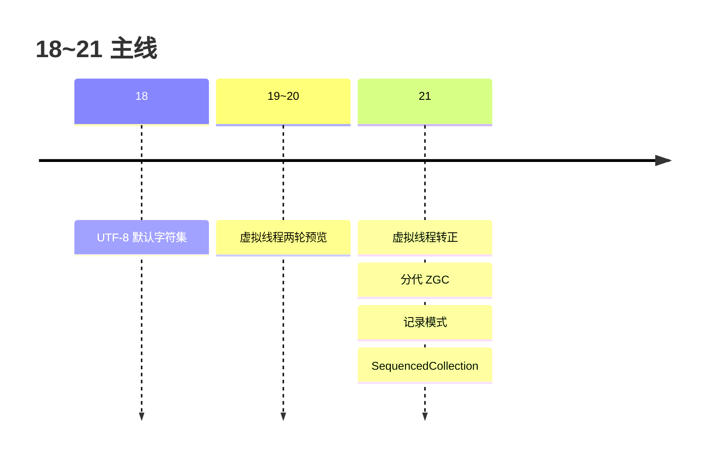
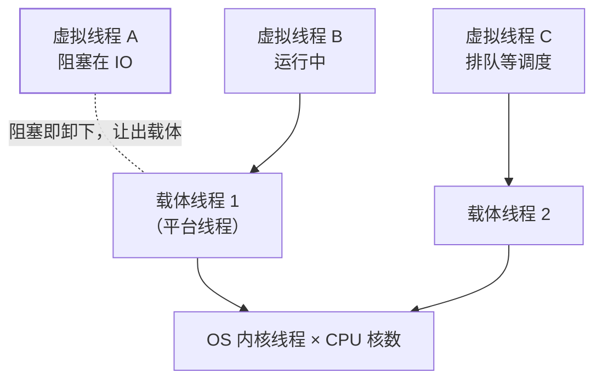

## 21 的主角：并发模型换代



Java 21（2023-09，LTS）最重要的变化不是语法，而是**Thread 变便宜了**：
阻塞一个虚拟线程不再占用一颗 OS 线程。"一请求一线程"的老写法在 21
之后重新成为最佳实践——这句话值得展开讲透。

## 虚拟线程（21 转正）

### 为什么需要它

平台线程（传统 Thread）是 **1:1 映射 OS 线程**：创建要系统调用、占
1MB 上下栈内存，阻塞在 IO 上时这颗内核线程就干等着。几千并发就把
线程池打满，吞吐被"线程数 ≈ 并发数"卡死——这正是[线程池](/java/intermediate/concurrent/02-thread-pool/)
调来调去的根源。

虚拟线程是 **JVM 在用户态调度的线程（M:N）**：海量虚拟线程挂到少量
平台线程（**载体线程 carrier**，数量 ≈ CPU 核数）上跑；虚拟线程阻塞
IO 时，JVM 把它**从载体上卸下**（unmount），载体立刻去跑别的虚拟线程。
栈也存在堆上、按需伸缩（几百字节起步）。



### 怎么用

```java
// 直接创建
Thread.startVirtualThread(() -> handle(req));

// 推荐：_executor 用法——每任务一个虚拟线程（别池化！）
try (var executor = Executors.newVirtualThreadPerTaskExecutor()) {
    executor.submit(() -> callRpc());     // 并发 10 万也不虚
}
```

**心智转变**：虚拟线程便宜到**不需要池化**——线程池在平台线程时代是
稀缺资源复用，在虚拟线程时代反而丢掉了排队能力。该限流用
Semaphore，该隔离用独立的 executor，[线程池参数那套](/java/intermediate/concurrent/02-thread-pool/)
不迁移过来。

**适用边界**：吃 IO 的任务（RPC、DB、HTTP）收益巨大；CPU 密集没意义
（核就那么多，载体线程数没变）。虚拟线程也不让单个请求变快，它让
**同一进程能同时挂着更多"在等"的任务**。

### pin 问题：什么时候卸不下载体

虚拟线程阻塞时若**无法让出载体**，就"钉"（pin）在平台线程上——载体
被占着干等，池化等于白做：

- 在 `synchronized` 块/方法内阻塞（21 最主要来源；22 起 JEP 491 已修复，
  但生产生态仍要注意）；热点路径改用 `ReentrantLock`。
- `native` 方法或外部函数内阻塞。

池大小设成 CPU 核数即可（默认如此），调大无害也无益。

## 结构化并发与作用域值（21 预览）

配套虚拟线程的两个新模型，把"并发任务的生命周期"管起来：

```java
// StructuredTaskScope：子任务与父作用域同生共死
try (var scope = new StructuredTaskScope.ShutdownOnFailure()) {
    var user  = scope.fork(() -> fetchUser(id));
    var order = scope.fork(() -> fetchOrders(id));
    scope.join().throwIfFailed();          // 任一失败全组取消
    return new Profile(user.get(), order.get());
}
```

对比 `CompletableFuture.allOf`：异常传播、取消联动、超时管理全部
**跟着代码块结构走**，不用手工编排。

`ScopedValue`（21 预览）是 `ThreadLocal` 的不可变替代：线程封闭数据
跟随结构化作用域传递，虚拟线程百万级时比 ThreadLocal 查找更便宜，
也不存在[忘记 remove 的内存泄漏](/java/intermediate/concurrent/06-threadlocal/)。

## 其他值得知道的（18~21）

| 特性 | 版本 | 说明 |
|---|---|---|
| 记录模式 + switch 模式匹配转正 | 21 | `case Circle(Point(var x, var y))` 解构嵌套 record，接续上一篇 |
| SequencedCollection | 21 | 集合体系补上"有序"接口：`getFirst()/getLast()/reversed()` |
| 分代 ZGC | 21 | ZGC 引入分代（`-XX:+ZGenerational`），吞吐大幅改善——之前 ZGC 不分代是最大短板 |
| UTF-8 默认字符集 | 18 | `file.encoding` 默认 UTF-8，跨平台乱码少一大类 |
| 字符串模板 | 21 预览 | `"\{name}"` 插值（预览期，后续版本方向有调整） |

GC 选型语境下的 ZGC/G1 对比见
[垃圾回收算法与收集器](/java/advanced/jvm/03-garbage-collection/)。

## 小结

- 虚拟线程 = JVM 用户态调度的 M:N 线程：阻塞即卸下载体，栈在堆上，
  创建成本接近对象——IO 密集高并发换了活法。
- 心法三条：**不池化虚拟线程**、限流交给 Semaphore、`synchronized`
  内阻塞会 pin 载体（改 ReentrantLock）。
- 结构化并发把任务生命周期还给代码块结构；ScopedValue 是 ThreadLocal
  的现代替代。
- 21 同时转正了模式匹配收官件（记录模式）与分代 ZGC，是当下升级
  的首选落点。
