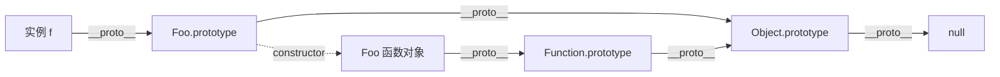
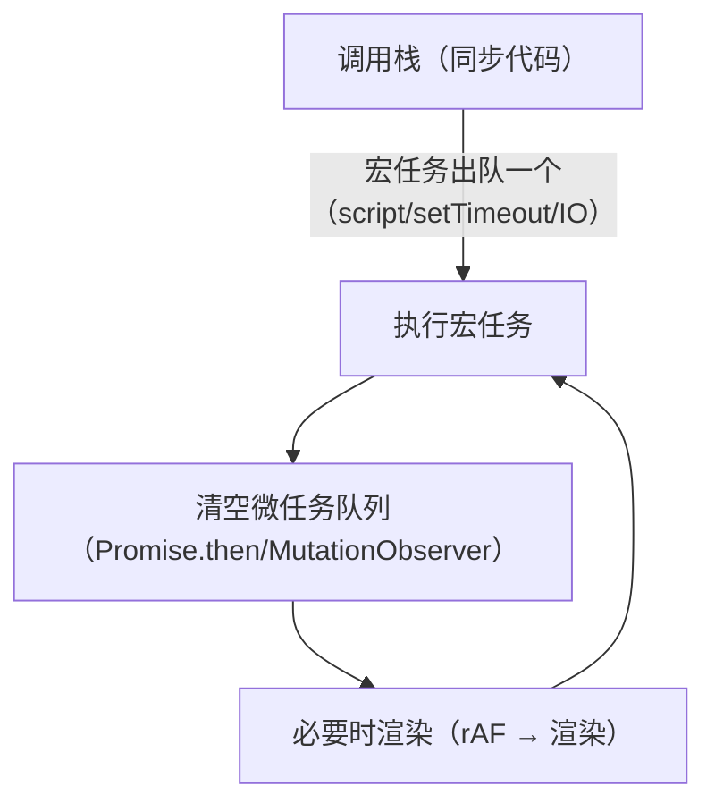

## 类型系统：7 种 + 1

原始类型 `undefined / null / boolean / number / string / symbol / bigint`
按值访问、存栈；`object`（含数组/函数）按引用访问。三个必背坑：

```js
typeof null === 'object'          // 历史 bug，判 null 用 ===
0.1 + 0.2 !== 0.3                 // IEEE 754 双精度，十进制小数大多存不精确
NaN !== NaN                       // 判 NaN 用 Number.isNaN()
```

**隐式转换**只发生在三处：`==` 比较、`if` 条件、`+` 有字符串参与。规则记
两条就够：

- `==` 两边类型不同时：null/undefined 互相相等不转型；其余转数字比。
- 对象转原始值：先 `valueOf` 后 `toString`（`[object Object]`）——
  `[] + {}` 得 `"[object Object]"`、`[] + []` 得 `""` 的根源。

工程结论：**永远用 `===`**，隐式转换只用来读题不用来写码。

## 原型链：继承的唯一天然机制

每个对象有 `__proto__`（即构造函数的 `prototype`），属性查找沿链上行，
到 `Object.prototype.__proto__ === null` 终止。



- `instanceof`：沿左边 `__proto__` 链找右边 `prototype`。
- **new 做四件事**：建空对象 → 链到构造器 prototype → 绑 this 执行 →
  返回对象（构造器显式返回对象时覆盖）。
- **继承的本质**：`Child.prototype.__proto__ = Parent.prototype`
  （ES6 `class extends` 的语法糖内核），子类构造器里 `super()` 先于
  `this`。

## 闭包与作用域

函数持有其**词法作用域**的引用，逃逸后作用域不释放：

```js
function counter() {
  let n = 0;
  return () => ++n;   // n 被闭包持有，外部无法直接触碰
}
```

价值：私有状态、柯里化、模块模式。代价：**被闭包引用的变量随函数共存亡**
——事件回调忘记解绑、定时器持有大对象，都是内存泄漏经典来源。

`var` 的函数级作用域 + 提升，是循环回调全打印最后一个下标的元凶；
`let/const` 的块级作用域 + TDZ（暂时性死区）修好了这一切。

## this：谁调用指向谁

四条优先级从高到低：

| 规则 | 场景 | this |
|---|---|---|
| new 绑定 | `new Foo()` | 新建的对象 |
| 显式绑定 | `call/apply/bind` | 指定的对象 |
| 隐式绑定 | `obj.fn()` | obj（链式取最后一层） |
| 默认绑定 | 独立调用 `fn()` | undefined（严格式）/ window |

箭头函数**没有 this**，沿词法作用域取外层——回调里保住 this 的现代答案。
`bind` 返回的函数 this 永久固化，new 可穿透（优先级最高）。

## 事件循环：单线程的并发幻觉

JS 单线程跑调用栈，异步全靠事件循环调度：



必背输出顺序：

```js
setTimeout(() => console.log(1));        // 宏任务
Promise.resolve().then(() => console.log(2));  // 微任务
console.log(3);                           // 同步
// 输出：3 2 1 —— 每个宏任务后先清空全部微任务
```

`async/await` 是 Promise 的语法糖：`await` 之后的代码等于 `.then`
回调（微任务）；`async` 函数的错误用 `try/catch` 接。

## 深浅拷贝

- 赋值：只复制引用。
- 浅拷贝：`{...obj}` / `Object.assign`——第一层新对象，嵌套层仍共享。
- 深拷贝：`structuredClone(obj)`（现代原生，支持循环引用）；
  `JSON.parse(JSON.stringify)` 快但丢函数/undefined/Date 变字符串。

## 小结

- 类型：`===` 干掉隐式转换九成的坑；对象转换记 valueOf → toString。
- 原型链是继承唯一机制，`class` 是糖；new 四步 + instanceof 沿链查找。
- 闭包 = 函数 + 词法作用域引用：私有性换来泄漏风险。
- this 四级优先级，箭头函数取外层；事件循环：宏任务一个、微任务清空。

## 延伸阅读

- [JS 万字总结 重量级干货（掘金）](https://juejin.im/post/5e9f0bdce51d4546f5791989)——本篇母本，含更完整的面试题式展开
- [MDN JavaScript 指南](https://developer.mozilla.org/zh-CN/docs/Web/JavaScript/Guide)
