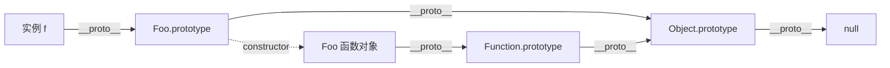

## 两根指针：__proto__ 与 prototype

JS 没有类继承的引擎机制，对象之间只靠**一根链**：每个对象有内部槽
`[[Prototype]]`（暴露为 `__proto__`），属性查找沿链上行，到
`Object.prototype.__proto__ === null` 终止。

容易混的是两根指针的方向：

| 指针 | 在谁身上 | 指向谁 |
|---|---|---|
| `__proto__`（`[[Prototype]]`） | **每个对象** | 它的原型对象 |
| `prototype` | **每个函数** | 用它 new 出来的实例的原型 |



读法：`f.toString()` 先找 f 自己 → `Foo.prototype` →
`Object.prototype` → 找到。**constructor 回指**函数对象本身，函数又
是 Function 的实例——函数对象的双重身份全在这张图里。

工程上别写 `__proto__`（非标准且慢），用 `Object.getPrototypeOf` /
`Object.create(proto)` / `Object.setPrototypeOf`。

## new 与 instanceof 的手写实现

**new 做四件事**——手写一遍就彻底懂了：

```js
function myNew(Foo, ...args) {
  const obj = Object.create(Foo.prototype);  // ① 建空对象并链到 prototype
  const ret = Foo.apply(obj, args);          // ② 绑 this 执行构造逻辑
  return ret instanceof Object ? ret : obj;  // ③ 构造器显式返回对象时覆盖，④ 否则返回 obj
}
```

**instanceof 就是沿链查找**：

```js
function myInstanceof(obj, Foo) {
  let proto = Object.getPrototypeOf(obj);
  while (proto) {
    if (proto === Foo.prototype) return true;
    proto = Object.getPrototypeOf(proto);
  }
  return false;
}
```

推论：原始值永远 `instanceof` 为 false（没有原型链可走）；跨 iframe
/ 跨 realm 的对象 instanceof 会失灵（两套原型体系）——判数组用
`Array.isArray` 不用 instanceof 的原因。

## 继承的演进史：五步走到 class

面试爱问"继承写法"，其实是在考**每一步解决了前一步的什么缺陷**：

```js
// ① 原型链继承：Child.prototype = new Parent()
//    缺陷：引用类型属性被所有实例共享（一个改全体变）；
//         创建 Child 时无法给 Parent 传参

// ② 借用构造函数：Child 内执行 Parent.call(this, name)
//    修复：属性独立、可传参
//    缺陷：方法只能定义在构造函数里，无法复用；原型上的方法继承不到

// ③ 组合继承 = ① + ②：属性独立、方法复用
//    缺陷：Parent 构造函数被执行了两次（属性在实例和原型上各一份）

// ④ 寄生组合继承（ES5 的最优解）：
Child.prototype = Object.create(Parent.prototype);
Child.prototype.constructor = Child;   // 修回 constructor 指向
//    只调一次 Parent，实例属性不重复

// ⑤ class extends：④ 的语法糖，引擎级实现
class Child extends Parent {
  constructor(name) {
    super(name);        // 必须先于 this——对应"先建父类部分"
  }
}
```

**继承的本质始终是一行**：`Child.prototype.__proto__ ===
Parent.prototype`——④ 和 ⑤ 都是把它交给机器去做。

## class 不只是糖的部分

说"class 是语法糖"对九成场景成立，但有四处是 ES5 写不出来的：

1. **内部严格模式**：class 体强制 strict mode；
2. **声明不提升**（严格说是 TDZ）：定义前访问抛错，函数声明则整体提升；
3. **方法不可枚举**：ES5 手挂 prototype 的方法是可枚举的；
4. **new.target 与无法不 new 调用**：`Foo()` 直接调用 class 抛错。

现代补充：`static` 静态成员（挂在构造函数上而非原型上）、`#field`
私有字段（真私有，不是 `_` 约定）、`get/set` 存取器。

## 属性查找的边界行为

- **自有 vs 继承**：`obj.hasOwnProperty(key)` 只查自有属性
  （`Object.hasOwn(obj, key)` 是现代写法）；
- **覆盖与遮蔽**：实例属性遮蔽原型同名属性；赋值只会写在最内层，
  永远不改原型——`f.x = 1` 在 f 上新建属性，不动 `Foo.prototype.x`；
- **getter/setter 拦截整条链**：原型上有 setter 时，`f.x = 1` 触发
  的是 setter 而不是"在 f 上新建数据属性"——用 `Object.defineProperty`
  才能绕过。

## 小结

- `__proto__` 是对象的链，`prototype` 是函数的出厂配置——分清两根
  指针，原型链图就不再是背的。
- new 四步 + instanceof 沿链查找，手写一遍顶十道题。
- 继承五步演进：共享引用缺陷 → 传参需求 → 双重构造 → 寄生组合 →
  class；本质始终是链接到父类原型。
- class 的四处"非糖"：严格模式、TDZ、方法不可枚举、必须 new。

## 延伸阅读

- [MDN 继承与原型链](https://developer.mozilla.org/zh-CN/docs/Web/JavaScript/Inheritance_and_the_prototype_chain)
- [MDN class](https://developer.mozilla.org/zh-CN/docs/Web/JavaScript/Reference/Classes)
