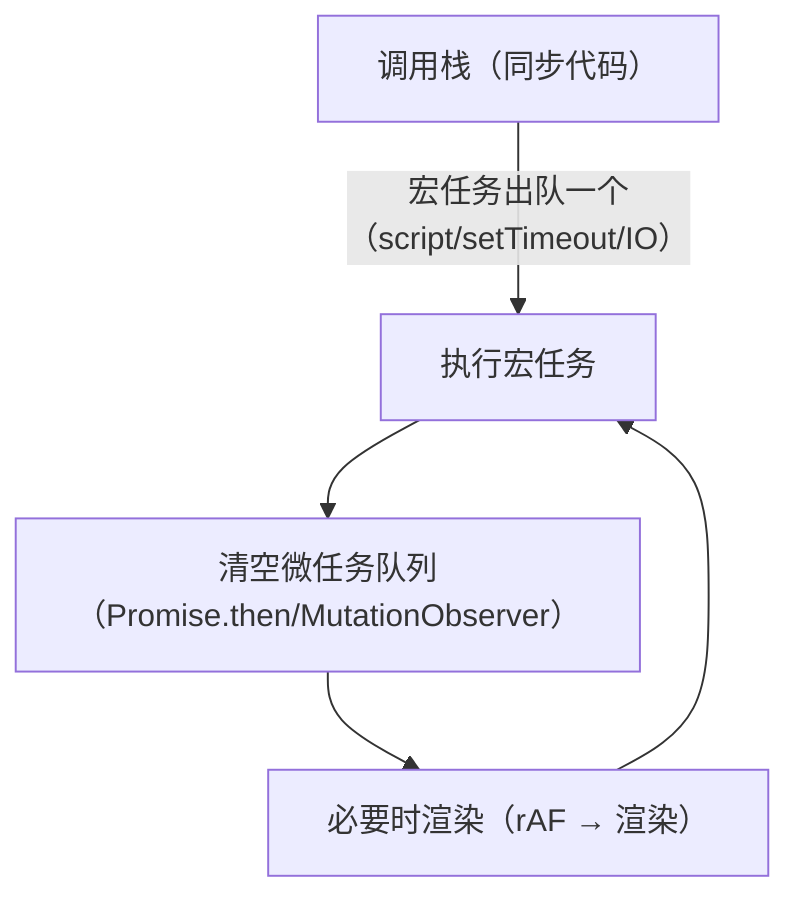

import AlgorithmVizIsland from '../../../../../components/viz/AlgorithmVizIsland.astro';

## 单线程为什么还需要异步

JS 单线程跑调用栈——DOM 操作天然要求互斥，两条线程同时改 DOM 无法
仲裁。但网络请求、定时器如果同步等待，页面就冻结。**异步 = 把耗时
操作委托给宿主环境（浏览器/Node），完成后回调排队回来执行**——
事件循环就是这套排队的调度规则。

## 宏任务与微任务



两条铁律：

1. **每个宏任务执行完，立即清空整个微任务队列**，才轮到渲染和下一个
   宏任务；
2. 微任务在当前调用栈 bottoms 时插队——**微任务比 setTimeout 快，
   哪怕 setTimeout(0)**。

把一次「同步 → 微任务 → 宏任务」的完整排班按帧放一遍：

<AlgorithmVizIsland demo="js-event-loop" />

必背输出顺序，以及它的进阶版：

```js
setTimeout(() => console.log(1));
Promise.resolve().then(() => console.log(2));
console.log(3);                            // 3 2 1

// 进阶：async/await 的调度语义
async function main() {
  console.log("a");
  await Promise.resolve();                 // await 之后 = .then 回调 = 微任务
  console.log("b");                        // b 在同步代码之后、setTimeout 之前
}
setTimeout(() => console.log("c"));
main();
console.log("d");                          // a d b c
```

`await X` 的准确语义：**把 X 后面的代码包成微任务，先让出调用栈**。
`async` 函数本身第一次调用是同步执行的（直到第一个 await）——
"a 先于 d 打印"的根源。

## 异步演进史：回调 → Promise → async/await

**回调时代**的问题不只是嵌套难看——还有**回调地狱的三宗罪**：
错误无法统一捕获、无法组合（多个异步如何汇合）、控制反转（把回调
交给不可信的第三方，它可能调多次/不调）。

Promise 用**三状态机**一次性解决三宗罪：

```js
// 状态：pending → fulfilled / rejected，一旦定型不可逆（解决控制反转）
// then 返回新 Promise → 链式（解决组合与嵌套）
// catch 统一捕获链上任何一环的异常（解决错误处理）
fetchData()
  .then(parse)
  .then(save)
  .catch(err => console.error("链上任何一环失败都到这", err))
  .finally(close);
```

链式的一个细节常被追问：**每层 then 返回值会传给下一层**；返回
Promise 会被展开（等它落地），抛异常则链跳到最近的 catch——
Promise 链是"自动管道"。

**async/await 是 Promise 的语法糖**：await 之后的代码等于 .then
回调；async 函数必定返回 Promise。错误用 try/catch 接：

```js
async function run() {
  try {
    const data = await fetchData();
    await save(data);
  } catch (err) {
    console.error("await 的 reject 在这里接住", err);
  }
}
```

**await 的并行陷阱**：顺序 await 是串行的，互相独立的请求要并发——

```js
const [a, b] = await Promise.all([fetchA(), fetchB()]);  // 并发，全成功才过
// 要全部结果、容忍失败
const results = await Promise.allSettled([fetchA(), fetchB()]);
```

`Promise.all`（一败俱败）、`allSettled`（全都要）、`race`（超时控制
的惯用法：请求与 setTimeout(Promise) 赛跑）、`any`（首个成功）——
四个静态方法的语义差异是必考点。

## 并发控制：手写 limit

面试与工程的双高频：**N 个任务，最多同时跑 M 个**：

```js
async function pool(tasks, limit) {
  const results = [];
  const executing = new Set();
  for (const task of tasks) {
    const p = task().then((r) => { executing.delete(p); return r; });
    executing.add(p);
    results.push(p);
    if (executing.size >= limit) {
      await Promise.race(executing);     // 满员时等任何一个完成腾位
    }
  }
  return Promise.all(results);
}
```

核心思想一句话：**用 `Promise.race` 监听"在跑集合"，完成一个补一个**。
线程池篇的有界队列、MQ 的削峰是同一思想的跨语言重现。

## 浏览器与 Node 的差异

Node 的宏任务队列按**阶段（phase）**组织：timers → pending →
poll → check（setImmediate）→ close——`setTimeout(fn, 0)` 与
`setImmediate(fn)` 在主模块里顺序不定（取决于进入 poll 时定时器是否
超时），在 I/O 回调里 setImmediate 必先执行。`process.nextTick` 是
优先于一切微任务的 Node 特权队列。深入见 Node GC 篇同一套运行时。

## 小结

- 两条铁律：宏任务一个一清空微任务；微任务永远快于 setTimeout。
- await = 后续代码打包成微任务并让出栈；async 函数开头是同步的。
- Promise 三状态不可逆解决控制反转，链式解决组合，catch 统一兜底。
- 独立请求用 `Promise.all` 并发；并发控制 = race 监听在跑集合。

## 延伸阅读

- [MDN 并发模型与事件循环](https://developer.mozilla.org/zh-CN/docs/Web/JavaScript/Event_loop)
- [Node.js 事件循环](https://nodejs.org/zh-cn/learn/asynchronous-work/event-loop-timers-and-nexttick)
