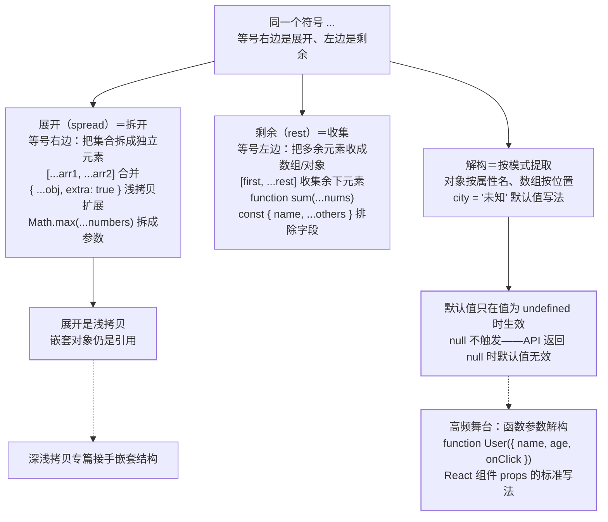

解构赋值和展开/剩余运算符是 ES6 使用率最高的语法——**日常代码里
几乎每 10 行就有一次**。它们是同一语法符号 `...` 的两个方向：
左边是"收集"（rest），右边是"展开"（spread）。

## 对象解构：按属性名提取

```javascript
const { name, age, city = "未知" } = user;      // 提取 + 默认值
const { name: userName } = user;                 // 重命名
const { address: { city } } = user;              // 嵌套解构
function greet({ name, age }) { ... }             // 函数参数解构
```

- **函数参数解构**是 React 组件 props 的标准写法——
  `function User({ name, age, onClick })` 本质就是解构赋值；
- **默认值在右边不存在时生效**（值为 `undefined` 才触发，`null`
  不触发——高频陷阱）。

## 数组解构：按位置提取

```javascript
const [first, second, ...rest] = [1, 2, 3, 4, 5];  // rest = [3,4,5]
let a = 1, b = 2;
[a, b] = [b, a];                                     // 交换变量
```

- **跳过元素**：`const [, second] = [1, 2]`——只要第二个；
- **交换变量**不需要临时变量——数组解构的经典应用。

## 展开与剩余：`...` 的两个方向

```javascript
// 展开（spread）：右边 → 把"集合"拆成独立元素
const merged = [...arr1, ...arr2];                 // 数组合并
const copy = { ...obj, extra: true };              // 浅拷贝 + 扩展
Math.max(...numbers);                              // 拆成独立参数

// 剩余（rest）：左边 → 把"多余元素"收集成数组
function sum(...nums) { return nums.reduce((a,b) => a+b); }
const { name, ...others } = user;                  // 排除某字段
```

- **方向记忆**：等号**右边是展开**（拆开），等号**左边是剩余**
  （收集）；
- 展开运算符做的是**浅拷贝**——嵌套对象仍是引用（深浅拷贝篇）。

把这篇的骨架画成一张图——同一个符号 `...`，等号两边方向相反：



图上两条红线是本篇最高频的两个坑：展开只做浅拷贝，嵌套结构要深拷贝专篇接手；
默认值的触发条件是 `undefined` 而不是「值不存在」——`null` 不算。

## 高频追问速答

- **解构的默认值什么时候生效？** 只有值为 `undefined` 时——
  `null` 不会触发默认值（高频陷阱：API 返回 `null` 时默认值无效）。
- **展开和 Object.assign 的区别？** 展开更简洁且顺序可控制
  （后面的覆盖前面的）；但都是**浅拷贝**。
- **解构赋值在什么场景最有用？** ①函数参数（React props）；
  ②交换变量；③提取嵌套对象的深层字段；④函数返回多个值。

## 小结

- 解构 = 按模式提取（对象按名、数组按位），展开 = 拆成独立元素，
  剩余 = 收集多余元素——同一符号 `...` 的两个方向。
- 默认值只在 `undefined` 时触发；展开是浅拷贝——两个高频陷阱。
- 函数参数解构是 React/现代 JS 的标配写法——**日常代码最高频的
  ES6 语法**。
