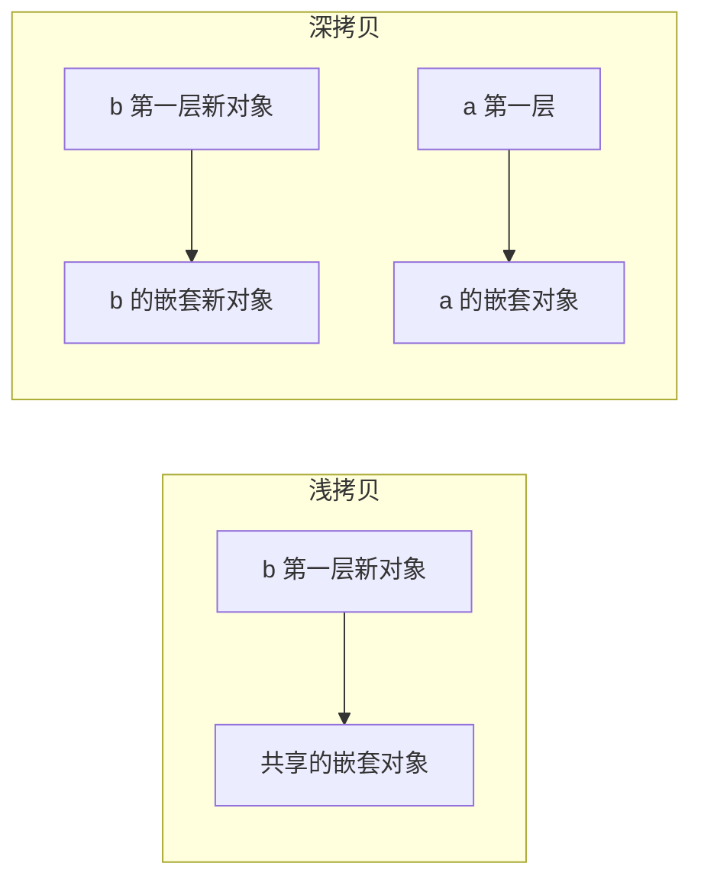

[类型系统](/js/basic/core/01-js-fundamentals/)篇用 4 行速览过深浅拷贝，
这篇把它挖到面试手写题的深度：「手写一个深拷贝」是 JS 面试出场率最高
的编码题之一——考点环环相扣：递归、类型分派、循环引用、WeakMap。

## 问题的根源：引用类型的共享

原始类型（number/string/boolean）赋值是**复制值**，互不相干；引用类型
（对象/数组/Map/Set）赋值是**复制地址**——两个变量指向同一个对象，
改一个「另一个也变了」。拷贝要解决的就是这个共享：

| 操作 | 新对象？ | 嵌套层 |
| --- | --- | --- |
| 赋值 `b = a` | ❌ 同一个 | 完全共享 |
| 浅拷贝 `{...a}` / `Object.assign` | ✅ 第一层新 | 嵌套层仍共享 |
| 深拷贝 | ✅ | 全部递归新建，彻底断开 |

```js
const a = { info: { age: 1 } };
const b = { ...a };
b.info.age = 2;
a.info.age; // 2 —— 浅拷贝只复制了第一层，info 仍指向同一个对象
```



## JSON 法：一行代码与四大缺陷

`JSON.parse(JSON.stringify(obj))` 是流传最广的「土法深拷贝」，面试
答它必须立刻报缺陷：

1. **丢类型**：函数、`undefined`、Symbol 直接消失；Date 变 ISO 字符串；
   RegExp/Error 变空对象 `{}`；
2. **Map/Set 变普通对象**（且常为空 `{}`）；
3. **循环引用直接抛 TypeError**（`Converting circular structure to
   JSON`）；
4. **NaN/Infinity 变 null**。

它只适合「纯 JSON 数据」（能用 JSON 表示的本来就没丢东西的风险）。

## structuredClone：现代标准答案

原生的 `structuredClone(obj)`（2022 起全平台支持）解决了大部分痛点：
支持循环引用、保留 Date/Map/Set/RegExp/ArrayBuffer、底层就是
[postMessage 的结构化克隆](/js/intermediate/web/06-worker/)算法。

限制两个：**函数和 DOM 节点不能拷**（直接抛错）、**原型链丢失**（类
实例拷完变成普通对象，方法没了）。所以：纯数据用 structuredClone，
类实例/带方法的复杂对象用 lodash 的 `cloneDeep` 或 immer 这类专业库。

## 手写深拷贝：递归 + WeakMap

手写题的完整答案分四层递进，每层都是考点：

```js
function deepClone(obj, map = new WeakMap()) {
  if (obj === null || typeof obj !== 'object') return obj;

  if (obj instanceof Date) return new Date(obj);
  if (obj instanceof RegExp) return new RegExp(obj, obj.flags);

  if (map.has(obj)) return map.get(obj); // 命中：循环引用，直接取

  const clone = Array.isArray(obj) ? [] : {};
  map.set(obj, clone); // 记下「原对象 → 副本」，必须在递归前

  for (const key of Object.keys(obj)) {
    clone[key] = deepClone(obj[key], map);
  }
  return clone;
}
```

逐层拆解：

- **类型分派**：非对象直接返回（递归出口）；Date/RegExp 这类要先建
  同值副本，不能进通用分支；
- **循环引用**：`a.self = a` 会让递归永远出不来——WeakMap 记录
  「已拷对象 → 副本」，递归中再遇到已见对象直接返回副本，递归终止；
- **为什么必须在递归前 set**：先记后递归，循环引用回来时 map 里才有
  得查——顺序反了照样爆栈；
- **为什么用 WeakMap 不是 Map**：拷贝完成后外界对副本的引用断开时，
  原对象与副本都应可被 GC 回收——WeakMap 的弱键不阻止回收（呼应
  [Map/Set 与 WeakMap](/js/basic/core/07-collection-types/) 篇）。

进阶版还要处理 Symbol 键（`getOwnPropertySymbols`）、原型链
（`Object.create(Object.getPrototypeOf(obj))`）——面试口头补充比写全
更加分。

## 小结

- 引用类型赋值共享地址是拷贝问题的根源：赋值不建新对象、浅拷贝只保
  第一层、深拷贝彻底断开。
- JSON 法四大缺陷：丢函数/undefined、Date 变字符串、Map/Set 失真、
  循环引用抛错。
- structuredClone 是数据深拷贝的标准答案；函数/DOM 拷不了、原型链
  会丢，类实例交给专业库。
- 手写深拷贝四层：递归出口 → 类型分派 → WeakMap 防循环引用（先 set
  再递归）→ 弱键不妨碍 GC。

## 延伸阅读

- [MDN：structuredClone](https://developer.mozilla.org/zh-CN/docs/Web/API/structuredClone)
- [MDN：WeakMap](https://developer.mozilla.org/zh-CN/docs/Web/JavaScript/Reference/Global_Objects/WeakMap)
- [MDN：结构化克隆算法](https://developer.mozilla.org/zh-CN/docs/Web/API/Web_Workers_API/Structured_clone_algorithm)
