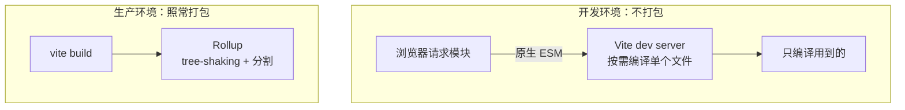

「Webpack 和 Vite 的区别是什么」稳居前端面试前五高频题，但它其实不是
两个工具的对比题，而是**打包器演进史**的理解题：从「必须打包」到「开发
时可以不打包」，背后是浏览器能力（原生 ESM）的进步。这篇把这条线讲清。

## 打包器解决什么

浏览器曾经没有模块系统——ES5 时代只能靠 `<script>` 标签顺序加载 +
IIFE 手动隔离作用域。打包器（bundler）应运而生：把散落的模块**合并成
浏览器能吃的少数文件**。今天的打包器早已不止合并，四件事全包：

- **模块合并与依赖图**（解析 import/require，拼成 bundle）；
- **转译**（TS→JS、新语法→旧语法、Sass→CSS，交给 loader/插件）；
- **优化**（压缩、混淆、tree-shaking、代码分割）；
- **开发体验**（HMR 热更新、dev server）。

## Webpack 的模型：一切皆模块

Webpack 的世界观：**万物皆模块**——JS、CSS、图片都是模块，统一进依赖
图。两个扩展点撑起整个生态：

- **Loader**：把非 JS 的东西**转换**成模块（babel-loader 转 TS、
  css-loader 解析 CSS）——只做「文件进、文件出」的翻译；
- **Plugin**：介入**构建生命周期的每个钩子**（打包优化、资源注入、
  环境变量替换）——做「流程级」的事。

代价是**开发时全量打包**：启动要构建完整依赖图，项目越大 dev server
启动和热更新越慢——这是 Vite 的切入点。

## Vite 为什么快：双引擎

开发时 Vite **不打包**：浏览器原生支持 ESM 了，dev server 只在浏览器
请求某个模块时**按需编译这一个文件**（esbuild 预编译依赖、源码用
esbuild 转译）——启动时间从「与项目大小成正比」变成**常数级**。生产
构建时回归传统：用 Rollup 做完整打包（tree-shaking、分割、压缩）。

面试标准答案就三句：**Vite 快在开发态按需编译（不打包），快在用
esbuild（Go 实现，比 JS 工具链快一个量级）；生产态它仍然打包（Rollup）
——产物质量与 Webpack 同级**。

## tree-shaking：为什么必须 ESM

tree-shaking = 打包时删掉没被引用的导出。它成立的前提是**能在不执行
代码的情况下，静态分析出「谁引用了谁」**：

- **ESM 的 import/export 是静态结构**：写在顶层、不可条件化，编译期
  就能画出完整依赖图，没被引的分支可以安全删除；
- **CommonJS 的 require 是动态调用**：`if (x) require('./a')` 完全
  合法，只有运行时才知道引了谁——没法安全摇。

工程上还有一个关键开关：`package.json` 的 **`sideEffects` 字段**——
声明「本包的模块没有副作用」（如只导出组件的 UI 库），打包器才敢删
「虽未使用但有 import」的模块；没声明时保守起见全保留。这就是
「ES 项目记得配 sideEffects」的原因。

## HMR 与代码分割

- **HMR（热模块替换）**：改一个模块，只把这一个模块的新版本推给浏览器
  **替换执行**，页面不整页刷新、组件状态保留——Vite 的按需编译让
  HMR 从「秒级」到「毫秒级」（只需重新编译改动的那一个文件）。
- **代码分割**：`import()` 动态导入自动切出独立 chunk——首屏只加载
  首屏代码，路由级/组件级懒加载是标配实践（呼应
  [Web 性能指标](/js/intermediate/web/10-web-vitals/)的 LCP 优化）。

选型口径：新项目默认 Vite（开发体验差距太大）；巨型遗留工程 + 重度
依赖 Webpack 特有生态（module federation、自定义 loader 资产）才维持
Webpack。

## 小结

- 打包器四件事：合并、转译、优化、开发体验；Webpack 万物皆模块 +
  loader 翻译、plugin 管流程。
- Vite 快在开发态原生 ESM 按需编译 + esbuild 预构建，生产仍由
  Rollup 打包——「开发不打包、生产照常打包」的双引擎。
- tree-shaking 依赖 ESM 静态结构，CJS 动态 require 摇不动；
  sideEffects 声明才敢删。
- HMR 模块级替换保留状态；`import()` 动态导入实现路由级分割。

## 延伸阅读

- [Vite 官方：为什么选 Vite](https://cn.vite.dev/guide/why)
- [Webpack 官方：概念](https://webpack.js.org/concepts/)
- [MDN：JavaScript 模块](https://developer.mozilla.org/zh-CN/docs/Web/JavaScript/Guide/Modules)
