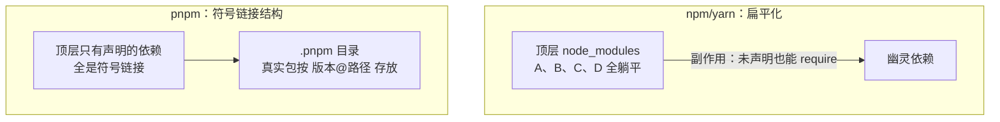

「pnpm 为什么快」「幽灵依赖是什么」是前端工程化第二轮必考题——本仓库
也用 pnpm 管理。这篇从 node_modules 的目录结构演进讲起：**包管理的
一切问题，都是目录结构问题**。

## 两代结构：嵌套地狱与扁平化

npm v2 时代按依赖树**嵌套**安装：A 依赖 lodash@3、B 依赖 lodash@4，
就在各自目录下各装一份——树深了之后 Windows 路径超长、同版本包重复
几百份，史称依赖地狱。

npm v3（和 yarn）改成**扁平化**：所有依赖尽量提升（hoist）到顶层
`node_modules`，版本冲突的才嵌套进各自目录。空间省了、树浅了，但
埋下一颗雷——**幽灵依赖（幻影依赖）**。

## 幽灵依赖：扁平化的副作用

你只声明了 `express`，但代码里 `require('body-parser')` 也能跑——
因为 body-parser 是 express 的依赖，被 hoist 到了顶层，**未声明的
依赖变得可见可引**。这就是幽灵依赖：代码依赖了 package.json 里
不存在的包。后果：某天 express 升级不再依赖 body-parser，你的代码
悄悄崩掉——**能跑 ≠ 声明过**。

## pnpm：内容寻址 + 硬链接 + 符号链接

pnpm 用三件套重写了目录结构：

- **内容寻址存储（store）**：全局只存一份每个包的每个版本（按内容
  哈希寻址）——10 个项目用同一个 lodash，磁盘上只有一份；
- **硬链接**：项目的 `node_modules` 里不是复制，是**硬链接**到 store
  ——不占额外空间，又保持「每项目可独立读写」的假象；
- **符号链接 + .pnpm 目录**：顶层 `node_modules` **只放 package.json
  里声明过的包**（符号链接指向 `.pnpm` 内的真实位置），传递依赖被
  关在自己的 `node_modules` 里，互相不可见。

效果：**幽灵依赖在 pnpm 结构下直接 require 不到**——依赖边界回到
声明本身，这也是「pnpm 严格」的出处。附带收益：安装快（硬链接零
复制 + 并行下载 + 强缓存）、磁盘占用骤减。

## lockfile：可复现的承诺

`pnpm-lock.yaml` 记录**解析后的完整依赖树**：每个包的精确版本、下载
地址、完整性哈希。没有它，`^1.2.0` 这类语义化范围在不同时间会解析出
不同版本——「上周能装，今天装完崩」的根源。纪律：**lockfile 必须
提交**，团队成员和 CI 都按同一棵树安装。

延伸追问「npm ci 与 npm install 的区别」：`install` 可能更新 lockfile
（package.json 与 lock 冲突时以 package.json 为准重解析），`ci`
**严格按 lockfile 安装、不一致直接报错**——CI 环境永远用 `npm ci` /
`pnpm install --frozen-lockfile`。

## 小结

- 包管理的一切问题都是目录结构问题：嵌套地狱 → 扁平化 → pnpm 的
  符号链接结构。
- 幽灵依赖 = 未声明却可 require，扁平化的副作用；pnpm 顶层只放声明
  依赖，边界回到声明。
- pnpm = 内容寻址 store + 硬链接（省空间）+ 符号链接（严格边界），
  快与省是一体两面。
- lockfile 锁解析树保可复现，必须提交；CI 用 ci/frozen-lockfile。

## 延伸阅读

- [pnpm 官方：符号链接的 node_modules 结构](https://pnpm.io/symlinked-node-modules-structure)
- [pnpm 官方：与 npm/yarn 的对比](https://pnpm.io/feature-comparison)
- [npm 官方：package-lock.json](https://docs.npmjs.com/cli/v10/configuring-npm/package-lock-json)
