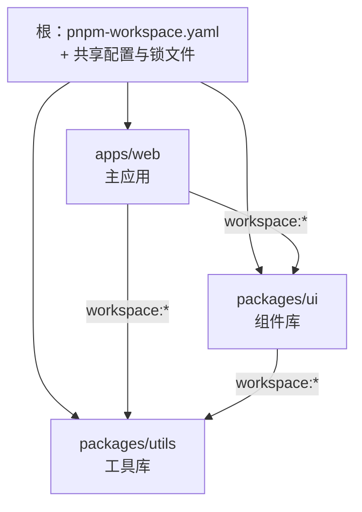

项目从一个仓库长到十几个包时，「一个包一个仓库」还是「一个仓库装所有
包」就成了必答题。Monorepo 不是「仓库大」，而是**用工具链解决多包仓库
的依赖共享、原子变更与任务编排**——pnpm workspace 是当下的事实标准。

## 两种仓库策略的取舍

| | Polyrepo（多仓） | Monorepo（单仓多包） |
| --- | --- | --- |
| 跨包改动 | 逐仓提 PR、发版、等依赖升级 | **一次原子提交**，跨包永远同步 |
| 代码复用 | 发 npm 包、管理版本矩阵 | 直接引用源码，无版本协调 |
| 权限与边界 | 仓库级天然隔离 | 需要工具/规范补（目录约定、CODEOWNERS） |
| CI 范围 | 天然只构建本仓 | 必须做**增量构建**（否则全量构建灾难） |
| 适用 | 团队边界清晰、发布节奏独立 | 包间强关联、同步演进（组件库+文档+应用） |

记忆口径：**Monorepo 换来同步与复用，付出的是工具复杂度**——包少且
边界清晰的团队不必赶时髦。

## workspace：pnpm 的单仓多包结构

根目录一个 `pnpm-workspace.yaml` 声明包的位置，就完成了工作区初始化：

```yaml
packages:
  - 'packages/*'   # 库包
  - 'apps/*'       # 应用
```

包与包之间的依赖用 **`workspace:*` 协议**引用——不写死版本号，直接
「用工作区里那个」：

```json
// apps/web/package.json
{
  "dependencies": {
    "@acme/ui": "workspace:*"
  }
}
```

`workspace:*` 在开发期链接到本地源码（改了 ui 包，web 立刻生效），
发布时可被替换成真实版本号。上一
[npm/pnpm 依赖管理](/js/intermediate/engineering/02-package-managers/)
篇的符号链接结构在这里继续工作：本地包之间零发布成本地引用。



## 任务编排：过滤与增量缓存

多包之后「在正确的包里跑正确的命令」是日常，两层工具各管一件事：

- **过滤执行**：`pnpm --filter @acme/ui build` 只跑指定包；
  `--filter ./apps/**` 按路径批量跑——解决「跑哪」。
- **任务图 + 增量缓存**（Turborepo/Nx 的价值）：理解包间依赖后按
  **拓扑序**编排（utils 构建完才能构建 ui），并把任务结果**缓存**——
  缓存键 = 输入文件内容哈希 + 命令 + 环境变量，输入没变的包直接命中
  缓存跳过重跑。CI 里配合远端缓存，全队共享构建结果。

这就是 Monorepo CI 高频追问的答案——**「怎么只构建变更的包」= 依赖图
定拓扑序 + 内容哈希定缓存命中**，变更检测到包级，未受影响的包零成本。

## 版本策略：fixed 与 independent

多包发版时包间版本号怎么走，两大流派：

- **Fixed（锁定/联动）**：所有包同一个版本号，任一发布全体升——组件
  库生态常用（保证包间兼容性一目了然）；
- **Independent（独立）**：各包按自身变更独立升版本——utils 改了只
  升 utils。搭配 changesets 这类工具：改代码时顺手写一份变更说明，
  发版时工具汇总成版本号与 changelog。

## 小结

- Monorepo 换原子提交与代码复用，付工具复杂度；边界清晰的团队不必
  跟风。
- `pnpm-workspace.yaml` 声明包位置，`workspace:*` 让本地包零成本
  互相引用，发布时替换真实版本。
- CI 只构建变更的包 = 依赖图拓扑序 + 输入哈希增量缓存（Turborepo/Nx）。
- 版本策略二选一：fixed 联动保兼容，independent 独立升级配 changesets。

## 延伸阅读

- [pnpm 官方：workspace](https://pnpm.io/workspaces)
- [Turborepo 官方：缓存与任务图](https://turborepo.com/docs/crafting-your-repository/caching)
- [changesets：版本与变更日志工具](https://github.com/changesets/changesets)
