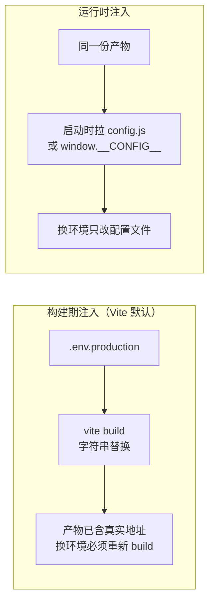

前端产物是纯静态文件，但代码要在 dev/test/prod 四个环境里跑——API
地址、上报开关这些差异**在哪一步、以什么方式**注入代码，决定了部署
的灵活性。「为什么改个接口地址还要重新构建」这道高频题，答案就在
「构建期注入」四个字里。

## Vite 的 .env 分层与白名单

Vite 约定：项目根下按环境命名的 `.env` 文件，构建时自动加载合并：

```text
.env                # 所有环境共用
.env.development    # dev 时叠加（pnpm dev 默认 mode=development）
.env.production     # build 时叠加
.env.local          # 本地私有覆盖，gitignore
```

关键机制是**变量白名单**：只有 `VITE_` 前缀的变量才会暴露给客户端
代码，通过 `import.meta.env.VITE_API_URL` 读取——其余变量只属于
构建过程本身。

为什么要有白名单？因为**产物是公开的**：打包后的 JS 谁都能下载查看，
任何进了产物的字符串都会被扒出来。白名单强迫开发者显式声明「这个值
我接受公开」，而不是把整个 process.env 一锅端进前端。

## 构建期烙死：与 Node 的本质差异

[Node 的环境变量](/js/intermediate/node/07-env-config/)是**运行时**
读取——同一份代码，换环境只需换启动参数，不用改代码。前端相反：
`import.meta.env.VITE_API_URL` 在**构建时被字符串替换**，值直接
烙进产物文件——



高频追问的标准答案就出来了：**为什么生产改个 API 地址要重新发版？
因为默认方案是构建期注入，环境差异在 build 那一刻就固化了**。CI 里
每个环境独立构建（构建矩阵：同一份代码 × N 个 mode），产物互不通用。

## 同一份产物跑多环境：运行时注入

当「一次构建、多环境部署」成为需求（容器化部署常见），就要把配置
挪到运行时——产物里不烙地址，部署时再注入：

- **挂载配置文件**：部署时在产物目录放一个 `config.js`（或
  `window.__CONFIG__ = {...}`），`index.html` 在应用脚本之前加载它，
  应用启动时优先读运行时配置；
- **接口下发**：应用启动时调一个 `/config` 接口拉取配置（Docker/K8s
  场景配合 ConfigMap/环境变量，呼应 K8s 的
  [ConfigMap 与 Secret](/kubernetes/basic/core/04-config-secret/)）。

代价是多一层间接：配置错误从「构建失败」变成「运行时才发现」，
需要兜底默认值——工程上常用折中：少量易变的（API 网关地址）运行时
注入，其余保持构建期。

## 安全边界：前端没有机密

把上一节推到底就是安全结论：**前端产物里没有任何机密可言**——
「混淆了总安全吧」不成立，产物字符串全局可搜。规则：

- API Key 若必须放前端（如地图 SDK key），要用**域名白名单/ referer
  限制**在服务端兜底，而不是指望藏住；
- 真正的机密（数据库、第三方密钥）只放后端，前端通过自己的接口代理
  访问——「前端直连第三方」的设计要审慎。

## 小结

- Vite 按 mode 加载 `.env` 分层文件，`VITE_` 前缀白名单控制暴露面，
  产物公开是白名单存在的理由。
- 前端环境变量默认构建期烙死，改配置即重新构建；Node 是运行时读取，
  两者的差异来自产物形态。
- 同一产物跑多环境走运行时注入（config.js 挂载或接口下发），代价是
  配置错误后移，折中方案是易变项运行时、其余构建期。
- 前端没有机密：SDK key 靠服务端白名单兜底，真机密只放后端代理。

## 延伸阅读

- [Vite 官方：环境变量与模式](https://cn.vite.dev/guide/env-and-mode)
- [12-factor：配置与代码分离](https://12factor.net/zh_cn/config)
- [MDN：import.meta](https://developer.mozilla.org/zh-CN/docs/Web/JavaScript/Reference/Operators/import.meta)
