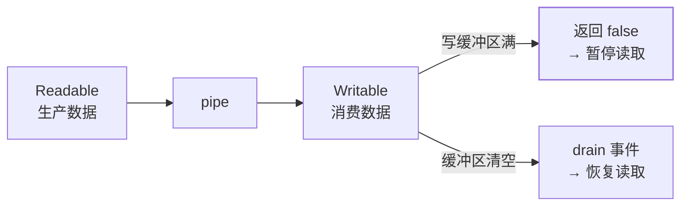

"读取一个 10GB 的日志文件并统计错误数"——用 `fs.readFile` 直接读 =
**10GB 全部进内存 = OOM**。流（Stream）的答案是**分块处理**：数据像
水管里的水一样逐块流过，内存占用恒定。Node 岗必考题。

## 四种流类型

| 类型 | 方向 | 例子 |
| --- | --- | --- |
| Readable | 可读 | fs.createReadStream、http 请求体 |
| Writable | 可写 | fs.createWriteStream、http 响应体 |
| Duplex | 双工 | TCP socket、WebSocket |
| Transform | 变换 | zlib.createGzip()、加密流 |

```javascript
// 大文件复制：内存恒定，不随文件大小增长
const rs = fs.createReadStream("src.log");
const ws = fs.createWriteStream("dst.log");
rs.pipe(ws);
```

## 背压：消费端慢了怎么办

生产端（读）快、消费端（写）慢——数据会在内存里堆积。**背压
（backpressure）** 是流的自动调节机制：



- `pipe()` **自动处理背压**（写不过来时暂停读、drain 后恢复）——
  这就是"用 pipe 别手动 data 事件"的第一理由；
- 手动处理要监听 data/drain 配对——容易写错（经典面试手写题）。

## pipeline：pipe 的现代替代

`pipe()` 的缺陷：**错误不会传播**——源或目标出错，管道不自动销毁，
可能留下半关闭的流。Node 10 引入的 `stream.pipeline()` 修复：

```javascript
const { pipeline } = require("stream/promises");
await pipeline(
  fs.createReadStream("src.log"),
  zlib.createGzip(),
  fs.createWriteStream("src.log.gz")
);   // 任一环出错 → 全部销毁 → Promise reject
```

- **生产代码用 pipeline（或 stream-compose）替代 pipe**——错误
  统一传播、自动清理全部流。

## 高频追问速答

- **流式处理真的省内存吗？** 省——`readFile` 全量 = 文件大小进内存；
  流式 = 固定 chunk 大小（默认 64KB）的滑动窗口。**内存占用从
  O(文件大小) 降为 O(1)**。
- **什么时候不需要流？** 小文件（几 MB）直接 readFile 更简单——
  流的复杂度要换回收益。
- **transform 流是什么？** 读写的中间变换环节（gzip/加密/行解析）
  ——pipeline 里串多个 transform 组成处理链（Unix 管道哲学）。

## 小结

- 流 = 分块处理：**内存 O(1) 处理任意大小的数据**——大文件/网络
  转发的唯一正解。
- 四类型（Readable/Writable/Duplex/Transform）+ 背压自动调节
  （pipe）+ 错误传播（pipeline）——三层理解。
- 10GB 日志统计、文件压缩上传、HTTP 代理转发——凡是"数据量大 +
  可分块"的场景就是流的舞台。
