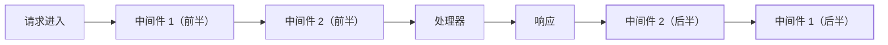

Express 与 Koa 都是 Node 的 Web 框架，中间件模型却完全不同——
**Express 是线性回调（一去不回），Koa 是洋葱圈（去了还会回来）**。
这个差异决定了：日志计时、错误捕获、响应后逻辑能不能优雅实现。
Node 后端面试的高频对比题。

## Express：线性回调，一去不回

```javascript
app.use((req, res, next) => {
  console.log("请求前");
  next();                          // 交给下一个中间件
  console.log("这里在响应后执行吗？不一定——next 是异步的");
});
```

- 中间件按注册顺序**线性执行**，`next()` 只是"把控制权交给下一个"；
- **响应的时机由 res.end() 决定**，中间件无法感知——响应后逻辑
  （计时、审计）只能靠 hack（监听 res 的 finish 事件）；
- 错误处理：四参数中间件 `(err, req, res, next)`——必须是四个参数
  Express 才识别为错误处理器（高频陷阱）。

## Koa：洋葱圈，await 就是回来了

```javascript
app.use(async (ctx, next) => {
  const start = Date.now();
  await next();                    // 进入内层，等响应完成才回来
  const cost = Date.now() - start; // ← 响应后逻辑，天然位置
  console.log(`${ctx.method} ${ctx.url} - ${cost}ms`);
});
```



- 基于 **async/await**：`await next()` 等**整个内层执行完毕**——
  中间件的"后半段"天然在响应之后执行；
- 日志计时、错误捕获、响应头追加——洋葱外圈的"后半段"是标准位置。

## compose：洋葱模型的手写

Koa 的核心是 compose 函数——把中间件数组合成一个函数：

```javascript
function compose(middlewares) {
  return (ctx) => {
    const dispatch = (i) => {
      const mw = middlewares[i];
      if (!mw) return Promise.resolve();
      return mw(ctx, () => dispatch(i + 1));   // next = 执行下一个
    };
    return dispatch(0);
  };
}
```

- **手写 compose** 是 Node 面试的手写题——核心是递归 + Promise 链；
- 理解了 compose，"洋葱为什么能回来"就一目了然：`await next()`
  等的就是递归的下一层执行完。

## 高频追问速答

- **Express 能实现洋葱吗？** 理论上可以（用 Promise 包装 next），
  但 Express 的生态与设计建立在回调上——**Koa 生而为洋葱**（TJ
  就是 Express 作者，Koa 是他的反思之作）。
- **Koa 的错误处理？** try/catch 包住 await next()——洋葱外圈
  捕获所有内层错误；或用 app.on("error") 兜底——比 Express 的
  四参数中间件更直观。
- **中间件顺序影响什么？** 洋葱圈：外层（先注册）的"前半段"先执行、
  "后半段"后执行——错误处理放最外层、日志计时按需嵌套。

## 小结

- Express 线性回调（一去不回）vs Koa 洋葱圈（await 回来）——响应后
  逻辑的能力差异是框架选择的考虑点。
- compose 递归是洋葱模型的实现本质——手写一次彻底理解。
- 中间件顺序：外层包裹内层——"洋葱"的名字就是执行顺序的图示。
