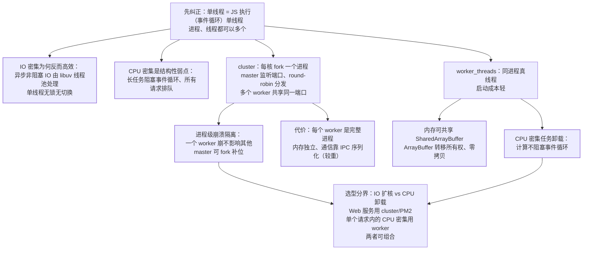

"Node 是单线程的，怎么利用多核？"——先纠正：**Node 的 JS 执行是单
线程的（一个事件循环），但进程/线程可以多个**。cluster（多进程）与
worker_threads（多线程）是两个正解，适用场景不同。

## cluster：每核一个进程

```javascript
const cluster = require("cluster");
if (cluster.isPrimary) {
  // 每核 fork 一个 worker
  for (let i = 0; i < os.cpus().length; i++) cluster.fork();
} else {
  require("./server");   // 每个 worker 跑同一个服务
}
```

- master 负责**监听端口并分发连接**（round-robin），worker 各自处理
  ——多个进程共享同一端口；
- **进程隔离**：一个 worker 崩溃不影响其他（master 可 fork 补位）——
  稳定性好；
- 代价：每个 worker 是完整进程（内存独立、通信靠 IPC 序列化）。

## worker_threads：轻量多线程

```javascript
const { Worker } = require("worker_threads");
new Worker("./heavy-task.js", { workerData: { n: 1e9 } });
```

- **真正的线程**：同一进程内，内存可共享（SharedArrayBuffer）、
  通信可传 ArrayBuffer（转移所有权，零拷贝）；
- 场景：**CPU 密集任务**（图像处理/大数计算/加密）不阻塞事件循环
  ——单线程的 JS 遇到 CPU 密集就阻塞一切，worker 是解法。

## 对比选型

| | cluster（多进程） | worker_threads（多线程） |
| --- | --- | --- |
| 隔离 | 进程级（崩溃隔离） | 线程级（共享进程） |
| 通信 | IPC 序列化（较重） | SharedArrayBuffer/转移（轻） |
| 启动成本 | 高（完整进程） | 低（轻量线程） |
| 场景 | **IO 服务扩核**（Web 服务） | **CPU 密集任务**（计算卸载） |

经验：**Web 服务用 cluster/PM2 扩核**；**单个请求内的 CPU 密集计算
用 worker_threads 卸载**——两者可组合。



图上先立准「单线程」的准确含义——JS 执行单线程而进程/线程可多个，
由此推出两头的判断：IO 密集反而高效（异步非阻塞 + 无锁无切换）、
CPU 密集是结构性弱点（阻塞事件循环全员排队）；两条多核路线各有
一张底牌——cluster 赢在进程级崩溃隔离、代价是完整进程加 IPC
序列化，worker_threads 赢在轻量与可共享内存；选型收在「IO 扩核
用 cluster、CPU 卸载用 worker」这一句。

## 高频追问速答

- **Node 单线程为什么还能高并发？** 单线程指 JS 执行（事件循环），
  **IO 是异步非阻塞**的（libuv 线程池处理）——单线程 + 异步 IO 在
  IO 密集场景反而高效（无锁无切换）。
- **CPU 密集为什么是 Node 的弱点？** 事件循环被长任务阻塞——所有
  请求都排队；解法：worker_threads 卸载或拆微服务。
- **PM2 的 cluster 模式是什么？** PM2 帮你管理 cluster（自动 fork
  N 个 worker、崩溃重启、0 秒重载）——生产部署的标配。

## 小结

- 单线程 = JS 执行单线程（事件循环），非不能多核。
- cluster 多进程：IO 服务扩核 + 崩溃隔离；worker_threads 多线程：
  CPU 密集卸载 + 轻量通信——按"IO 扩核 vs CPU 卸载"选。
- CPU 密集阻塞事件循环是 Node 的结构性弱点——worker_threads 是
  官方解法。
