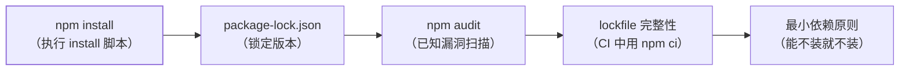

Node 的安全风险集中在四个面：**依赖供应链**（npm 包被投毒）、**输入
注入**（SQL/命令/路径遍历）、**HTTP 安全头缺失**、**密钥与凭据泄露**。
Node 安全最佳实践 = 每个面有对应的防线，并且知道攻击面在哪。

## 依赖供应链：npm install 就是执行代码

npm 包的 install 脚本可以执行任意命令——`npm install` 就是"运行了
陌生人的代码"：



- **package-lock.json 必须提交**——CI 用 `npm ci`（严格按 lock 安装，
  不解析 ^/~ 范围）——防止依赖漂移引入恶意版本；
- `npm audit` 定期扫描已知漏洞——高危漏洞升级或用 `overrides` 锁定；
- **最小依赖**：能用 Node 内置模块的不装第三方（如
  `crypto.randomUUID()` 替代 uuid 包）。

## 输入校验与注入防护

与 security 方向的 XSS/SQL 注入篇同源——Node 特有的注入面：

| 注入类型 | 攻击方式 | 防御 |
| --- | --- | --- |
| 命令注入 | 用户输入拼入 `child_process.exec` | 用 `execFile`（参数数组，不经过 shell） |
| 路径遍历 | `../../etc/passwd` | `path.resolve` + 前缀校验 |
| 原型污染 | `{"__proto__": {"admin": true}}` | 冻结 Object.prototype / 用 Map |

```javascript
// ❌ 命令注入
exec(`convert ${userInput}.png out.png`);
// ✅ 参数数组（不经过 shell）
execFile("convert", [userInput, "out.png"]);
```

## HTTP 安全头：helmet 一行代码

```javascript
const helmet = require("helmet");
app.use(helmet());   // 一行设置 X-Content-Type-Options/CSP/HSTS 等安全头
```

- helmet 设置十余个安全响应头——防 MIME 嗅探、XSS、点击劫持、
  强制 HTTPS——**Express/Koa 生产必装**（对照 nginx 篇的安全头）。

## 密钥与运行时

- **环境变量**（环境变量篇）：密钥不硬编码、不入库；
- **非 root 运行**：Docker/PM2 以非 root 用户运行（SSH 篇的
  capabilities 同思想——最小权限）；
- **rate limiting**：express-rate-limit 按路由限流（登录/注册
  严格限流——风控篇的第一道门）。

## 高频追问速答

- **npm 包被投毒了怎么办？** 事前：lockfile + audit + 最小依赖；
  事后：`npm ls` 追踪受影响范围 + 升级或移除 + 检查生产日志确认
  是否已被利用——**事后响应速度比事前预防更决定损失**。
- **JWT 的 secret 泄露了怎么办？** 立即轮换 secret（旧 token 全部
  失效）——代价是所有用户重新登录；这也是"短有效期 + refresh
  token"设计的动机（登录态篇）。
- **怎么防 prototype pollution？** 输入 JSON.parse 后检查键名
  （过滤 `__proto__`/`constructor`）——或用 Map 替代 Object 存
  用户数据。

## 小结

- 四面防线：供应链（lockfile+audit+最小依赖）、注入（参数化+
  路径校验+原型污染防护）、HTTP 头（helmet）、运行时（非 root+
  限流+密钥管理）。
- `npm install` = 执行陌生代码——**供应链是 Node 特有的最大
  攻击面**。
- 安全不是功能而是**持续过程**：audit 定期跑、依赖定期升级、
  安全头定期验证。
