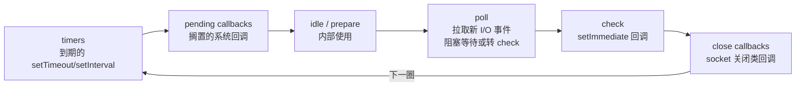

[浏览器事件循环](/js/basic/core/05-event-loop/)篇讲过宏任务/微任务的通用
模型，结尾留了一句「Node 的宏任务队列按阶段组织」。这一篇把这个坑挖穿：
Node 的循环怎么转、`nextTick` 凭什么插队、`setTimeout(0)` 和
`setImmediate` 谁先跑。这组对比是前端转 Node 岗位的必考题。

## 六阶段模型：宏任务被分组

浏览器的事件循环只有「取一个宏任务 → 清空微任务」的单层节奏；Node
（libuv）把宏任务**按类型分成组，一组一组地跑**，每圈循环经过六个阶段：



关键理解是**每进一个阶段处理一批，批内清完微任务**；`poll` 是核心枢纽：
没有定时器到期也没有 I/O 时它在此休眠，有 `setImmediate` 排队则让位给
`check`。这解释了 Node 下一批经典怪象——顺序不是「一个一个宏任务」，而是
「一阶段一阶段」。

## process.nextTick：特权队列

Node 里其实有两个「微任务」概念，优先级不同：

| 队列 | 时机 | 典型 API |
| --- | --- | --- |
| **nextTick 队列** | 当前操作一结束立刻清空，**先于** Promise 微任务 | `process.nextTick` |
| **微任务队列** | nextTick 队列清空后 | `Promise.then`、`queueMicrotask` |

```js
Promise.resolve().then(() => console.log('p'));
process.nextTick(() => console.log('tick'));
// 输出：tick → p —— nextTick 永远插队
```

记忆口径：**nextTick 是 Node 的特权加塞，微任务是标准规范**。`nextTick`
设计目的是「当前同步代码执行完、事件循环继续前」必须完成的动作（如
EventEmitter 的错误冒泡），滥用会饿死事件循环——官方文档明确警告递归
`nextTick` 会让 I/O 永远得不到调度。

## setImmediate vs setTimeout：顺序由上下文决定

经典竞态题。两者都是宏任务侧的定时调度，但挂在不同阶段：

- `setTimeout(fn, 0)` → **timers 阶段**（0 会被钳到 1ms）；
- `setImmediate(fn)` → **check 阶段**。

```js
setTimeout(() => console.log('timeout'), 0);
setImmediate(() => console.log('immediate'));
// 主模块：顺序不确定（取决于进 poll 时定时器是否已到期）

fs.readFile('a.txt', () => {
  setTimeout(() => console.log('timeout'), 0);
  setImmediate(() => console.log('immediate'));
  // I/O 回调内：必打 immediate → timeout
});
```

主模块里两者**顺序不确定**：脚本跑完进 poll，若此时 1ms 定时器恰好到期
就先走 timers，否则先走 check——毫秒级的时钟抖动决定了结果，不是玄学而是
竞态。但在 **I/O 回调内部**顺序确定：I/O 回调在 poll 阶段执行，出口下一站
是 check（setImmediate），再下一圈才轮到 timers。

## 与浏览器循环的完整对比

| | 浏览器 | Node |
| --- | --- | --- |
| 宏任务组织 | 单一队列逐个取 | 六阶段分组批处理 |
| 微任务 | 每个宏任务后清空 | 阶段切换（批后）清空 |
| 特权队列 | 无 | `process.nextTick` 优先 |
| 定时器精度 | 4ms 嵌套钳制 | 1ms 下限，libuv 分组调度 |
| 页面/进程退出 | 无对应概念 | 循环空转结束 → 进程退出 |

两个实操推论：

- **Node 的微任务时机更「粗」**：浏览器每个宏任务后清微任务，Node 是每批
  结束清一次——同一段代码在两边的输出顺序可能不同，跨端依赖执行顺序是
  不可移植的坏味道。
- **进程退出 = 循环无事可做**：所有句柄关闭、定时器清空后事件循环停转，
  进程退出（`unref()` 就是「这个句柄不阻止退出」）；这和浏览器「页面关了
  才算完」是两种生命周期模型。

## 小结

- Node 事件循环六阶段：timers → pending → poll → check → close，
  宏任务按阶段分组批处理，poll 是枢纽。
- `process.nextTick` 优先于 Promise 微任务，是加塞特权队列，递归使用会
  饿死 I/O。
- `setTimeout(0)` 与 `setImmediate` 主模块顺序不定，I/O 回调内
  setImmediate 必先——根因是两者分属 timers 与 check 阶段。
- 与浏览器的本质差异是「逐个 vs 分组」：跨端不要依赖宏微任务输出顺序。

## 延伸阅读

- [Node.js 官方：事件循环、定时器与 process.nextTick](https://nodejs.org/zh-cn/learn/asynchronous-work/event-loop-timers-and-nexttick)
- [libuv 设计概览](https://docs.libuv.org/en/v1.x/design.html)
- [MDN：浏览器事件循环](https://developer.mozilla.org/zh-CN/docs/Web/JavaScript/Event_loop)
