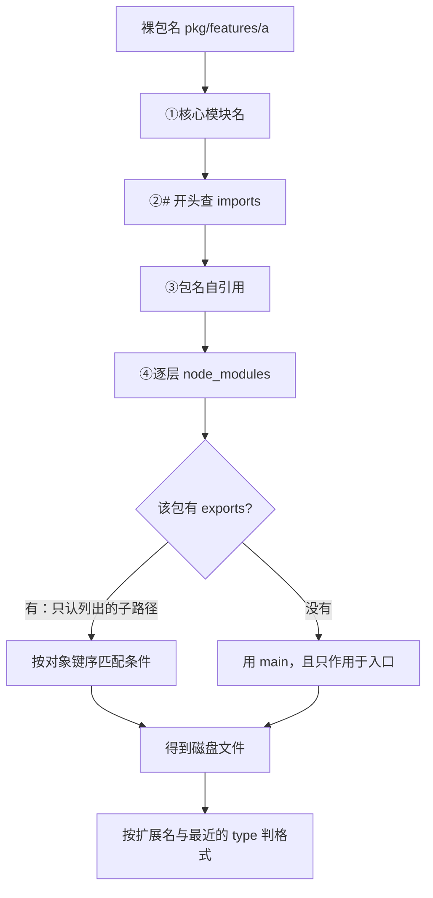
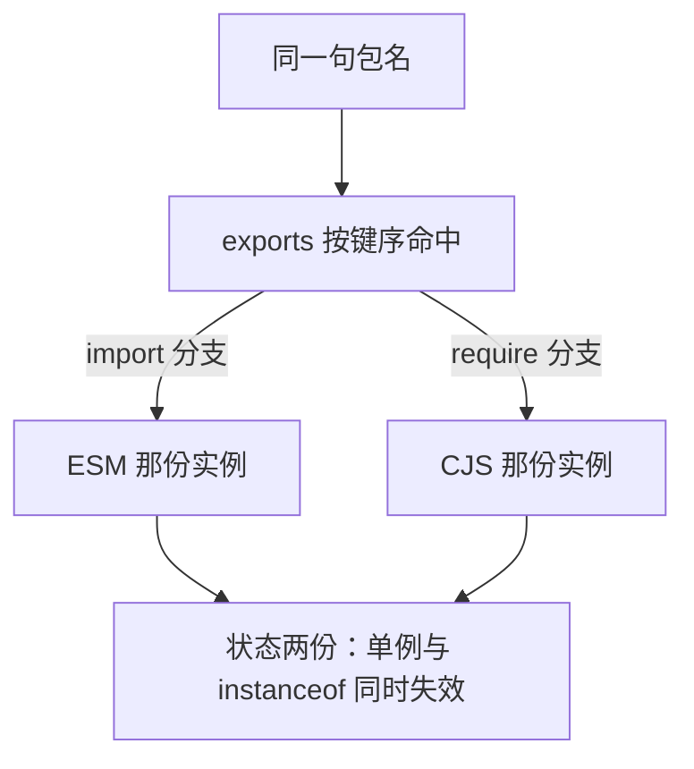

[模块系统：CommonJS 与 ESM](/js/intermediate/node/02-modules/) 回答的是「两种模块语法差在
哪」。它留了另一半没答：**`import { x } from "pkg"` 这一句里，`pkg` 是怎么变成磁盘上一个具体
文件的**。线上最难查的模块问题几乎全落在这一环——包明明装了、文件就在 `node_modules` 里，
`import` 却报 `ERR_PACKAGE_PATH_NOT_EXPORTED`；或者同一份库被跑了两遍，单例不成立、跨格式
`instanceof` 判假。本篇只管这一段路：从「说明符（specifier）」到「文件路径」。

分工先划清：**装进 `node_modules` 的那本账**（嵌套结构、幽灵依赖、pnpm 的硬链接）在
[npm、pnpm 与依赖管理](/js/intermediate/engineering/02-package-managers/)，**把模块拼成
bundle 那一侧**在[打包器：从 Webpack 到 Vite](/js/intermediate/engineering/01-bundlers/)。
本篇只讲运行期 Node 自己的解析器——它读的字段就是下面那张步骤表里出现的这些。

> 口径说明：下面的步骤表、条件表与对照表是**本篇按官方文档归纳**的——官方把规则分写在
> 「Modules: Packages」「CommonJS」「ECMAScript modules」三页里，没有并成一张表。每格的
> 出处紧跟在后面。**实测读数全部来自本机 `node -v` = v24.14.0**，实验件是 `/tmp` 下的
> 一次性最小包，跑完即删。

## 关卡一：一次解析走八步，顺序写死在官方算法里

`require(X) from module at path Y` 那页的「All together」就是这八步，ESM 侧另有一份
`ESM_RESOLVE` / `PACKAGE_RESOLVE` 规范，两者在这八步上同构：

| 步 | 判什么 | 命中之后去哪 |
| --- | --- | --- |
| 1 | 是不是核心模块名 | 直接返回内置库，后面的步都不走 |
| 2 | 是不是以 `/` 开头 | 把基准目录换成文件系统根，再按第 3 步走 |
| 3 | 是不是相对路径（`.`、`./`、`../`） | `LOAD_AS_FILE` → `LOAD_AS_DIRECTORY` → 抛 not found |
| 4 | 是不是以 `#` 开头 | `LOAD_PACKAGE_IMPORTS`，只查本包的 `imports` |
| 5 | 包名自引用 | `LOAD_PACKAGE_SELF`，用本包自己的 `exports` |
| 6 | 有没有「包映射表」`PACKAGE_MAP` | 走 `LOAD_PACKAGE_MAP`；这一步只在自定义加载钩子下才有内容，本篇不展开 |
| 7 | 逐层 `node_modules` 里找这个包 | `LOAD_PACKAGE_EXPORTS` **先于** `LOAD_AS_FILE`/`LOAD_AS_DIRECTORY` |
| 8 | 全部落空 | 抛 not found |

第 7 步那一格是本关的题眼：**`exports` 的检查排在按文件、按目录加载之前**，所以只要包声明了
`exports`，`main` 就再也轮不到。官方把这条写成了明文的优先级：

> "If both `"exports"` and `"main"` are defined, the `"exports"` field takes precedence over
> `"main"` in supported versions of Node.js."

实测一个 `main` 与 `exports` 各指一份文件的最小包，解析结果是 `exports` 那一侧——`main` 指向
的文件从头到尾没被打开：

```javascript
// node_modules/pkg/package.json
// { "main": "./ignored-by-exports.js",
//   "exports": { ".": { "import": "./esm.mjs", "require": "./cjs.cjs" } } }
console.log(import.meta.resolve("pkg"));
// → file:///.../node_modules/pkg/esm.mjs（main 那个文件被完全绕过）
```

裸包名的逐层查找也不是「找到最近那个 `node_modules` 就收工」。官方 `NODE_MODULES_PATHS` 的
写法是从当前目录一路向上，**每层都拼一个 `node_modules` 候选**，但途中遇到路径里已经有
`node_modules` 这一段就跳过该层：

```text
NODE_MODULES_PATHS(START)
4. while I >= 0,
   a. if PARTS[I] = "node_modules", GOTO d.   // 这一层不再拼候选
   b. DIR = path join(PARTS[0 .. I] + "node_modules")
```

这条跳过规则有两个直接后果，都是面试里能加分的边界：



- **就近优先**：`node_modules/a/node_modules/pkg` 会盖掉顶层的 `pkg`。实测把嵌套副本里的
  `esm.mjs` 改成打印 `NESTED-ESM`，从 `a` 内部 `import("pkg")` 拿到的正是嵌套那份；
- **包与包之间默认互相看不见**：`require` 从 `node_modules` 里的文件出发时不会再把顶层
  `node_modules` 当候选，于是一个包想 `require` 自己没声明的兄弟依赖就失败。这正是
  [pnpm 严格结构](/js/intermediate/engineering/02-package-managers/)能成立的运行时依据——
  它没有额外禁止什么，只是把本来就成立的隔离用符号链接摊开了。

## 关卡二：`.js` 是 ESM 还是 CJS，由「最近的父 package.json」判

格式不是由文件里写了什么语法判的，而是由**离它最近的那份 `package.json`** 判的。官方的定义
逐字如下：

> "The `"type"` field defines the module format that Node.js uses for all `.js` files that have
> that `package.json` file as their nearest parent."
>
> "The nearest parent `package.json` is defined as the first `package.json` found when searching
> in the current folder, that folder's parent, and so on up until a `node_modules` folder or the
> volume root is reached."

三个判据按顺序落：`.mjs` 恒为 ESM、`.cjs` 恒为 CJS（扩展名直接指定，不看 `type`）；`.js` 看
最近的 `package.json` 的 `type`；`"module"` 判 ESM，缺字段或 `"commonjs"` 判 CJS。

一处不能顺着旧口径说的地方：早期「没有 `type` 就一定是 CJS，写 ESM 语法直接报错」的说法在
当前版本上已经不严——官方 `LOAD_AS_FILE` 的那一步名字本身就写着会尝试探测：

```text
2. If X.js is a file,
    a. Find the closest package scope SCOPE to X.
    c. If the SCOPE/package.json contains "type" field, ...
    d. MAYBE_DETECT_AND_LOAD(X.js)      // 这一步名字直译「可能要检测再加载」
```

实测：一个 `package.json` 没有 `type` 字段、`index.js` 里写 `export const` 的包，被
`require()` 直接加载成功，拿到的是 `{ format: "ESM-in-dot-js" }`。所以正确的心智模型是
**「`type` 判格式，缺省时 Node 还会看一眼语法」**，而不是「缺省必炸」。

失效边界在「向上查找到哪里为止」：查找在第一个 `node_modules` 或卷根处停住。于是想让包里
某个子目录换格式，办法是**在那个目录里放一份局部 `package.json`**；反过来，往仓库根塞一份
`"type": "module"` 会连带影响所有没被 `node_modules` 隔断的 `.js`——这是 monorepo 里
「我的脚本突然不能写 `require` 了」的常见成因（对照
[Monorepo 与工作区管理](/js/intermediate/engineering/03-monorepo/)）。

顺带一条两侧不对称，很多迁移事故的第一现场就在这：

```javascript
// CJS 侧：扩展名可以省，省与不省是同一份模块实例
const a = require("./plain");
const b = require("./plain.js");
console.log(a === b);            // true：LOAD_AS_FILE 会依次补 .js/.json/.node

// ESM 侧：同一路径写成 './plain' 直接报错（实测 ERR_MODULE_NOT_FOUND）
// import * as m from "./plain"; // ✗
// import * as m from "./plain.js"; // ✓ 必须写全
```

官方原因只写了两个短语——"No default extensions"、"No folder mains"，没写成因；通行的解释口径
是「ESM 的说明符按 URL 处理，URL 不该靠文件系统试探」。记规则本身就够用：相对与绝对说明符
**必须自带扩展名、目录里的 `index` 也要写全**。

## 关卡三：`exports` 是白名单，不是映射表

`exports` 的官方开篇定义里，第三条能力是**排他**的：

> "The `"exports"` provides a modern alternative to `"main"` allowing multiple entry points to be
> defined, conditional entry resolution support between environments, and **preventing any other
> entry points besides those defined in `"exports"`**."

落地成一句可执行的判据：**声明了 `exports` 之后，没列进去的子路径即使文件就在盘上也拿不到**。

```javascript
// pkg 的 exports 只列了 "." 与 "./features/public.mjs"
await import("pkg/features/hidden.mjs");   // ✗ ERR_PACKAGE_PATH_NOT_EXPORTED
await import("pkg/features/public.mjs");   // ✓ 加载成功
```

官方同时补了一句「这不是硬封装」，绕法与原因要一起记：

> "It is not a strong encapsulation since a direct require of any absolute subpath of the package
> such as `require('/path/to/node_modules/pkg/subpath.js')` will still load `subpath.js`."

实测用绝对路径 `require` 那个「本该被封装掉」的文件，确实加载成功。所以 `exports` 挡的是
**按包名的引用**，挡不住按路径的引用；把它当安全边界用是误读。

`exports` 的写法另有四条形状规则，每条都有对应报错：

| 写法 | 规则 | 违规后果 |
| --- | --- | --- |
| `"./sub": "./src/sub.js"` | 目标（值）必须是 `./` 开头的相对 URL 路径 | `ERR_INVALID_PACKAGE_TARGET`（实测两侧都抛） |
| `"./features/*": null` | `null` 从模式里挖掉一段私有目录 | 命中它 → `ERR_PACKAGE_PATH_NOT_EXPORTED` |
| `"./f/*.js": "./dist/f/*.js"` | `*` 是**纯字符串替换**，可多次出现，不做扩展名特殊处理 | 目标拼错 → 找不到文件 |
| `{ ".": {...}, "import": {...} }` | 键不能一半带 `.` 一半不带 | `ERR_INVALID_PACKAGE_CONFIG`（实测原文见下） |

那条混键的报错，本机实测打印是：

```text
Error [ERR_INVALID_PACKAGE_CONFIG]: Invalid package config
.../pkg/package.json while importing
"exports" cannot contain some keys starting with '.' and
some not. The exports object must either be an object of
package subpath keys or an object of main entry condition
name keys only.
```

还有一个容易看错的对象：`exports` 的**键匹配的是说明符，不是磁盘路径**。实测把键写成
`"./x"`、目标写成 `"./x.js"`，`require("pkg7/x")` 成功——磁盘上并没有叫 `x` 的文件。

## 关卡四：条件按对象键序命中，先中先得

同一个入口想给不同环境发不同文件，靠的是条件（condition）。官方给了两条硬规则：

> "Within the `"exports"` object, key order is significant. During condition matching, earlier
> entries have higher priority and take precedence over later entries. *The general rule is that
> conditions should be from most specific to least specific in object order*."

> "`"default"` - the generic fallback that always matches. ... *This condition should always come
> last.*"（而 `"types"` 相反，*"This condition should always be included first."*）

Node 自己实现的条件就这几个，含义按官方原话压缩：

| 条件 | 何时命中 | 要记住的那一句 |
| --- | --- | --- |
| `"node-addons"` | 任何 Node 环境，用于含原生 C++ 插件的入口 | 可被 `--no-addons` 关掉 |
| `"node"` | 任何 Node 环境，CJS 或 ESM 都行 | 官方：多数情况下不必专门写它 |
| `"import"` | 经 `import`/`import()`/ESM 解析时 | *"Applies regardless of the module format of the target file."* |
| `"require"` | 经 `require()` 加载时 | 与 `"import"` 永远互斥 |
| `"module-sync"` | `import` 与 `require` 都命中 | 目标是 ESM 且模块图里不能有顶层 `await` |
| `"default"` | 永远命中 | 必须写在最后，否则后面的分支是死代码 |

键序不是风格问题，它直接决定拿到哪份代码——实测两份写法只差顺序，结果就不同：

```javascript
// pkg8：{ "default": "./cjs.cjs", "import": "./esm.mjs" }
import.meta.resolve("pkg8");   // → ./cjs.cjs，default 抢在 import 前面
// pkg9：{ "import": "./esm.mjs", "default": "./cjs.cjs" }
import.meta.resolve("pkg9");   // → ./esm.mjs，这才是想要的分支
```

命中即停的另一半是「**没人认领的条件会被忽略**」：

> "Condition strings other than the `"import"`, `"require"`, `"node"`, `"module-sync"`,
> `"node-addons"` and `"default"` conditions implemented in Node.js core are ignored by default.
> ... user conditions can be enabled in Node.js via the `--conditions` / `-C` flag."

所以 `"browser"`、`"development"`、`"production"` 这些生态约定条件在 Node 里默认不生效——
需要显式 `node --conditions=development app.mjs` 才会进那一条（本机实测该旗标可用）。
ESM 解析器带的默认条件官方写成一个数组：*"defaultConditions is the conditional environment
name array, `["node", "import"]`."*；`require` 侧的条件则在 `LOAD_PACKAGE_IMPORTS` 那一步写死
为 `["node", "require", "module-sync"]`，并注明启用 `--no-require-module` 时退化为
`["node", "require"]`。

`exports` 还可以省掉入口那一层键，直接把条件对象当整段用；实测两种加载各走各的分支：

```json
// 直接写条件对象，等价于把整段包在 "." 里
{ "name": "pkg6", "exports": { "import": "./e.mjs", "require": "./c.cjs" } }
```

```text
require("pkg6") → sugar-cjs        import("pkg6") → sugar-esm
```

## 关卡五：`require` 现在能加载 ESM，唯一的硬边界是同步

`02-modules` 记的是「Node 22+ 才支持 `require` 同步加载 ESM」；官方现在的写法更宽：
**当前所有受支持的 Node.js 版本默认都可用**，`createRequire()` 在两种上下文里都能造。本机
v24.14.0 实测一份「只有 ESM 目标」的包能被 `require` 拿到：

```javascript
// pkg10：{ "exports": { ".": "./e.mjs" } }，e.mjs 是纯 ESM
const m = require("pkg10");        // → { format: "ESM-ONLY" }，同步拿到
```

边界只有一条，且是**整条模块图**的同步性，不是入口那一个文件：

> "`require()` can only be used to load ECMAScript modules from CommonJS modules if the ECMAScript
> module *and its dependencies* are synchronous (i.e. they do not contain top-level `await`). If it
> does, `ERR_REQUIRE_ASYNC_MODULE` will be thrown when the module is `require()`-ed."

实测把 `export const v = await Promise.resolve(1);` 挂成一条 `exports` 分支，`require("pkg/tla")`
立刻抛 `ERR_REQUIRE_ASYNC_MODULE`。要躲开它只有两条路：调用侧改用动态 `import()`，或者包作者
把 `"module-sync"` 条件写在能同步加载的那条分支上——官方对这条条件的原文定义是：

> "`"module-sync"` - matches no matter the package is loaded via `import`, `import()` or
> `require()`. The format is expected to be ES modules that does not contain top-level `await`
> in its module graph - if it does, `ERR_REQUIRE_ASYNC_MODULE` will be thrown when the module is
> `require()`-ed."

也就是说 `module-sync` 是**声明而不是免检**：实测把一条含顶层 `await` 的 ESM 挂在
`"module-sync"` 分支上，`require()` 照样抛 `ERR_REQUIRE_ASYNC_MODULE`。

```json
// 作者侧：让 require 与 import 共用同一份 ESM，但只对同步图成立
"exports": {
  ".": { "module-sync": "./e.mjs", "import": "./e.mjs", "require": "./c.cjs" }
}
```

## 关卡六：双包陷阱——同一份代码被跑了两遍

上面所有规则合起来，产出的是这个最容易吃亏的后果：**同一句包名，`import` 与 `require` 可以
各自加载一份互不相干的实例**。官方现在把这一节的内容挪出了 API 文档，`packages` 页只留一句
指向 [nodejs/package-examples](https://github.com/nodejs/package-examples)，其「双包」一节写的是：

> "two versions of the same package can be loaded within the same runtime environment"
> "properties added to one (like `pkgInstance.foo = 3`) are not present on the other"

本机实测最小包一份（`import` 分支指 `.mjs`、`require` 分支指 `.cjs`，两侧各自往
`globalThis` 上记一次加载数）：

```javascript
const esm = await import("pkg");
const cjs = require("pkg");
console.log(esm.Thing === cjs.Thing);              // false：两个构造器
console.log(new esm.Thing() instanceof cjs.Thing); // false：跨格式判假
console.log(globalThis.__loads);                   // 2：模块体跑了两遍
```

于是三类症状各有成因：**`instanceof` 判假**（两份类）、**单例不成立**（两份模块级状态，
注册表、缓存、连接池各一份）、**加了属性另一边看不见**（官方原文那句）。



作者侧的缓解，官方 guide 给了两条路子并直说代价：*"create an ES module wrapper file that
defines the named exports"*（让 ESM 只做 CJS 的薄封装，全生态共享 CJS 那一份状态，代价是多
一层转发），或 *"Isolate the state in one or more CommonJS files that are shared"*（把可变状态
抽进共享的 CJS 文件）。结论是那句 *"Every pattern has tradeoffs"*。

读者侧能做的只有一件事——**先量出来再说**：同一进程里分别按两种方式取一次，比一下同一个
导出是否 `===`；不等就是撞上了。工具链上唯一能提前看见的是 `--conditions`（打包器与
bundler-aware 的解析器可能给出第三种结果，那不属于本篇的口径）。

## 关卡七：包自己的两条私路——带 `#` 的 `imports` 与自引用

`exports` 管「别人怎么进我的包」，另两个字段管「我自己内部怎么写路径」。

`imports` 是包内私有的映射，官方的定义与两条特性：

> "there is a package `"imports"` field to create private mappings that only apply to import
> specifiers from within the package itself. Entries in the `"imports"` field must always start
> with `#` to ensure they are disambiguated from external package specifiers."
> "Unlike the `"exports"` field, the `"imports"` field permits mapping to external packages."

前缀 `#` 是语法要求而不是风格；它换来的是「重命名内部文件时只改一处，且不与任何外部包名
冲突」。实测包内 `import util from "#util"` 正常拿到目标，包外同样写法直接
`ERR_PACKAGE_IMPORT_NOT_DEFINED`。

自引用则让一个包在测试与内部代码里用**自己的包名**导入自己，规则与代价：

> "Within a package, the values defined in the package's `"exports"` field can be referenced via
> the package's name."

并且 *"Self-referencing is available only if `package.json` has `"exports"`, and will allow
importing only what that `"exports"` allows."*——必须有 `exports`，且只放行 `exports` 允许的路径。

```javascript
// 包内文件 self.mjs
import { format } from "pkg";   // → "ESM"，走自己 exports 的 import 分支
```

这条的价值是**测试跑的就是消费者会走的那条路**：写 `./src/x.js` 能绕过 `exports`，用包名
`pkg` 就绕不过——于是封装写漏了什么，自引用立刻暴露。

## 各字段买了什么、边界在哪

| 字段/规则 | 买到的能力 | 一条失效边界 |
| --- | --- | --- |
| `main` | 官方：支持 Node.js 10 及以下时它**是必需的** | 一旦有 `exports` 就整个失效 |
| `exports` | 多入口 + 按环境分支 + 关掉未列路径 | 绝对路径直取照样能过，不是安全边界 |
| `exports` 的键序 | 「最具体到最不具体」的优先级 | `default` 写前头会让后面的分支变死代码 |
| `type` | 一份 `package.json` 统管一片 `.js` 的格式 | 向上查找到 `node_modules`/卷根为止 |
| `imports`（`#`） | 包内私有别名，可指外部包 | 只对本包内生效，包外一律未定义 |
| 自引用 | 用包名测自己的公开面 | 必须有 `exports`，且只放行 `exports` 允许的 |
| `module-sync` | 让 `require` 也能同步吃到 ESM | 模块图里有顶层 `await` 就抛 `ERR_REQUIRE_ASYNC_MODULE` |

## 高频追问速答

- **`main` 和 `exports` 都有，走哪个？** `exports`。机理不是「优先级配置」，而是算法把
  `LOAD_PACKAGE_EXPORTS` 排在按文件/按目录加载之前。
- **为什么文件在 `node_modules` 里却 `ERR_PACKAGE_PATH_NOT_EXPORTED`？** 因为该包的 `exports`
  是白名单，你引的子路径没被列出；这不是安装坏了。
- **`"type": "module"` 到底管谁？** 管「以这份 `package.json` 为最近父级」的所有 `.js`，向上
  找到 `node_modules` 或卷根就停；`.mjs`/`.cjs` 不受它影响。
- **`import` 和 `require` 拿到的是同一份吗？** 默认不是。两侧条件不同、目标文件不同就是两份
  实例，跨格式 `instanceof` 判假。
- **`exports` 里的 `"browser"` 在 Node 里生效吗？** 不生效，非核心条件默认被忽略，除非
  `node --conditions=browser`。
- **`require` 一个用了顶层 `await` 的包会怎样？** 抛 `ERR_REQUIRE_ASYNC_MODULE`；改用动态
  `import()`，或让作者把这条挂 `"module-sync"`。
- **`#` 开头的说明符是什么？** 本包 `imports` 的私有映射，包外用就报未定义。

## 要点备忘

1. 解析顺序八步：核心模块 → `/` → 相对路径 → `#` imports → 自引用 → 包映射表 →
   逐层 `node_modules` → 抛错；`exports` 检查排在按文件/按目录之前。
2. `exports` 存在时 `main` 整个失效；官方原话是 `exports` takes precedence over `main`。
3. `node_modules` 逐层向上找，路径里已含 `node_modules` 的那一层跳过候选 → 嵌套副本就近优先、
   包与包默认互不可见。
4. `.js` 的格式：`.mjs`/`.cjs` 由扩展名定死；`.js` 看最近的 `package.json` 的 `type`；缺省时
   官方算法那步写作 `MAYBE_DETECT_AND_LOAD`，实测无 `type` 却写 ESM 语法的包能被 `require` 成功。
5. 最近父级的查找在第一个 `node_modules` 或卷根停止 → 子目录换格式靠局部 `package.json`。
6. ESM 侧「No default extensions / No folder mains」：相对导入必须写全扩展名与 `index` 全路径；
   CJS 侧可省且省与不省同实例。
7. `exports` 是白名单：未列子路径报 `ERR_PACKAGE_PATH_NOT_EXPORTED`，但绝对路径直取仍可绕过——
   官方明说这不是硬封装。
8. `exports` 的目标值必须以 `./` 开头；`*` 是纯字符串替换；`null` 用来从模式里挖私有目录。
9. `exports` 的键不能一半带 `.` 一半不带，否则整包 `ERR_INVALID_PACKAGE_CONFIG`。
10. `exports` 的键匹配说明符而不是磁盘路径。
11. 条件按键序命中，先中先得：`types` 最前、`default` 最后、`import` 与 `require` 互斥。
12. 非核心条件（`browser`/`development`/`production`）默认被忽略，用 `--conditions` 显式开启。
13. ESM 默认条件数组 `["node", "import"]`；`require` 侧是 `["node", "require", "module-sync"]`。
14. `require(esm)` 在当前受支持版本默认可用，唯一硬边界是**整条模块图**无顶层 `await`。
15. 双包陷阱的三种症状：跨格式 `instanceof` 判假、模块级状态两份、一边加属性另一边看不见；
    自查方式是比同名的 `===`。
16. `imports` 必须以 `#` 开头、只对包内生效，且允许指向外部包；自引用要求有 `exports` 且只放行
    `exports` 允许的路径。

## 延伸阅读

- [Node.js 官方：Modules: Packages](https://nodejs.org/api/packages.html)——`type`、`exports`、
  条件、`imports`、自引用与双包那节的现口径
- [Node.js 官方：CommonJS modules](https://nodejs.org/api/modules.html)——「All together」与
  `LOAD_NODE_MODULES`/`NODE_MODULES_PATHS` 算法原文
- [Node.js 官方：ECMAScript modules](https://nodejs.org/api/esm.html)——`PACKAGE_RESOLVE`、
  默认条件数组、必带扩展名那两条
- [nodejs/package-examples 的双包一节](https://github.com/nodejs/package-examples)——官方
  `packages` 页现在把双包细节指到这里
- 站内：[模块系统：CommonJS 与 ESM](/js/intermediate/node/02-modules/)、
  [npm、pnpm 与依赖管理](/js/intermediate/engineering/02-package-managers/)、
  [Monorepo 与工作区管理](/js/intermediate/engineering/03-monorepo/)、
  [类型声明与 .d.ts](/typescript/basic/core/05-declaration-files/)（`types` 字段那一侧）
